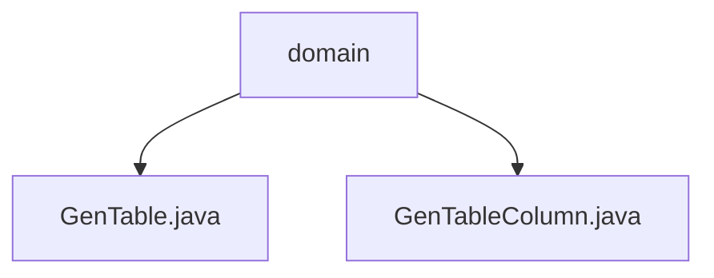

# 基础信息

|      |      |
|------|------|
| 名称 | domain |
| 编码语言 | .java |
| 代码路径 | RuoYi-main/ruoyi-generator/src/main/java/com/ruoyi/generator/domain |
| 包名 | RuoYi-main.ruoyi-generator.src.main.java.com.ruoyi.generator.domain |
| 概述说明 | GenTable类管理表信息和生成路径，GenTableColumn类定义表列属性，两者共同实现自动化代码生成。 |

# 说明

## 概述
该代码模块是一个用于自动化生成代码的工具模块，主要包含两个核心类：`GenTable` 和 `GenTableColumn`。`GenTable` 类负责管理表信息、列信息、生成路径以及模板类型等属性，帮助用户定义和配置生成代码所需的关键参数。`GenTableColumn` 类则用于定义数据库表列的属性，包括列ID、名称、类型、Java字段、主键、自增等关键信息，并提供相应的操作方法。通过这两个类的协作，该模块能够简化代码生成过程，提高开发效率。

## 主要业务场景
该模块的主要业务场景是自动化代码生成，特别是在基于数据库表结构生成相关代码时。以下是其主要应用场景：
1. **表结构映射**：通过 `GenTableColumn` 类，开发者可以定义数据库表列的属性，并将其映射到Java对象中，便于后续操作。
2. **代码生成配置**：使用 `GenTable` 类，开发者可以配置生成代码所需的关键参数，如表结构、字段属性、代码输出路径以及使用的模板类型。
3. **自动化代码生成**：结合 `GenTable` 和 `GenTableColumn` 类的功能，开发者可以快速生成符合表结构的代码，减少手动编写代码的工作量，提高开发效率。

### 包内部结构视图

该流程图展示了RuoYi项目中生成器模块的域文件夹结构。`domain`文件夹下包含两个Java文件：`GenTable.java`和`GenTableColumn.java`，分别用于处理生成器的表和列信息。这种结构有助于清晰地组织和管理生成器模块的代码。

# 文件列表 File List

| 名称   | 类型  | 说明 |
|-------|------|-------------|
| [GenTable.java](GenTable.md) | file | GenTable类用于生成代码，包含表、列、路径、模板等属性。 |
| [GenTableColumn.java](GenTableColumn.md) | file | GenTableColumn类定义数据库表列属性，包括ID、名称、类型、Java字段、主键、自增等。 |

