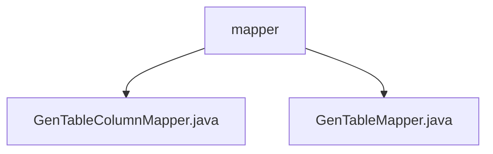

# 基础信息

|      |      |
|------|------|
| 名称 | mapper |
| 编码语言 | .java |
| 代码路径 | RuoYi-main/ruoyi-generator/src/main/java/com/ruoyi/generator/mapper |
| 包名 | RuoYi-main.ruoyi-generator.src.main.java.com.ruoyi.generator.mapper |
| 概述说明 | 输入内容为空，无法生成总结描述。 |

# 说明

## 概述
该代码模块主要涉及代码生成器的数据访问层（DAO层），具体包括`GenTableColumnMapper.java`和`GenTableMapper.java`两个文件。这些文件属于RuoYi框架中的代码生成器模块，负责与数据库表相关的操作。`GenTableMapper`和`GenTableColumnMapper`分别用于处理数据库表和表字段的映射关系，提供了对表和字段信息的查询、插入、更新和删除等操作。

## 主要业务场景
1. **代码生成器的数据管理**：该模块主要用于代码生成器中的表和字段信息的管理。通过`GenTableMapper`和`GenTableColumnMapper`，开发者可以方便地获取数据库表和字段的详细信息，这些信息将被用于生成相应的代码模板。
2. **数据库表与字段的CRUD操作**：该模块提供了对数据库表和字段的基本操作，包括查询表信息、查询字段信息、插入新表或字段、更新表或字段信息以及删除表或字段等。这些操作是代码生成器核心功能的基础。
3. **动态生成代码**：通过获取数据库表和字段的元数据信息，代码生成器可以根据这些信息动态生成对应的实体类、Mapper接口、Service层代码以及Controller层代码，从而减少开发者的重复劳动，提高开发效率。
4. **数据库元数据的管理与维护**：该模块还负责维护数据库表和字段的元数据信息，确保代码生成器能够准确反映数据库结构的变化，并生成与数据库结构一致的代码。

### 包内部结构视图

该流程图展示了`mapper`文件夹下的文件层级关系。`mapper`文件夹包含两个文件：`GenTableColumnMapper.java`和`GenTableMapper.java`。这两个文件直接位于`mapper`文件夹下，没有进一步的子文件夹结构。

# 文件列表 File List

| 名称   | 类型  | 说明 |
|-------|------|-------------|
| [GenTableColumnMapper.java](GenTableColumnMapper.md) | file | 内容为空，无法生成概要描述。 |
| [GenTableMapper.java](GenTableMapper.md) | file | 信息为空，无法生成概要描述。 |

