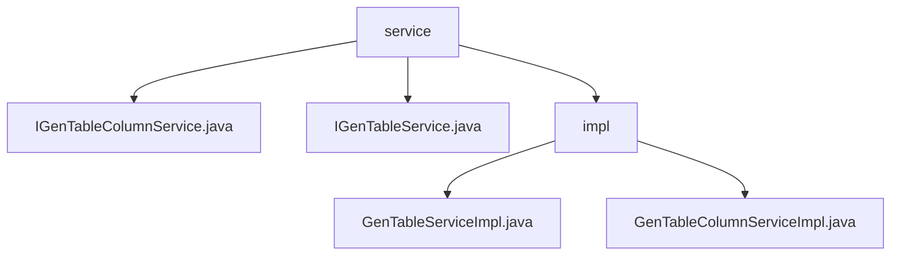

# 基础信息

|      |      |
|------|------|
| 名称 | service |
| 编码语言 | .java |
| 代码路径 | RuoYi-main/ruoyi-generator/src/main/java/com/ruoyi/generator/service |
| 包名 | RuoYi-main.ruoyi-generator.src.main.java.com.ruoyi.generator.service |
| 概述说明 | 该模块实现业务表及字段管理，支持查询、修改、删除、导入和代码生成，确保数据准确性和开发效率。 |

# 说明

## 概述
该代码模块主要实现了对业务表及其字段的全面管理功能。通过`GenTableServiceImpl`和`GenTableColumnServiceImpl`两个服务类，模块提供了对业务表和业务字段的查询、修改、删除、导入以及生成代码等操作。这些功能共同确保了业务数据的准确性和时效性，提升了系统的灵活性和可维护性。

## 主要业务场景
1. **业务表管理**：通过`GenTableServiceImpl`类，用户可以执行对业务表的查询、修改、删除、导入以及生成代码等操作。这些功能涵盖了业务表管理的主要需求，帮助用户高效地管理和操作业务表数据。
2. **业务字段管理**：通过`GenTableColumnServiceImpl`类，用户可以执行对业务字段的查询、新增、修改和删除操作。这些操作确保了业务字段数据的准确性和时效性，提升了系统的灵活性和可维护性。
3. **数据维护**：模块提供了对业务表和字段的全面管理，确保系统数据的准确性和一致性，支持系统的持续维护和更新。
4. **代码生成**：模块支持生成与业务表和字段相关的代码，提高了开发效率，减少了手动编码的工作量。

### 包内部结构视图

该流程图展示了RuoYi项目中`generator`模块的`service`目录结构。`service`目录下包含两个接口文件`IGenTableColumnService.java`和`IGenTableService.java`，以及一个`impl`子目录。`impl`子目录中包含了两个实现类文件`GenTableServiceImpl.java`和`GenTableColumnServiceImpl.java`。流程图清晰地展示了接口与实现类之间的层级关系。

# 文件列表 File List

| 名称   | 类型  | 说明 |
|-------|------|-------------|
| [IGenTableService.java](IGenTableService.md) | file | 无内容提供，无法生成概要描述。 |
| [IGenTableColumnService.java](IGenTableColumnService.md) | file | 无内容提供，无法生成概要描述。 |
| [impl](impl/_module.md) | package | GenTableServiceImpl和GenTableColumnServiceImpl分别管理业务表和业务字段，支持查询、修改、删除等操作，提升系统灵活性和可维护性。 |

