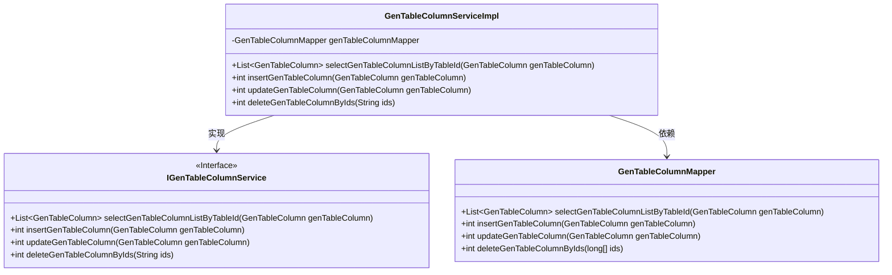
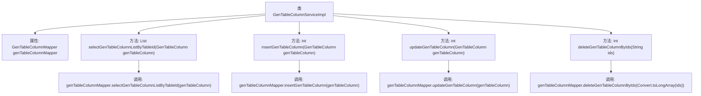

# 基础信息

|      |      |
|------|------|
| 名称 | GenTableColumnServiceImpl |
| 编码语言 | .java |
| 代码路径 | RuoYi-main/ruoyi-generator/src/main/java/com/ruoyi/generator/service/impl/GenTableColumnServiceImpl.java |
| 包名 | com.ruoyi.generator.service.impl |
| 依赖项 | ['java.util.List', 'org.springframework.beans.factory.annotation.Autowired', 'org.springframework.stereotype.Service', 'com.ruoyi.common.core.text.Convert', 'com.ruoyi.generator.domain.GenTableColumn', 'com.ruoyi.generator.mapper.GenTableColumnMapper', 'com.ruoyi.generator.service.IGenTableColumnService'] |
| 概述说明 | 实现业务字段的增删改查功能。 |

# 说明

该功能实现了对业务字段的全面管理，包括查询、新增、修改和删除操作。用户可以通过查询功能获取指定业务字段的详细信息，新增功能允许用户添加新的业务字段，修改功能支持对现有业务字段进行更新，删除功能则用于移除不再需要的业务字段。这些操作共同确保了业务字段数据的准确性和时效性，提升了系统的灵活性和可维护性。

# 类列表 Class Summary

| 名称   | 类型  | 说明 |
|-------|------|-------------|
| GenTableColumnServiceImpl | class | 实现业务字段的查询、新增、修改和删除功能。 |

## 类 GenTableColumnServiceImpl

|      |      |
|------|------|
| 访问范围 | @Service;public |
| 类型 | class |
| 名称 | GenTableColumnServiceImpl |
| 说明 | 实现业务字段的查询、新增、修改和删除功能。 |

### UML类图

类图描述：  
`GenTableColumnServiceImpl` 是一个服务实现类，实现了 `IGenTableColumnService` 接口，并依赖 `GenTableColumnMapper` 来执行数据库操作。`IGenTableColumnService` 接口定义了查询、新增、修改和删除业务字段的方法。`GenTableColumnMapper` 是数据访问层，负责与数据库交互，执行具体的 SQL 操作。

### 内部方法调用关系图

**描述：**  
`GenTableColumnServiceImpl`类实现了`IGenTableColumnService`接口，主要负责业务字段的增删改查操作。类中通过`@Autowired`注入了`GenTableColumnMapper`对象，用于与数据库交互。具体方法包括查询业务字段列表、新增业务字段、修改业务字段和删除业务字段。每个方法都调用了`genTableColumnMapper`的相应方法来完成数据库操作。

### 字段列表 Field List

| 名称  | 类型  | 说明 |
|-------|-------|------|
| genTableColumnMapper | GenTableColumnMapper | 自动注入GenTableColumnMapper实例。 |

### 方法列表 Method List

| 名称  | 类型  | 说明 |
|-------|-------|------|
| selectGenTableColumnListByTableId | List<GenTableColumn> | 通过表ID查询生成表列列表的方法，调用Mapper接口实现。 |
| updateGenTableColumn | int | 重写updateGenTableColumn方法，调用mapper更新GenTableColumn。 |
| deleteGenTableColumnByIds | int | 方法deleteGenTableColumnByIds根据传入的ids删除数据库表列。 |
| insertGenTableColumn | int | 重写insertGenTableColumn方法，调用mapper插入表列数据。 |

