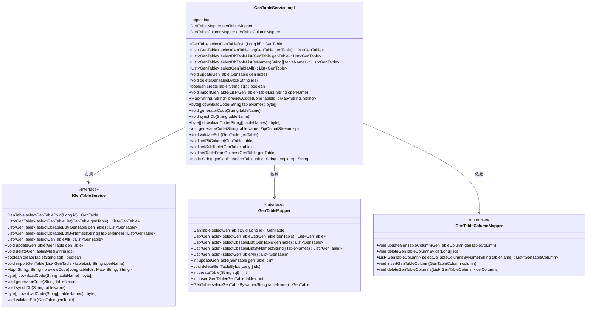

# 基础信息

|      |      |
|------|------|
| 名称 | GenTableServiceImpl |
| 编码语言 | .java |
| 代码路径 | RuoYi-main/ruoyi-generator/src/main/java/com/ruoyi/generator/service/impl/GenTableServiceImpl.java |
| 包名 | com.ruoyi.generator.service.impl |
| 依赖项 | ['java.io.ByteArrayOutputStream', 'java.io.File', 'java.io.IOException', 'java.io.StringWriter', 'java.util.LinkedHashMap', 'java.util.List', 'java.util.Map', 'java.util.function.Function', 'java.util.stream.Collectors', 'java.util.zip.ZipEntry', 'java.util.zip.ZipOutputStream', 'org.apache.commons.io.FileUtils', 'org.apache.commons.io.IOUtils', 'org.apache.velocity.Template', 'org.apache.velocity.VelocityContext', 'org.apache.velocity.app.Velocity', 'org.slf4j.Logger', 'org.slf4j.LoggerFactory', 'org.springframework.beans.factory.annotation.Autowired', 'org.springframework.stereotype.Service', 'org.springframework.transaction.annotation.Transactional', 'com.alibaba.fastjson.JSON', 'com.alibaba.fastjson.JSONObject', 'com.ruoyi.common.constant.Constants', 'com.ruoyi.common.constant.GenConstants', 'com.ruoyi.common.core.text.CharsetKit', 'com.ruoyi.common.core.text.Convert', 'com.ruoyi.common.exception.ServiceException', 'com.ruoyi.common.utils.StringUtils', 'com.ruoyi.generator.domain.GenTable', 'com.ruoyi.generator.domain.GenTableColumn', 'com.ruoyi.generator.mapper.GenTableColumnMapper', 'com.ruoyi.generator.mapper.GenTableMapper', 'com.ruoyi.generator.service.IGenTableService', 'com.ruoyi.generator.util.GenUtils', 'com.ruoyi.generator.util.VelocityInitializer', 'com.ruoyi.generator.util.VelocityUtils'] |
| 概述说明 | GenTableServiceImpl实现IGenTableService，提供表查询、修改、删除、导入及代码生成功能。 |

# 说明

GenTableServiceImpl实现了IGenTableService接口，提供了对业务表的全面管理功能。该服务类支持业务表的查询、修改、删除、导入以及生成代码等操作，涵盖了业务表管理的主要需求。通过这些功能，用户可以高效地管理和操作业务表数据，确保系统的灵活性和可维护性。

# 类列表 Class Summary

| 名称   | 类型  | 说明 |
|-------|------|-------------|
| GenTableServiceImpl | class | GenTableServiceImpl实现IGenTableService，提供业务表查询、修改、删除、导入、生成代码等功能。 |

## 类 GenTableServiceImpl

|      |      |
|------|------|
| 访问范围 | @Service;public |
| 类型 | class |
| 名称 | GenTableServiceImpl |
| 说明 | GenTableServiceImpl实现IGenTableService，提供业务表查询、修改、删除、导入、生成代码等功能。 |

### UML类图

**描述：**
`GenTableServiceImpl` 是一个服务实现类，实现了 `IGenTableService` 接口，负责处理与生成表相关的业务逻辑。它依赖于 `GenTableMapper` 和 `GenTableColumnMapper` 两个接口来访问数据库，提供了查询、更新、删除、导入表结构、生成代码等功能。类图展示了 `GenTableServiceImpl` 与相关接口和依赖类之间的关系，清晰地描述了其结构和功能。

### 内部方法调用关系图

```mermaid
graph TD
    A["类GenTableServiceImpl"]
    B["属性: Logger log"]
    C["属性: GenTableMapper genTableMapper"]
    D["属性: GenTableColumnMapper genTableColumnMapper"]
    E["方法: GenTable selectGenTableById(Long id)"]
    F["方法: List<GenTable> selectGenTableList(GenTable genTable)"]
    G["方法: List<GenTable> selectDbTableList(GenTable genTable)"]
    H["方法: List<GenTable> selectDbTableListByNames(String[] tableNames)"]
    I["方法: List<GenTable> selectGenTableAll()"]
    J["方法: void updateGenTable(GenTable genTable)"]
    K["方法: void deleteGenTableByIds(String ids)"]
    L["方法: boolean createTable(String sql)"]
    M["方法: void importGenTable(List<GenTable> tableList, String operName)"]
    N["方法: Map<String, String> previewCode(Long tableId)"]
    O["方法: byte[] downloadCode(String tableName)"]
    P["方法: void generatorCode(String tableName)"]
    Q["方法: void synchDb(String tableName)"]
    R["方法: byte[] downloadCode(String[] tableNames)"]
    S["方法: void validateEdit(GenTable genTable)"]
    T["方法: void setPkColumn(GenTable table)"]
    U["方法: void setSubTable(GenTable table)"]
    V["方法: void setTableFromOptions(GenTable genTable)"]
    W["方法: static String getGenPath(GenTable table, String template)"]

    A --> B
    A --> C
    A --> D
    A --> E
    A --> F
    A --> G
    A --> H
    A --> I
    A --> J
    A --> K
    A --> L
    A --> M
    A --> N
    A --> O
    A --> P
    A --> Q
    A --> R
    A --> S
    A --> T
    A --> U
    A --> V
    A --> W
```

这段代码定义了一个名为 `GenTableServiceImpl` 的服务类，实现了 `IGenTableService` 接口。该类主要负责生成、查询、更新和删除数据库表信息，并提供了多种与表相关的操作，如导入表结构、同步数据库、生成代码等。代码中使用了多个Mapper接口来与数据库交互，并通过注解 `@Autowired` 进行依赖注入。每个方法都有明确的职责，如 `selectGenTableById` 用于查询单个表信息，`updateGenTable` 用于更新表信息，`generatorCode` 用于生成代码文件等。整体设计合理，功能模块清晰。

### 字段列表 Field List

| 名称  | 类型  | 说明 |
|-------|-------|------|
| genTableMapper | GenTableMapper | 自动注入GenTableMapper实例。 |
| log = LoggerFactory.getLogger(GenTableServiceImpl.class) | Logger | 定义日志记录器，用于GenTableServiceImpl类的日志输出。 |
| genTableColumnMapper | GenTableColumnMapper | 自动注入GenTableColumnMapper实例。 |

### 方法列表 Method List

| 名称  | 类型  | 说明 |
|-------|-------|------|
| selectGenTableList | List<GenTable> | 重写方法selectGenTableList，调用mapper查询GenTable列表。 |
| selectDbTableList | List<GenTable> | 重写方法，调用Mapper查询数据库表列表。 |
| downloadCode | byte[] | 重写方法下载代码，生成ZIP文件并返回字节数组。 |
| selectGenTableById | GenTable | 根据ID查询GenTable并设置选项后返回。 |
| setTableFromOptions | void | 解析JSON参数并设置GenTable对象的树结构和父菜单信息。 |
| importGenTable | void | 批量导入表信息，包括表及其列数据，处理异常。 |
| updateGenTable | void | 更新GenTable及其关联列，参数序列化后保存。 |
| synchDb | void | 方法同步数据库表结构，更新或插入列，删除不存在列。 |
| validateEdit | void | 验证编辑操作，检查树模板和子表模板的关键字段是否为空。 |
| downloadCode | byte[] | 重写方法，生成并返回指定表名的代码压缩包字节数组。 |
| previewCode | Map<String, String> | 该方法根据表ID查询信息，渲染模板并返回结果。 |
| deleteGenTableByIds | void | 删除指定ID的生成表及其列。 |
| generatorCode | void | 生成代码方法：查询表信息，设置主子表及主键列，渲染模板并写入ZIP文件。 |
| selectGenTableAll | List<GenTable> | 重写方法，调用Mapper接口查询所有GenTable数据并返回列表。 |
| selectDbTableListByNames | List<GenTable> | 重写方法，根据表名列表查询数据库表信息并返回结果。 |
| getGenPath | String | 根据表路径和模板生成文件路径，默认路径为当前目录下的src文件夹。 |
| setSubTable | void | 该方法根据子表名称设置子表，若名称非空则从数据库查询并赋值。 |
| generatorCode | void | 根据表名生成代码，查询表信息，设置主子表及主键列，渲染模板并写入文件。 |
| setPkColumn | void | 设置主键列，优先选择标记为主键的列，若无则选首列，子表同理。 |
| createTable | boolean | 重写createTable方法，调用genTableMapper.createTable并返回结果是否为0。 |

