# 基础信息

|      |      |
|------|------|
| 名称 | GenUtils |
| 编码语言 | .java |
| 代码路径 | RuoYi-main/ruoyi-generator/src/main/java/com/ruoyi/generator/util/GenUtils.java |
| 包名 | com.ruoyi.generator.util |
| 依赖项 | ['java.util.Arrays', 'org.apache.commons.lang3.RegExUtils', 'com.ruoyi.common.constant.GenConstants', 'com.ruoyi.common.utils.StringUtils', 'com.ruoyi.generator.config.GenConfig', 'com.ruoyi.generator.domain.GenTable', 'com.ruoyi.generator.domain.GenTableColumn'] |
| 概述说明 | GenUtils类负责初始化表信息和列属性，支持表名转换、字段类型设置及查询条件配置。 |

# 说明

GenUtils类是一个用于初始化表信息和列属性的工具类，主要功能包括表名转换、字段类型设置以及查询条件配置。通过该类，用户可以方便地对数据库表的相关信息进行管理和配置，确保数据的准确性和一致性。

# 类列表 Class Summary

| 名称   | 类型  | 说明 |
|-------|------|-------------|
| GenUtils | class | GenUtils类用于初始化表信息和列属性，包含表名转换、字段类型设置、查询条件配置等功能。 |

## 类 GenUtils

|      |      |
|------|------|
| 访问范围 | public |
| 类型 | class |
| 名称 | GenUtils |
| 说明 | GenUtils类用于初始化表信息和列属性，包含表名转换、字段类型设置、查询条件配置等功能。 |

### UML类图

```mermaid
classDiagram
    class GenUtils {
        +static void initTable(GenTable genTable, String operName)
        +static void initColumnField(GenTableColumn column, GenTable table)
        +static boolean arraysContains(String[] arr, String targetValue)
        +static String getModuleName(String packageName)
        +static String getBusinessName(String tableName)
        +static String convertClassName(String tableName)
        +static String replaceFirst(String replacementm, String[] searchList)
        +static String replaceText(String text)
        +static String getDbType(String columnType)
        +static Integer getColumnLength(String columnType)
    }

    class GenTable {
        -String tableName
        -String className
        -String packageName
        -String moduleName
        -String businessName
        -String functionName
        -String functionAuthor
        -String createBy
        +String getTableName()
        +void setClassName(String className)
        +void setPackageName(String packageName)
        +void setModuleName(String moduleName)
        +void setBusinessName(String businessName)
        +void setFunctionName(String functionName)
        +void setFunctionAuthor(String functionAuthor)
        +void setCreateBy(String createBy)
    }

    class GenTableColumn {
        -String columnName
        -String columnType
        -String javaField
        -String javaType
        -String htmlType
        -String queryType
        -boolean isInsert
        -boolean isEdit
        -boolean isList
        -boolean isQuery
        -boolean isPk
        +String getColumnName()
        +String getColumnType()
        +void setTableId(String tableId)
        +void setCreateBy(String createBy)
        +void setJavaField(String javaField)
        +void setJavaType(String javaType)
        +void setHtmlType(String htmlType)
        +void setQueryType(String queryType)
        +void setIsInsert(boolean isInsert)
        +void setIsEdit(boolean isEdit)
        +void setIsList(boolean isList)
        +void setIsQuery(boolean isQuery)
        +boolean isPk()
    }

    class GenConfig {
        <<Interface>>
        +static String getPackageName()
        +static String getAuthor()
        +static boolean getAutoRemovePre()
        +static String getTablePrefix()
    }

    class StringUtils {
        <<Interface>>
        +static String toCamelCase(String str)
        +static String substring(String str, int start, int end)
        +static String convertToCamelCase(String str)
        +static String substringBefore(String str, String separator)
        +static String substringBetween(String str, String open, String close)
        +static boolean endsWithIgnoreCase(String str, String suffix)
        +static String[] split(String str, String separator)
        +static int indexOf(String str, String substr)
    }

    class RegExUtils {
        <<Interface>>
        +static String replaceAll(String text, String regex, String replacement)
    }

    class GenConstants {
        <<Interface>>
        +static String TYPE_STRING
        +static String QUERY_EQ
        +static String[] COLUMNTYPE_STR
        +static String[] COLUMNTYPE_TEXT
        +static String HTML_TEXTAREA
        +static String HTML_INPUT
        +static String[] COLUMNTYPE_TIME
        +static String TYPE_DATE
        +static String HTML_DATETIME
        +static String[] COLUMNTYPE_NUMBER
        +static String TYPE_BIGDECIMAL
        +static String TYPE_INTEGER
        +static String TYPE_LONG
        +static String REQUIRE
        +static String[] COLUMNNAME_NOT_EDIT
        +static String[] COLUMNNAME_NOT_LIST
        +static String[] COLUMNNAME_NOT_QUERY
        +static String QUERY_LIKE
        +static String HTML_RADIO
        +static String HTML_SELECT
        +static String HTML_UPLOAD
        +static String HTML_SUMMERNOTE
    }

    GenUtils --> GenTable : 初始化表信息
    GenUtils --> GenTableColumn : 初始化列属性字段
    GenUtils --> GenConfig : 获取配置信息
    GenUtils --> StringUtils : 字符串处理
    GenUtils --> RegExUtils : 正则表达式处理
    GenUtils --> GenConstants : 使用常量
```

**描述**：`GenUtils` 类是一个工具类，用于初始化表信息和列属性字段。它依赖于 `GenTable` 和 `GenTableColumn` 类来设置表名、类名、包名、模块名等属性，并根据列类型设置 Java 字段名、Java 类型、HTML 类型等。`GenUtils` 还依赖于 `GenConfig` 获取配置信息，使用 `StringUtils` 和 `RegExUtils` 进行字符串处理和正则表达式替换，并引用 `GenConstants` 中的常量来设置字段类型和查询类型。

### 内部方法调用关系图

```mermaid
graph TD
    A["类GenUtils"]
    B["方法: initTable(GenTable genTable, String operName)"]
    C["方法: initColumnField(GenTableColumn column, GenTable table)"]
    D["方法: arraysContains(String[] arr, String targetValue)"]
    E["方法: getModuleName(String packageName)"]
    F["方法: getBusinessName(String tableName)"]
    G["方法: convertClassName(String tableName)"]
    H["方法: replaceFirst(String replacementm, String[] searchList)"]
    I["方法: replaceText(String text)"]
    J["方法: getDbType(String columnType)"]
    K["方法: getColumnLength(String columnType)"]

    A --> B
    A --> C
    A --> D
    A --> E
    A --> F
    A --> G
    A --> H
    A --> I
    A --> J
    A --> K

    B --> B1["genTable.setClassName(convertClassName(genTable.getTableName()))"]
    B --> B2["genTable.setPackageName(GenConfig.getPackageName())"]
    B --> B3["genTable.setModuleName(getModuleName(GenConfig.getPackageName()))"]
    B --> B4["genTable.setBusinessName(getBusinessName(genTable.getTableName()))"]
    B --> B5["genTable.setFunctionName(replaceText(genTable.getTableComment()))"]
    B --> B6["genTable.setFunctionAuthor(GenConfig.getAuthor())"]
    B --> B7["genTable.setCreateBy(operName)"]

    C --> C1["String dataType = getDbType(column.getColumnType())"]
    C --> C2["String columnName = column.getColumnName()"]
    C --> C3["column.setTableId(table.getTableId())"]
    C --> C4["column.setCreateBy(table.getCreateBy())"]
    C --> C5["column.setJavaField(StringUtils.toCamelCase(columnName))"]
    C --> C6["column.setJavaType(GenConstants.TYPE_STRING)"]
    C --> C7["column.setQueryType(GenConstants.QUERY_EQ)"]
    C --> C8["if (arraysContains(GenConstants.COLUMNTYPE_STR, dataType) || arraysContains(GenConstants.COLUMNTYPE_TEXT, dataType))"]
    C --> C9["if (arraysContains(GenConstants.COLUMNTYPE_TIME, dataType))"]
    C --> C10["if (arraysContains(GenConstants.COLUMNTYPE_NUMBER, dataType))"]
    C --> C11["column.setIsInsert(GenConstants.REQUIRE)"]
    C --> C12["if (!arraysContains(GenConstants.COLUMNNAME_NOT_EDIT, columnName) && !column.isPk())"]
    C --> C13["if (!arraysContains(GenConstants.COLUMNNAME_NOT_LIST, columnName) && !column.isPk())"]
    C --> C14["if (!arraysContains(GenConstants.COLUMNNAME_NOT_QUERY, columnName) && !column.isPk())"]
    C --> C15["if (StringUtils.endsWithIgnoreCase(columnName, 'name'))"]
    C --> C16["if (StringUtils.endsWithIgnoreCase(columnName, 'status'))"]
    C --> C17["if (StringUtils.endsWithIgnoreCase(columnName, 'type') || StringUtils.endsWithIgnoreCase(columnName, 'sex'))"]
    C --> C18["if (StringUtils.endsWithIgnoreCase(columnName, 'file'))"]
    C --> C19["if (StringUtils.endsWithIgnoreCase(columnName, 'content'))"]

    D --> D1["return Arrays.asList(arr).contains(targetValue)"]

    E --> E1["int lastIndex = packageName.lastIndexOf('.')"]
    E --> E2["int nameLength = packageName.length()"]
    E --> E3["return StringUtils.substring(packageName, lastIndex + 1, nameLength)"]

    F --> F1["int lastIndex = tableName.lastIndexOf('_')"]
    F --> F2["int nameLength = tableName.length()"]
    F --> F3["return StringUtils.substring(tableName, lastIndex + 1, nameLength)"]

    G --> G1["boolean autoRemovePre = GenConfig.getAutoRemovePre()"]
    G --> G2["String tablePrefix = GenConfig.getTablePrefix()"]
    G --> G3["if (autoRemovePre && StringUtils.isNotEmpty(tablePrefix))"]
    G --> G4["String[] searchList = StringUtils.split(tablePrefix, ',')"]
    G --> G5["tableName = replaceFirst(tableName, searchList)"]
    G --> G6["return StringUtils.convertToCamelCase(tableName)"]

    H --> H1["String text = replacementm"]
    H --> H2["for (String searchString : searchList)"]
    H --> H3["if (replacementm.startsWith(searchString))"]
    H --> H4["text = replacementm.replaceFirst(searchString, '')"]
    H --> H5["break"]
    H --> H6["return text"]

    I --> I1["return RegExUtils.replaceAll(text, '(?:表|若依)', '')"]

    J --> J1["if (StringUtils.indexOf(columnType, '(') > 0)"]
    J --> J2["return StringUtils.substringBefore(columnType, '(')"]
    J --> J3["else return columnType"]

    K --> K1["if (StringUtils.indexOf(columnType, '(') > 0)"]
    K --> K2["String length = StringUtils.substringBetween(columnType, '(', ')')"]
    K --> K3["return Integer.valueOf(length)"]
    K --> K4["else return 0"]
```

这段代码主要是一个生成工具类 `GenUtils`，用于初始化表信息和列属性字段。`initTable` 方法用于设置表的类名、包名、模块名、业务名等信息，而 `initColumnField` 方法则用于根据列的类型和名称设置相应的 Java 字段名、类型、查询类型等属性。代码中还包含了一些辅助方法，如 `arraysContains` 用于检查数组中是否包含指定值，`getModuleName` 用于获取模块名，`getBusinessName` 用于获取业务名等。整体代码结构清晰，功能明确，主要用于生成代码时对表和列的初始化处理。

### 字段列表 Field List

| 名称  | 类型  | 说明 |
|-------|-------|------|

### 方法列表 Method List

| 名称  | 类型  | 说明 |
|-------|-------|------|
| getBusinessName | String | 从表名中提取业务名称，去除下划线及前缀部分。 |
| getColumnLength | Integer | 提取列类型中的长度值，若无则返回0。 |
| replaceFirst | String | 方法替换字符串中首个匹配项并返回结果。 |
| arraysContains | boolean | 该方法检查字符串数组中是否包含目标值。 |
| initTable | void | 初始化生成表配置，设置类名、包名、模块名、业务名、功能名、作者及创建者。 |
| convertClassName | String | 方法转换表名为类名，自动移除前缀并转为驼峰格式。 |
| getModuleName | String | 提取包名中的模块名。 |
| getDbType | String | 提取数据库字段类型，去除括号内内容。 |
| replaceText | String | 静态方法replaceText通过正则表达式移除字符串中的“表”或“若依”。 |
| initColumnField | void | 初始化表字段，设置Java字段名、类型、查询类型、HTML控件类型及插入、编辑、列表、查询等属性。 |

