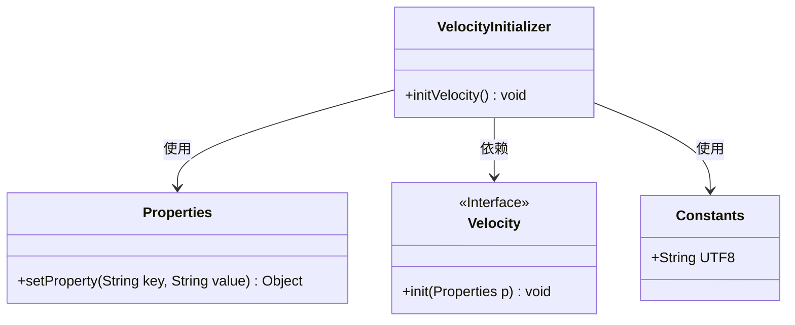
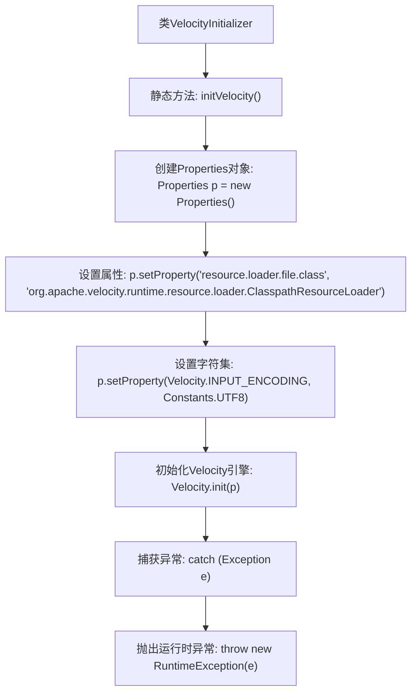

# 基础信息

|      |      |
|------|------|
| 名称 | VelocityInitializer |
| 编码语言 | .java |
| 代码路径 | RuoYi-main/ruoyi-generator/src/main/java/com/ruoyi/generator/util/VelocityInitializer.java |
| 包名 | com.ruoyi.generator.util |
| 依赖项 | ['java.util.Properties', 'org.apache.velocity.app.Velocity', 'com.ruoyi.common.constant.Constants'] |
| 概述说明 | VelocityInitializer类负责初始化Velocity引擎，配置资源加载器和字符集。 |

# 说明

VelocityInitializer类负责初始化Velocity引擎，配置资源加载器和字符集。通过该类的初始化过程，确保Velocity引擎能够正确加载资源并处理字符编码，为后续的模板渲染提供基础支持。

# 类列表 Class Summary

| 名称   | 类型  | 说明 |
|-------|------|-------------|
| VelocityInitializer | class | VelocityInitializer类初始化Velocity引擎，配置资源加载器和字符集。 |

## 类 VelocityInitializer

|      |      |
|------|------|
| 访问范围 | public |
| 类型 | class |
| 名称 | VelocityInitializer |
| 说明 | VelocityInitializer类初始化Velocity引擎，配置资源加载器和字符集。 |

### UML类图

### 描述
`VelocityInitializer` 类包含一个静态方法 `initVelocity`，用于初始化 Velocity 引擎。该方法通过 `Properties` 对象设置 Velocity 的配置属性，包括资源加载器和字符集，然后调用 `Velocity.init` 方法进行初始化。如果初始化过程中发生异常，将抛出 `RuntimeException`。该类依赖于 `Properties`、`Velocity` 和 `Constants` 类。

### 内部方法调用关系图

这段代码展示了`VelocityInitializer`类中的`initVelocity`方法，该方法用于初始化Velocity引擎。首先，创建一个`Properties`对象并设置相关属性，包括资源加载器和字符集。然后，调用`Velocity.init`方法初始化引擎。如果在初始化过程中发生异常，代码会捕获该异常并抛出一个运行时异常。流程图清晰地展示了这一过程的各个步骤及其顺序。

### 字段列表 Field List

| 名称  | 类型  | 说明 |
|-------|-------|------|

### 方法列表 Method List

| 名称  | 类型  | 说明 |
|-------|-------|------|
| initVelocity | void | 初始化Velocity引擎，配置资源加载器和字符集。 |

