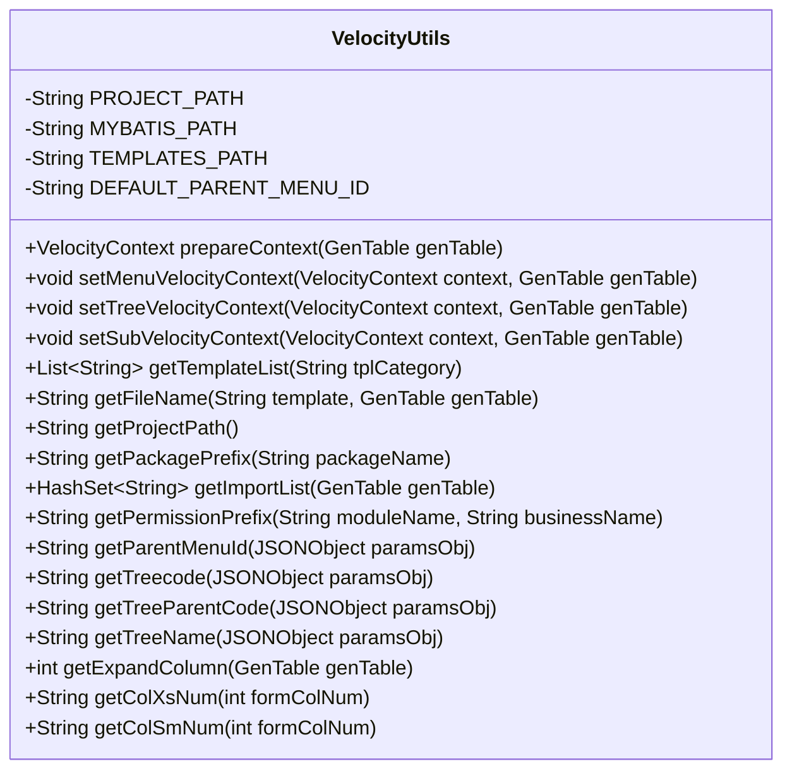

# 基础信息

|      |      |
|------|------|
| 名称 | VelocityUtils |
| 编码语言 | .java |
| 代码路径 | RuoYi-main/ruoyi-generator/src/main/java/com/ruoyi/generator/util/VelocityUtils.java |
| 包名 | com.ruoyi.generator.util |
| 依赖项 | ['java.util.ArrayList', 'java.util.HashSet', 'java.util.List', 'org.apache.velocity.VelocityContext', 'com.alibaba.fastjson.JSONObject', 'com.ruoyi.common.constant.GenConstants', 'com.ruoyi.common.utils.DateUtils', 'com.ruoyi.common.utils.StringUtils', 'com.ruoyi.generator.config.GenConfig', 'com.ruoyi.generator.domain.GenTable', 'com.ruoyi.generator.domain.GenTableColumn'] |
| 概述说明 | VelocityUtils类用于生成代码模板，管理路径、变量、文件命名及包导入。 |

# 说明

VelocityUtils类是一个用于生成代码模板的工具，主要功能包括路径配置、模板变量设置、文件命名以及导入包管理。通过这些功能，用户可以高效地生成符合需求的代码模板，简化开发流程，提升代码的一致性和可维护性。

# 类列表 Class Summary

| 名称   | 类型  | 说明 |
|-------|------|-------------|
| VelocityUtils | class | VelocityUtils类用于生成代码模板，包含路径配置、模板变量设置、文件命名及导入包管理。 |

## 类 VelocityUtils

|      |      |
|------|------|
| 访问范围 | public |
| 类型 | class |
| 名称 | VelocityUtils |
| 说明 | VelocityUtils类用于生成代码模板，包含路径配置、模板变量设置、文件命名及导入包管理。 |

### UML类图

**描述：**
`VelocityUtils` 类是一个工具类，主要用于处理与代码生成相关的模板上下文准备、文件路径生成、模板列表获取等操作。它包含多个静态方法，用于根据不同的业务表（`GenTable`）生成相应的模板上下文、获取模板文件路径、生成权限前缀等。这些方法通过处理 `GenTable` 对象和 `JSONObject` 对象，生成所需的模板上下文和文件路径，以便在代码生成过程中使用。

### 内部方法调用关系图

```mermaid
graph TD
    A["类VelocityUtils"]
    B["常量: PROJECT_PATH"]
    C["常量: MYBATIS_PATH"]
    D["常量: TEMPLATES_PATH"]
    E["常量: DEFAULT_PARENT_MENU_ID"]
    F["方法: prepareContext(GenTable genTable)"]
    G["方法: setMenuVelocityContext(VelocityContext context, GenTable genTable)"]
    H["方法: setTreeVelocityContext(VelocityContext context, GenTable genTable)"]
    I["方法: setSubVelocityContext(VelocityContext context, GenTable genTable)"]
    J["方法: getTemplateList(String tplCategory)"]
    K["方法: getFileName(String template, GenTable genTable)"]
    L["方法: getProjectPath()"]
    M["方法: getPackagePrefix(String packageName)"]
    N["方法: getImportList(GenTable genTable)"]
    O["方法: getPermissionPrefix(String moduleName, String businessName)"]
    P["方法: getParentMenuId(JSONObject paramsObj)"]
    Q["方法: getTreecode(JSONObject paramsObj)"]
    R["方法: getTreeParentCode(JSONObject paramsObj)"]
    S["方法: getTreeName(JSONObject paramsObj)"]
    T["方法: getExpandColumn(GenTable genTable)"]
    U["方法: getColXsNum(int formColNum)"]
    V["方法: getColSmNum(int formColNum)"]

    A --> B
    A --> C
    A --> D
    A --> E
    A --> F
    A --> G
    A --> H
    A --> I
    A --> J
    A --> K
    A --> L
    A --> M
    A --> N
    A --> O
    A --> P
    A --> Q
    A --> R
    A --> S
    A --> T
    A --> U
    A --> V
```

这段代码定义了一个名为 `VelocityUtils` 的工具类，主要用于生成 Velocity 模板的上下文信息。类中包含多个常量和方法，用于处理模板路径、文件名称、权限前缀、菜单ID等。`prepareContext` 方法是核心，负责设置模板变量信息，并调用其他方法如 `setMenuVelocityContext`、`setTreeVelocityContext` 和 `setSubVelocityContext` 来进一步配置上下文。其他方法如 `getTemplateList` 和 `getFileName` 则用于获取模板列表和生成文件路径。整个类通过一系列静态方法，支持在代码生成过程中动态配置和生成所需的模板文件。

### 字段列表 Field List

| 名称  | 类型  | 说明 |
|-------|-------|------|
| PROJECT_PATH = "main/java" | String | 项目路径定义为"main/java"。 |
| DEFAULT_PARENT_MENU_ID = "3" | String | 默认父菜单ID为"3"。 |
| TEMPLATES_PATH = "main/resources/templates" | String | 定义静态常量TEMPLATES_PATH，指向模板资源路径。 |
| MYBATIS_PATH = "main/resources/mapper" | String | MYBATIS_PATH定义为"main/resources/mapper"。 |

### 方法列表 Method List

| 名称  | 类型  | 说明 |
|-------|-------|------|
| getColXsNum | String | 根据输入参数返回对应Bootstrap列宽类名。 |
| getFileName | String | 根据模板和表信息生成文件路径。 |
| setSubVelocityContext | void | 设置子表上下文信息并存入VelocityContext对象。 |
| getColSmNum | String | 根据输入参数返回不同的col-sm类名。 |
| getImportList | HashSet<String> | 根据表格列类型生成导入列表，包含日期、BigDecimal等。 |
| getPackagePrefix | String | 该方法获取包名前缀，返回最后一个点之前的部分。 |
| setMenuVelocityContext | void | 方法设置菜单上下文，解析选项获取父菜单ID并存入上下文。 |
| getPermissionPrefix | String | 静态方法生成权限前缀，格式为模块名:业务名。 |
| getProjectPath | String | 获取项目路径，拼接包名并替换点号为斜杠。 |
| getExpandColumn | int | 获取GenTable中展开列的数量，遇到树名称列时停止计数。 |
| getTreeName | String | 从JSON对象获取树名并转换为驼峰格式，若无则返回空字符串。 |
| getTemplateList | List<String> | 获取模板列表方法，根据类别添加不同模板文件。 |
| getParentMenuId | String | 获取父菜单ID，若参数对象有效且包含父菜单ID则返回，否则返回默认值。 |
| setTreeVelocityContext | void | 方法设置VelocityContext的树结构参数，包括代码、父代码、名称和扩展列。 |
| getTreecode | String | 静态方法getTreecode从JSONObject中提取树形编码并转换为驼峰格式。 |
| getTreeParentCode | String | 方法getTreeParentCode检查paramsObj是否包含TREE_PARENT_CODE，若存在则返回其驼峰格式，否则返回空字符串。 |
| prepareContext | VelocityContext | 生成VelocityContext，包含模块、业务、包名等信息，处理模板类型并返回上下文。 |

