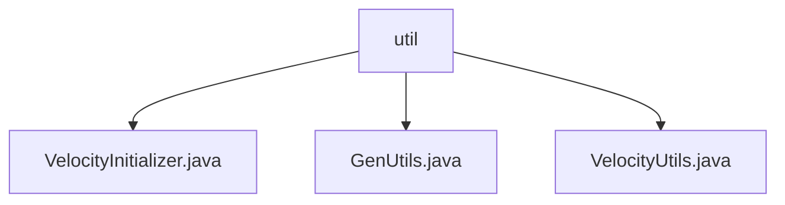

# 基础信息

|      |      |
|------|------|
| 名称 | util |
| 编码语言 | .java |
| 代码路径 | RuoYi-main/ruoyi-generator/src/main/java/com/ruoyi/generator/util |
| 包名 | RuoYi-main.ruoyi-generator.src.main.java.com.ruoyi.generator.util |
| 概述说明 | VelocityInitializer初始化引擎，GenUtils管理表信息，VelocityUtils生成代码模板。 |

# 说明

## 概述
该代码模块是一个基于Velocity模板引擎的代码生成工具，主要用于生成数据库表相关的代码模板。模块通过初始化Velocity引擎、管理表信息和列属性、以及生成代码模板等功能，简化了开发流程，提升了代码的一致性和可维护性。

## 主要业务场景
1. **Velocity引擎初始化**：`VelocityInitializer`类负责初始化Velocity引擎，配置资源加载器和字符集，确保引擎能够正确加载资源并处理字符编码，为后续的模板渲染提供基础支持。
2. **表信息管理**：`GenUtils`类用于初始化表信息和列属性，包括表名转换、字段类型设置以及查询条件配置，确保数据库表的相关信息能够被准确管理和配置。
3. **代码模板生成**：`VelocityUtils`类提供了路径配置、模板变量设置、文件命名以及导入包管理等功能，帮助用户高效生成符合需求的代码模板，简化开发流程，提升代码的一致性和可维护性。

### 包内部结构视图

该流程图展示了`util`文件夹下的三个文件：`VelocityInitializer.java`、`GenUtils.java`和`VelocityUtils.java`。`util`作为父节点，直接包含这三个文件，清晰地反映了它们的层级关系。

# 文件列表 File List

| 名称   | 类型  | 说明 |
|-------|------|-------------|
| [VelocityUtils.java](VelocityUtils.md) | file | VelocityUtils类用于生成代码模板，管理路径、变量、文件命名及包导入。 |
| [GenUtils.java](GenUtils.md) | file | GenUtils类负责初始化表信息和列属性，支持表名转换、字段类型设置及查询条件配置。 |
| [VelocityInitializer.java](VelocityInitializer.md) | file | VelocityInitializer类负责初始化Velocity引擎，配置资源加载器和字符集。 |

