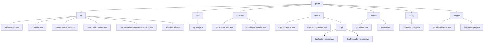

# 基础信息

|      |      |
|------|------|
| 名称 | com |
| 编码语言 | .java |
| 代码路径 | RuoYi-main/ruoyi-quartz/src/main/java/com |
| 包名 | RuoYi-main.ruoyi-quartz.src.main.java.com |
| 概述说明 | Quartz任务调度模块，支持任务执行、Cron处理、日志记录和并发控制。 |

# 说明

## 概述
该代码模块基于RuoYi框架，围绕Quartz任务调度框架的实现和扩展，提供了任务执行、Cron表达式处理、任务管理、日志记录、异常处理等功能。模块通过多个工具类、抽象类、控制器和服务类，确保任务能够准确、安全地调度和执行，同时提供了对Cron表达式的验证和时间计算功能，帮助开发者更好地管理和监控任务。模块的核心功能包括定时任务的配置、调度、执行状态跟踪以及执行日志的记录，适用于需要定时执行任务的业务场景，如数据同步、报表生成、定时通知等。

## 主要业务场景
1. **任务执行**：通过`JobInvokeUtil`类解析目标字符串并调用相应的方法，确保任务能够准确地被执行。`QuartzJobExecution`类继承自`AbstractQuartzJob`，并通过`JobInvokeUtil`执行具体的任务逻辑。
2. **Cron表达式处理**：`CronUtils`类提供了Cron表达式的验证、下次执行时间的计算以及近10次执行时间的列举功能，确保任务调度的准确性和可预测性。
3. **任务管理**：`ScheduleUtils`类提供了任务创建、触发策略配置以及白名单检查等功能，帮助用户高效地创建和管理Quartz任务，确保任务执行的安全性和可靠性。`SysJobController`和`SysJobServiceImpl`类实现了定时任务的初始化、状态查询、暂停与恢复、删除、状态修改、立即运行、新增与更新等功能。
4. **日志记录与异常处理**：`AbstractQuartzJob`抽象类在执行任务前后自动记录日志，并集成了异常处理机制，确保系统的稳定性和可追踪性。`SysJobLogController`和`SysJobLogServiceImpl`类提供了日志查看、列表获取、数据导出、日志删除和清理等功能。
5. **任务并发控制**：`QuartzDisallowConcurrentExecution`类通过配置禁止任务并发执行，确保在同一时间只有一个任务实例在运行，避免数据竞争或资源冲突。
6. **任务定义与日志记录**：通过`SysJob`类定义任务的基本属性，确保任务能够按照预定的策略和条件执行；通过`SysJobLog`类记录任务执行过程中的详细信息，便于后续的查询和分析。
7. **数据库操作与任务监控**：通过`SysJobMapper`和`SysJobLogMapper`接口，模块实现了对定时任务及其执行日志的数据库操作，确保定时任务的管理和监控功能得以实现。

### 包内部结构视图

该流程图展示了RuoYi项目中`ruoyi-quartz`模块的目录结构及其文件层级关系。`quartz`作为根节点，包含了多个子目录如`util`、`task`、`controller`等，每个子目录下又包含具体的Java文件。通过该图可以清晰地看到各个文件与其所属目录的从属关系，帮助开发者快速定位和理解项目的结构。

# 文件列表 File List

| 名称   | 类型  | 说明 |
|-------|------|-------------|
| [ruoyi](ruoyi/_module.md) | package | Quartz任务调度模块，支持任务执行、Cron处理、日志记录和并发控制。 |

