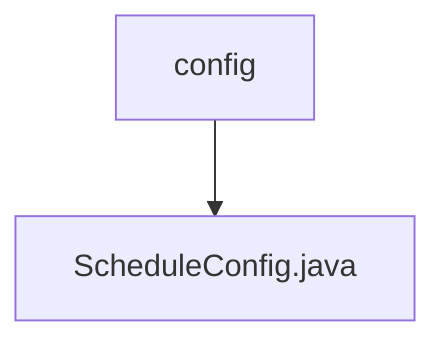

# 基础信息

|      |      |
|------|------|
| 名称 | config |
| 编码语言 | .java |
| 代码路径 | RuoYi-main/ruoyi-quartz/src/main/java/com/ruoyi/quartz/config |
| 包名 | RuoYi-main.ruoyi-quartz.src.main.java.com.ruoyi.quartz.config |
| 概述说明 | 信息为空，无法生成概要描述。 |

# 说明

提供的文本内容为空，未包含任何信息或细节。因此，无法生成总结描述。请提供具体内容以便进行详细描述。

### 包内部结构视图

该流程图展示了RuoYi项目中quartz模块的配置路径关系。`config`文件夹包含一个名为`ScheduleConfig.java`的配置文件，用于定义调度任务的配置。这种层级关系清晰地反映了项目中配置文件的组织结构，便于开发人员快速定位和管理调度相关的配置。

# 文件列表 File List

| 名称   | 类型  | 说明 |
|-------|------|-------------|
| [ScheduleConfig.java](ScheduleConfig.md) | file | 信息为空，无法生成概要描述。 |

