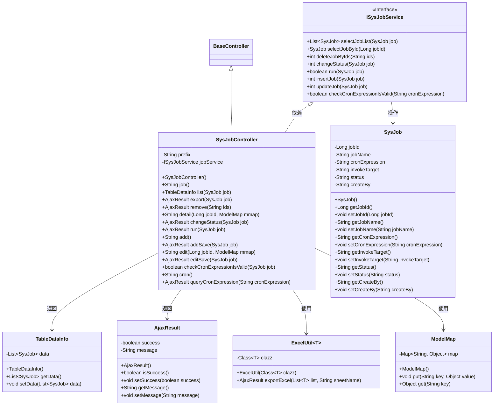

# 基础信息

|      |      |
|------|------|
| 名称 | SysJobController |
| 编码语言 | .java |
| 代码路径 | RuoYi-main/ruoyi-quartz/src/main/java/com/ruoyi/quartz/controller/SysJobController.java |
| 包名 | com.ruoyi.quartz.controller |
| 依赖项 | ['java.util.List', 'org.apache.shiro.authz.annotation.RequiresPermissions', 'org.quartz.SchedulerException', 'org.springframework.beans.factory.annotation.Autowired', 'org.springframework.stereotype.Controller', 'org.springframework.ui.ModelMap', 'org.springframework.validation.annotation.Validated', 'org.springframework.web.bind.annotation.GetMapping', 'org.springframework.web.bind.annotation.PathVariable', 'org.springframework.web.bind.annotation.PostMapping', 'org.springframework.web.bind.annotation.RequestMapping', 'org.springframework.web.bind.annotation.RequestParam', 'org.springframework.web.bind.annotation.ResponseBody', 'com.ruoyi.common.annotation.Log', 'com.ruoyi.common.constant.Constants', 'com.ruoyi.common.core.controller.BaseController', 'com.ruoyi.common.core.domain.AjaxResult', 'com.ruoyi.common.core.page.TableDataInfo', 'com.ruoyi.common.enums.BusinessType', 'com.ruoyi.common.exception.job.TaskException', 'com.ruoyi.common.utils.StringUtils', 'com.ruoyi.common.utils.poi.ExcelUtil', 'com.ruoyi.quartz.domain.SysJob', 'com.ruoyi.quartz.service.ISysJobService', 'com.ruoyi.quartz.util.CronUtils', 'com.ruoyi.quartz.util.ScheduleUtils'] |
| 概述说明 | SysJobController负责定时任务管理，支持增删改查、状态修改、执行及导出，需权限控制。 |

# 说明

SysJobController负责管理定时任务，提供新增、删除、修改、查询、状态变更、执行和导出等核心功能。为确保系统安全，所有操作均需进行严格的权限控制，以防止未授权访问或操作。该控制器是定时任务管理的关键组件，支持用户对任务进行全面管理和监控。

# 类列表 Class Summary

| 名称   | 类型  | 说明 |
|-------|------|-------------|
| SysJobController | class | SysJobController管理定时任务，提供增删改查、状态修改、执行、导出等功能，需权限控制。 |

## 类 SysJobController

|      |      |
|------|------|
| 访问范围 | @Controller;@RequestMapping("/monitor/job");public |
| 类型 | class |
| 名称 | SysJobController |
| 说明 | SysJobController管理定时任务，提供增删改查、状态修改、执行、导出等功能，需权限控制。 |

### UML类图

### 描述
该代码实现了一个定时任务管理系统，`SysJobController` 继承自 `BaseController`，并通过 `ISysJobService` 接口与业务逻辑层进行交互。控制器提供了任务列表查询、导出、删除、状态修改、立即执行、新增、编辑等功能，并通过 `AjaxResult` 和 `TableDataInfo` 返回操作结果。`SysJob` 类表示任务实体，`ExcelUtil` 用于导出任务数据到 Excel 文件，`ModelMap` 用于在视图和控制器之间传递数据。

### 内部方法调用关系图

```mermaid
graph TD
    A["类SysJobController"]
    B["属性: String prefix"]
    C["属性: ISysJobService jobService"]
    D["方法: job()"]
    E["方法: list(SysJob job)"]
    F["方法: export(SysJob job)"]
    G["方法: remove(String ids)"]
    H["方法: detail(Long jobId, ModelMap mmap)"]
    I["方法: changeStatus(SysJob job)"]
    J["方法: run(SysJob job)"]
    K["方法: add()"]
    L["方法: addSave(SysJob job)"]
    M["方法: edit(Long jobId, ModelMap mmap)"]
    N["方法: editSave(SysJob job)"]
    O["方法: checkCronExpressionIsValid(SysJob job)"]
    P["方法: cron()"]
    Q["方法: queryCronExpression(String cronExpression)"]

    A --> B
    A --> C
    A --> D
    A --> E
    A --> F
    A --> G
    A --> H
    A --> I
    A --> J
    A --> K
    A --> L
    A --> M
    A --> N
    A --> O
    A --> P
    A --> Q
```

该流程图展示了`SysJobController`类的主要方法和属性。`SysJobController`是一个控制器类，负责处理与定时任务相关的请求。它包含多个方法，如`job()`用于返回视图路径，`list(SysJob job)`用于获取任务列表，`export(SysJob job)`用于导出任务数据，`remove(String ids)`用于删除任务，`detail(Long jobId, ModelMap mmap)`用于查看任务详情，`changeStatus(SysJob job)`用于修改任务状态，`run(SysJob job)`用于立即执行任务，`add()`和`addSave(SysJob job)`用于新增任务，`edit(Long jobId, ModelMap mmap)`和`editSave(SysJob job)`用于编辑任务，`checkCronExpressionIsValid(SysJob job)`用于校验Cron表达式，`cron()`用于返回Cron表达式生成页面，`queryCronExpression(String cronExpression)`用于查询Cron表达式的执行时间。这些方法通过`jobService`属性与`ISysJobService`接口进行交互，完成具体的业务逻辑。

### 字段列表 Field List

| 名称  | 类型  | 说明 |
|-------|-------|------|
| prefix = "monitor/job" | String | 私有字符串变量prefix初始化为"monitor/job"。 |
| jobService | ISysJobService | 使用@Autowired自动注入ISysJobService实例。 |

### 方法列表 Method List

| 名称  | 类型  | 说明 |
|-------|-------|------|
| add | String | 需要权限"monitor:job:add"的GET请求处理add方法。 |
| checkCronExpressionIsValid | boolean | PostMapping方法检查Cron表达式有效性，返回布尔值。 |
| job | String | 需要权限查看监控任务，返回指定页面路径。 |
| list | TableDataInfo | 权限控制下，分页查询任务列表并返回数据。 |
| run | AjaxResult | 定时任务执行接口，需权限，返回执行结果或错误信息。 |
| editSave | AjaxResult | 定时任务修改接口，验证Cron表达式及目标字符串合法性。 |
| queryCronExpression | AjaxResult | 通过GET请求验证并返回Cron表达式触发时间列表。 |
| addSave | AjaxResult | 新增定时任务，校验Cron表达式及目标字符串合法性，成功后插入数据库。 |
| export | AjaxResult | 定时任务导出接口，需权限，返回Excel格式数据。 |
| changeStatus | AjaxResult | 定时任务状态变更接口，需权限，返回Ajax结果。 |
| detail | String | 获取作业详情接口，需权限，返回作业名称和详情。 |
| remove | AjaxResult | 定时任务删除接口，需权限验证，接收ID参数并调用服务删除。 |
| cron | String | GetMapping注解定义了一个cron方法，返回前缀加cron的字符串。 |
| edit | String | 编辑任务接口，需权限，根据任务ID获取并返回编辑页面。 |

