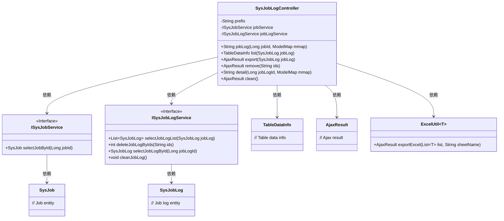

# 基础信息

|      |      |
|------|------|
| 名称 | SysJobLogController |
| 编码语言 | .java |
| 代码路径 | RuoYi-main/ruoyi-quartz/src/main/java/com/ruoyi/quartz/controller/SysJobLogController.java |
| 包名 | com.ruoyi.quartz.controller |
| 依赖项 | ['java.util.List', 'org.apache.shiro.authz.annotation.RequiresPermissions', 'org.springframework.beans.factory.annotation.Autowired', 'org.springframework.stereotype.Controller', 'org.springframework.ui.ModelMap', 'org.springframework.web.bind.annotation.GetMapping', 'org.springframework.web.bind.annotation.PathVariable', 'org.springframework.web.bind.annotation.PostMapping', 'org.springframework.web.bind.annotation.RequestMapping', 'org.springframework.web.bind.annotation.RequestParam', 'org.springframework.web.bind.annotation.ResponseBody', 'com.ruoyi.common.annotation.Log', 'com.ruoyi.common.core.controller.BaseController', 'com.ruoyi.common.core.domain.AjaxResult', 'com.ruoyi.common.core.page.TableDataInfo', 'com.ruoyi.common.enums.BusinessType', 'com.ruoyi.common.utils.StringUtils', 'com.ruoyi.common.utils.poi.ExcelUtil', 'com.ruoyi.quartz.domain.SysJob', 'com.ruoyi.quartz.domain.SysJobLog', 'com.ruoyi.quartz.service.ISysJobLogService', 'com.ruoyi.quartz.service.ISysJobService'] |
| 概述说明 | SysJobLogController管理监控日志，支持查看、列表、导出、删除、详情和清理操作。 |

# 说明

SysJobLogController负责处理监控日志，提供多种功能以方便用户管理和操作日志数据。用户可以通过该控制器查看日志详情、获取日志列表、导出日志数据、删除不需要的日志条目以及执行日志清理操作。这些功能确保了日志数据的高效管理和维护，帮助用户更好地监控系统运行状态。

# 类列表 Class Summary

| 名称   | 类型  | 说明 |
|-------|------|-------------|
| SysJobLogController | class | SysJobLogController处理监控日志，提供查看、列表、导出、删除、详情和清理功能。 |

## 类 SysJobLogController

|      |      |
|------|------|
| 访问范围 | @Controller;@RequestMapping("/monitor/jobLog");public |
| 类型 | class |
| 名称 | SysJobLogController |
| 说明 | SysJobLogController处理监控日志，提供查看、列表、导出、删除、详情和清理功能。 |

### UML类图

**描述：**
`SysJobLogController` 是一个控制器类，负责处理与任务日志相关的HTTP请求。它依赖于 `ISysJobService` 和 `ISysJobLogService` 接口来获取和操作任务及任务日志数据。控制器中的方法包括获取任务日志列表、导出日志、删除日志、查看日志详情以及清理日志等操作。这些方法通过返回 `TableDataInfo`、`AjaxResult` 等对象来响应客户端请求。`ExcelUtil` 类用于导出日志数据到Excel文件。

### 内部方法调用关系图

```mermaid
graph TD
    A["类SysJobLogController"]
    B["属性: String prefix"]
    C["属性: ISysJobService jobService"]
    D["属性: ISysJobLogService jobLogService"]
    E["方法: jobLog(Long jobId, ModelMap mmap)"]
    F["方法: list(SysJobLog jobLog)"]
    G["方法: export(SysJobLog jobLog)"]
    H["方法: remove(String ids)"]
    I["方法: detail(Long jobLogId, ModelMap mmap)"]
    J["方法: clean()"]
    K["内部调用: jobService.selectJobById(jobId)"]
    L["内部调用: jobLogService.selectJobLogList(jobLog)"]
    M["内部调用: jobLogService.deleteJobLogByIds(ids)"]
    N["内部调用: jobLogService.selectJobLogById(jobLogId)"]
    O["内部调用: jobLogService.cleanJobLog()"]
    P["内部调用: startPage()"]
    Q["内部调用: getDataTable(list)"]
    R["内部调用: ExcelUtil.exportExcel(list, '调度日志')"]
    S["内部调用: toAjax(result)"]
    T["内部调用: success()"]

    A --> B
    A --> C
    A --> D
    A --> E
    A --> F
    A --> G
    A --> H
    A --> I
    A --> J
    E --> K
    F --> P
    F --> L
    F --> Q
    G --> L
    G --> R
    H --> M
    H --> S
    I --> N
    J --> O
    J --> T
```

这段代码是一个Spring MVC控制器类`SysJobLogController`，用于处理与调度日志相关的HTTP请求。它包含多个方法，分别用于处理日志的查看、列表展示、导出、删除、详情查看和清理操作。每个方法通过调用相应的服务类方法来完成业务逻辑，并将结果返回给客户端。代码中使用了Spring的依赖注入和权限控制注解，确保每个操作都有相应的权限校验。

### 字段列表 Field List

| 名称  | 类型  | 说明 |
|-------|-------|------|
| prefix = "monitor/job" | String | 私有字符串变量prefix初始化为"monitor/job"。 |
| jobService | ISysJobService | 自动注入系统任务服务实例。 |
| jobLogService | ISysJobLogService | 自动注入系统任务日志服务实例。 |

### 方法列表 Method List

| 名称  | 类型  | 说明 |
|-------|-------|------|
| export | AjaxResult | 调度日志导出功能，需权限，返回Excel文件。 |
| remove | AjaxResult | 调度日志删除接口，需权限，接收ID参数并返回删除结果。 |
| detail | String | 通过权限检查，获取指定任务日志详情并返回视图。 |
| clean | AjaxResult | 调度日志清理接口，需权限monitor:job:remove，调用cleanJobLog方法。 |
| list | TableDataInfo | 监控任务日志列表接口，需权限，分页查询并返回数据。 |
| jobLog | String | 监控任务日志查看接口，根据任务ID获取任务信息并返回日志页面。 |

