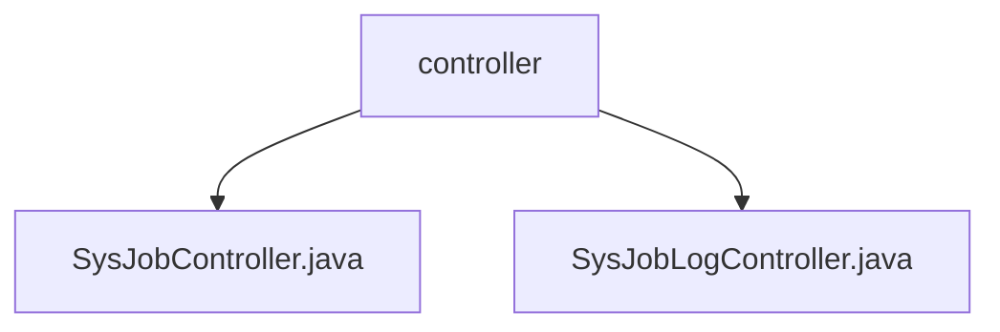

# 基础信息

|      |      |
|------|------|
| 名称 | controller |
| 编码语言 | .java |
| 代码路径 | RuoYi-main/ruoyi-quartz/src/main/java/com/ruoyi/quartz/controller |
| 包名 | RuoYi-main.ruoyi-quartz.src.main.java.com.ruoyi.quartz.controller |
| 概述说明 | SysJobController管理定时任务，SysJobLogController处理日志数据，均需权限控制。 |

# 说明

## 概述
该代码模块主要涉及定时任务的管理和监控日志的处理。模块包含两个核心控制器：`SysJobController` 和 `SysJobLogController`。`SysJobController` 负责管理定时任务，提供新增、删除、修改、查询、状态变更、执行和导出等功能，确保系统安全通过严格的权限控制。`SysJobLogController` 则负责处理监控日志，提供日志查看、列表获取、数据导出、日志删除和清理等功能，以支持日志数据的高效管理和系统运行状态的监控。

## 主要业务场景
1. **定时任务管理**：通过 `SysJobController`，用户可以创建、修改、删除和查询定时任务，同时可以变更任务状态、手动执行任务以及导出任务数据。所有操作均需通过权限验证，确保系统安全。
2. **监控日志处理**：通过 `SysJobLogController`，用户可以查看日志详情、获取日志列表、导出日志数据、删除不需要的日志条目以及执行日志清理操作。这些功能帮助用户更好地管理和维护日志数据，确保系统运行状态的透明性和可追溯性。

### 包内部结构视图

该流程图展示了RuoYi项目中quartz模块的控制器目录结构。`controller`文件夹下包含两个Java文件：`SysJobController.java`和`SysJobLogController.java`。这两个文件分别用于处理定时任务和定时任务日志的相关逻辑，体现了控制器层的职责划分。

# 文件列表 File List

| 名称   | 类型  | 说明 |
|-------|------|-------------|
| [SysJobLogController.java](SysJobLogController.md) | file | SysJobLogController管理监控日志，支持查看、列表、导出、删除、详情和清理操作。 |
| [SysJobController.java](SysJobController.md) | file | SysJobController负责定时任务管理，支持增删改查、状态修改、执行及导出，需权限控制。 |

