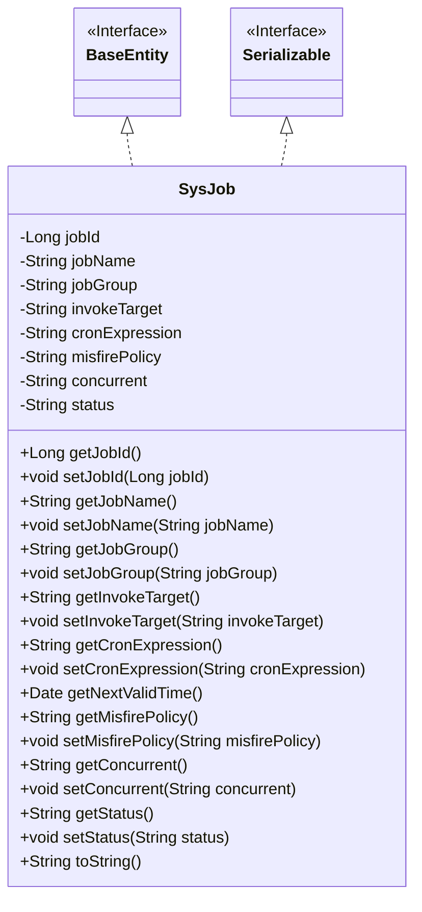

# 基础信息

|      |      |
|------|------|
| 名称 | SysJob |
| 编码语言 | .java |
| 代码路径 | RuoYi-main/ruoyi-quartz/src/main/java/com/ruoyi/quartz/domain/SysJob.java |
| 包名 | com.ruoyi.quartz.domain |
| 依赖项 | ['java.io.Serializable', 'java.util.Date', 'javax.validation.constraints', 'org.apache.commons.lang3.builder.ToStringBuilder', 'org.apache.commons.lang3.builder.ToStringStyle', 'com.ruoyi.common.annotation.Excel', 'com.ruoyi.common.annotation.Excel.ColumnType', 'com.ruoyi.common.constant.ScheduleConstants', 'com.ruoyi.common.core.domain.BaseEntity', 'com.ruoyi.common.utils.StringUtils', 'com.ruoyi.quartz.util.CronUtils'] |
| 概述说明 | SysJob类定义任务属性，含ID、名称、组名、调用目标、表达式、策略、并发和状态。 |

# 说明

SysJob类用于定义任务属性，包括任务ID、任务名称、所属组名、调用目标、执行表达式、计划策略、并发执行控制以及任务状态。这些属性共同构成了任务的基本信息，确保任务能够按照预定的策略和条件执行。

# 类列表 Class Summary

| 名称   | 类型  | 说明 |
|-------|------|-------------|
| SysJob | class | SysJob类定义任务属性，包括ID、名称、组名、调用目标、执行表达式、计划策略、并发执行和状态。 |

## 类 SysJob

|      |      |
|------|------|
| 访问范围 | public |
| 类型 | class |
| 名称 | SysJob |
| 说明 | SysJob类定义任务属性，包括ID、名称、组名、调用目标、执行表达式、计划策略、并发执行和状态。 |

### UML类图

**描述：**

`SysJob` 类继承自 `BaseEntity` 接口并实现了 `Serializable` 接口，表示它是一个可序列化的实体类。该类包含多个私有属性，如 `jobId`、`jobName`、`jobGroup` 等，分别表示任务的ID、名称、组名等信息。类中提供了这些属性的 getter 和 setter 方法，以及一个 `toString` 方法用于生成对象的字符串表示。`SysJob` 类主要用于管理定时任务的相关信息，并通过 `BaseEntity` 和 `Serializable` 接口实现基础功能和序列化支持。

### 内部方法调用关系图

```mermaid
graph TD
    A["类SysJob"]
    B["属性: Long jobId"]
    C["属性: String jobName"]
    D["属性: String jobGroup"]
    E["属性: String invokeTarget"]
    F["属性: String cronExpression"]
    G["属性: String misfirePolicy"]
    H["属性: String concurrent"]
    I["属性: String status"]
    J["方法: Long getJobId()"]
    K["方法: void setJobId(Long jobId)"]
    L["方法: String getJobName()"]
    M["方法: void setJobName(String jobName)"]
    N["方法: String getJobGroup()"]
    O["方法: void setJobGroup(String jobGroup)"]
    P["方法: String getInvokeTarget()"]
    Q["方法: void setInvokeTarget(String invokeTarget)"]
    R["方法: String getCronExpression()"]
    S["方法: void setCronExpression(String cronExpression)"]
    T["方法: Date getNextValidTime()"]
    U["方法: String getMisfirePolicy()"]
    V["方法: void setMisfirePolicy(String misfirePolicy)"]
    W["方法: String getConcurrent()"]
    X["方法: void setConcurrent(String concurrent)"]
    Y["方法: String getStatus()"]
    Z["方法: void setStatus(String status)"]
    AA["重写方法: String toString()"]

    A --> B
    A --> C
    A --> D
    A --> E
    A --> F
    A --> G
    A --> H
    A --> I
    A --> J
    A --> K
    A --> L
    A --> M
    A --> N
    A --> O
    A --> P
    A --> Q
    A --> R
    A --> S
    A --> T
    A --> U
    A --> V
    A --> W
    A --> X
    A --> Y
    A --> Z
    A --> AA
```

这段代码定义了一个名为 `SysJob` 的类，该类继承自 `BaseEntity` 并实现了 `Serializable` 接口。类中包含多个属性，如 `jobId`、`jobName`、`jobGroup` 等，并提供了相应的 getter 和 setter 方法。此外，`SysJob` 类还重写了 `toString()` 方法，用于返回对象的字符串表示。流程图展示了类中各个属性和方法之间的关系，以及它们如何被调用和操作。

### 字段列表 Field List

| 名称  | 类型  | 说明 |
|-------|-------|------|
| serialVersionUID = 1L | long | 定义了一个私有的静态常量序列化版本号。 |
| status | String | 任务状态字段，0表示正常，1表示暂停。 |
| jobId | Long | Excel任务序号字段定义为长整型变量jobId。 |
| invokeTarget | String | Excel注解标记调用目标字符串变量。 |
| jobGroup | String | Excel任务组名属性为jobGroup的字符串类型。 |
| cronExpression | String | Excel类中定义了一个私有字符串变量cronExpression，用于存储执行表达式。 |
| concurrent | String | Excel字段"并发执行"：0表示允许，1表示禁止。 |
| jobName | String | Excel注解标记任务名称字段。 |
| misfirePolicy = ScheduleConstants.MISFIRE_DEFAULT | String | 计划策略：0默认，1立即执行，2执行一次，3不立即执行。 |

### 方法列表 Method List

| 名称  | 类型  | 说明 |
|-------|-------|------|
| setJobName | void | 设置方法用于更新jobName属性值。 |
| setCronExpression | void | 设置定时任务表达式的方法。 |
| setConcurrent | void | 设置并发属性的方法。 |
| getStatus | String | 该方法返回当前状态值。 |
| getConcurrent | String | 获取并发状态的公共方法。 |
| getMisfirePolicy | String | 该方法返回misfirePolicy的值。 |
| getInvokeTarget | String | 调用目标字符串长度限制为1000字符，不能为空。 |
| getJobGroup | String | 获取作业组的方法，返回jobGroup值。 |
| getJobName | String | 任务名称校验：非空且不超过64字符。 |
| getJobId | Long | 获取任务ID的方法，返回长整型jobId。 |
| getCronExpression | String | Cron表达式验证：非空且长度不超过255字符。 |
| setMisfirePolicy | void | 设置任务调度失败处理策略。 |
| setInvokeTarget | void | 设置调用目标方法，更新对象属性。 |
| setJobGroup | void | 设置任务组的方法，将输入值赋给类的任务组变量。 |
| setJobId | void | 设置任务ID的方法，将传入的jobId赋值给类成员变量。 |
| setStatus | void | 定义方法setStatus，用于设置状态变量status的值。 |
| toString | String | 重写toString方法，返回包含任务ID、名称、组别、表达式、时间等信息的字符串。 |
| getNextValidTime | Date | 方法getNextValidTime根据cronExpression获取下一次有效时间，若无则返回null。 |

