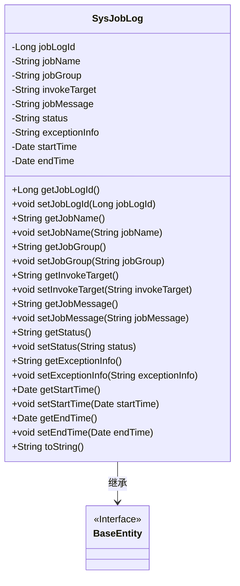

# 基础信息

|      |      |
|------|------|
| 名称 | SysJobLog |
| 编码语言 | .java |
| 代码路径 | RuoYi-main/ruoyi-quartz/src/main/java/com/ruoyi/quartz/domain/SysJobLog.java |
| 包名 | com.ruoyi.quartz.domain |
| 依赖项 | ['java.util.Date', 'org.apache.commons.lang3.builder.ToStringBuilder', 'org.apache.commons.lang3.builder.ToStringStyle', 'com.ruoyi.common.annotation.Excel', 'com.ruoyi.common.core.domain.BaseEntity'] |
| 概述说明 | SysJobLog类记录任务日志，含ID、名称、组名、目标、信息、状态、异常及时间。 |

# 说明

SysJobLog类用于记录任务日志，包含多个关键字段：ID用于唯一标识每条日志，名称和组名分别表示任务的名称和所属组，目标字段描述任务的具体目标，信息字段记录任务的详细信息，状态字段表示任务的执行状态，异常字段用于捕获任务执行过程中出现的异常情况，时间字段则记录日志的生成时间。这些字段共同构成了任务日志的完整信息，便于后续的查询和分析。

# 类列表 Class Summary

| 名称   | 类型  | 说明 |
|-------|------|-------------|
| SysJobLog | class | SysJobLog类记录任务日志，包含ID、名称、组名、目标、信息、状态、异常及时间。 |

## 类 SysJobLog

|      |      |
|------|------|
| 访问范围 | public |
| 类型 | class |
| 名称 | SysJobLog |
| 说明 | SysJobLog类记录任务日志，包含ID、名称、组名、目标、信息、状态、异常及时间。 |

### UML类图

这段代码定义了一个名为 `SysJobLog` 的类，该类继承自 `BaseEntity` 接口。`SysJobLog` 类包含了多个私有属性，如 `jobLogId`、`jobName`、`jobGroup` 等，并为这些属性提供了相应的 `getter` 和 `setter` 方法。此外，该类还重写了 `toString` 方法，用于返回对象的字符串表示。`SysJobLog` 类主要用于记录系统任务的日志信息，包括任务名称、任务组名、调用目标字符串、日志信息、执行状态、异常信息、开始时间和结束时间等。

### 内部方法调用关系图

```mermaid
graph TD
    A["类SysJobLog"]
    B["属性: Long jobLogId"]
    C["属性: String jobName"]
    D["属性: String jobGroup"]
    E["属性: String invokeTarget"]
    F["属性: String jobMessage"]
    G["属性: String status"]
    H["属性: String exceptionInfo"]
    I["属性: Date startTime"]
    J["属性: Date endTime"]
    K["方法: Long getJobLogId()"]
    L["方法: void setJobLogId(Long jobLogId)"]
    M["方法: String getJobName()"]
    N["方法: void setJobName(String jobName)"]
    O["方法: String getJobGroup()"]
    P["方法: void setJobGroup(String jobGroup)"]
    Q["方法: String getInvokeTarget()"]
    R["方法: void setInvokeTarget(String invokeTarget)"]
    S["方法: String getJobMessage()"]
    T["方法: void setJobMessage(String jobMessage)"]
    U["方法: String getStatus()"]
    V["方法: void setStatus(String status)"]
    W["方法: String getExceptionInfo()"]
    X["方法: void setExceptionInfo(String exceptionInfo)"]
    Y["方法: Date getStartTime()"]
    Z["方法: void setStartTime(Date startTime)"]
    AA["方法: Date getEndTime()"]
    AB["方法: void setEndTime(Date endTime)"]
    AC["重写方法: String toString()"]

    A --> B
    A --> C
    A --> D
    A --> E
    A --> F
    A --> G
    A --> H
    A --> I
    A --> J
    A --> K
    A --> L
    A --> M
    A --> N
    A --> O
    A --> P
    A --> Q
    A --> R
    A --> S
    A --> T
    A --> U
    A --> V
    A --> W
    A --> X
    A --> Y
    A --> Z
    A --> AA
    A --> AB
    A --> AC
```

该流程图展示了`SysJobLog`类的结构和内部方法调用关系。`SysJobLog`类继承自`BaseEntity`，包含多个属性和对应的`getter`和`setter`方法，以及一个重写的`toString`方法。流程图清晰地展示了每个属性与类之间的关系，以及类内部方法的调用路径，帮助理解类的整体设计和功能。

### 字段列表 Field List

| 名称  | 类型  | 说明 |
|-------|-------|------|
| startTime | Date | 定义私有日期类型变量startTime。 |
| endTime | Date | 私有日期类型变量endTime。 |
| jobLogId | Long | 日志序号为长整型私有变量。 |
| serialVersionUID = 1L | long | 声明一个私有的静态最终长整型序列化版本号。 |
| exceptionInfo | String | Excel异常信息字段定义。 |
| invokeTarget | String | Excel调用目标字符串变量声明。 |
| jobGroup | String | 任务组名定义为Excel中的私有字符串变量jobGroup。 |
| jobName | String | Excel任务名称字段定义为私有字符串类型。 |
| status | String | Excel字段"执行状态"映射为字符串，0表示正常，1表示失败。 |
| jobMessage | String | 日志信息字段用于存储任务消息。 |

### 方法列表 Method List

| 名称  | 类型  | 说明 |
|-------|-------|------|
| setJobLogId | void | 设置任务日志ID的方法。 |
| getStatus | String | 该方法返回当前状态字符串。 |
| getInvokeTarget | String | 获取调用目标字符串的方法。 |
| getJobName | String | 获取当前工作名称的方法。 |
| getJobMessage | String | 获取任务信息的方法。 |
| getJobLogId | Long | 获取任务日志ID的方法。 |
| getStartTime | Date | 获取开始时间的方法，返回startTime变量。 |
| setJobName | void | 设置类中的jobName属性值。 |
| getEndTime | Date | 方法getEndTime返回endTime日期对象。 |
| setExceptionInfo | void | 设置异常信息的方法。 |
| setStartTime | void | 设置开始时间的方法，接受Date类型参数。 |
| getExceptionInfo | String | 获取异常信息的方法。 |
| setJobMessage | void | 设置任务消息的方法，接受字符串参数。 |
| toString | String | 重写toString方法，多行格式输出任务日志信息。 |
| getJobGroup | String | 获取任务组的方法，返回任务组字符串。 |
| setInvokeTarget | void | 设置调用目标方法，赋值给成员变量。 |
| setEndTime | void | 设置结束时间的方法，接受Date类型参数。 |
| setStatus | void | 方法setStatus用于设置状态变量的值。 |
| setJobGroup | void | 设置任务组的方法，将传入的jobGroup赋值给当前对象的jobGroup属性。 |

