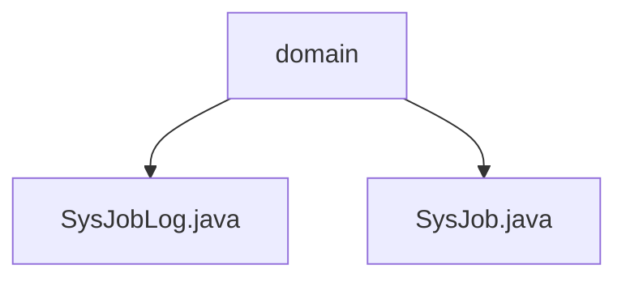

# 基础信息

|      |      |
|------|------|
| 名称 | domain |
| 编码语言 | .java |
| 代码路径 | RuoYi-main/ruoyi-quartz/src/main/java/com/ruoyi/quartz/domain |
| 包名 | RuoYi-main.ruoyi-quartz.src.main.java.com.ruoyi.quartz.domain |
| 概述说明 | SysJobLog类记录任务日志，包含ID、名称、组名、目标、信息、状态、异常和时间字段。SysJob类定义任务属性，包括ID、名称、组名、调用目标、执行表达式、计划策略、并发控制和状态。 |

# 说明

## 概述

该代码模块主要围绕任务管理和任务日志记录展开，提供了任务定义和任务日志记录的核心功能。模块通过`SysJob`类定义任务的属性，确保任务能够按照预定的策略和条件执行；同时通过`SysJobLog`类记录任务执行过程中的详细信息，便于后续的查询和分析。这两个类共同构成了任务管理和监控的基础。

## 主要业务场景

1. **任务定义与管理**：
   - 通过`SysJob`类定义任务的基本属性，包括任务ID、任务名称、所属组名、调用目标、执行表达式、计划策略、并发执行控制以及任务状态。这些属性确保了任务能够按照预定的策略和条件执行。
   - 该场景适用于需要定期或按特定条件执行的任务，如定时任务、批处理任务等。

2. **任务日志记录与监控**：
   - 通过`SysJobLog`类记录任务执行过程中的详细信息，包括任务ID、任务名称、所属组名、目标、信息、状态、异常情况以及日志生成时间。这些字段共同构成了任务日志的完整信息，便于后续的查询和分析。
   - 该场景适用于需要对任务执行情况进行监控和问题排查的场景，特别是在任务执行失败或出现异常时，能够快速定位问题并进行处理。

### 包内部结构视图

该流程图展示了 `domain` 文件夹下的两个文件 `SysJobLog.java` 和 `SysJob.java` 的层级关系。`domain` 作为父节点，包含了这两个文件，表示它们属于同一个目录结构。

# 文件列表 File List

| 名称   | 类型  | 说明 |
|-------|------|-------------|
| [SysJob.java](SysJob.md) | file | SysJob类定义任务属性，含ID、名称、组名、调用目标、表达式、策略、并发和状态。 |
| [SysJobLog.java](SysJobLog.md) | file | SysJobLog类记录任务日志，含ID、名称、组名、目标、信息、状态、异常及时间。 |

