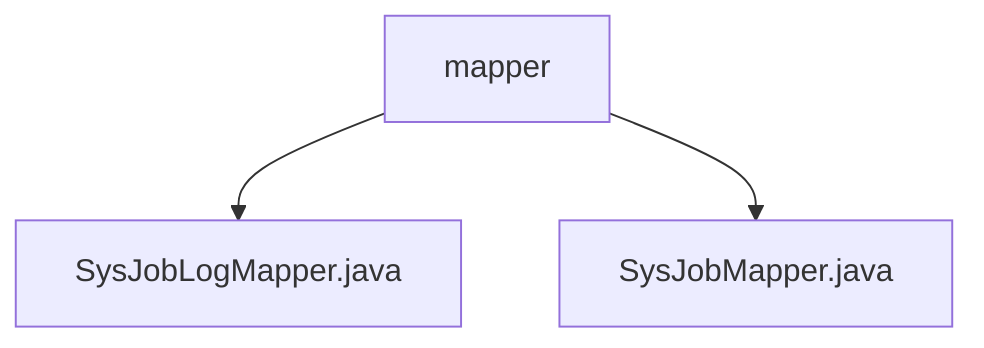

# 基础信息

|      |      |
|------|------|
| 名称 | mapper |
| 编码语言 | .java |
| 代码路径 | RuoYi-main/ruoyi-quartz/src/main/java/com/ruoyi/quartz/mapper |
| 包名 | RuoYi-main.ruoyi-quartz.src.main.java.com.ruoyi.quartz.mapper |
| 概述说明 | 内容为空，无法总结。 |

# 说明

## 概述
该代码模块是基于RuoYi框架的定时任务管理模块，主要涉及定时任务的调度、执行和日志记录功能。模块的核心功能包括定时任务的配置、调度、执行状态跟踪以及执行日志的记录。通过`SysJobMapper`和`SysJobLogMapper`两个接口，模块实现了对定时任务及其执行日志的数据库操作，确保定时任务的管理和监控功能得以实现。

## 主要业务场景
1. **定时任务配置与管理**：通过`SysJobMapper`接口，模块提供了对定时任务的增删改查操作。用户可以通过该接口配置定时任务的执行时间、执行频率、任务类等参数，并对任务进行启停操作。
2. **定时任务执行与调度**：模块负责根据配置的定时任务信息，通过Quartz框架进行任务的调度与执行。任务执行过程中，模块会实时更新任务的状态信息。
3. **任务执行日志记录**：通过`SysJobLogMapper`接口，模块记录了定时任务的执行日志，包括任务开始时间、结束时间、执行结果（成功或失败）以及异常信息。这些日志信息有助于用户监控任务的执行情况，并进行问题排查。
4. **任务执行状态监控**：模块提供了对定时任务执行状态的实时监控功能，用户可以通过日志信息了解任务的执行进度和结果，确保任务按预期执行。

该模块通过结合Quartz框架和RuoYi框架的数据库操作功能，实现了对定时任务的全面管理，适用于需要定时执行任务的业务场景，如数据同步、报表生成、定时通知等。

### 包内部结构视图

该流程图展示了`mapper`文件夹下的两个文件`SysJobLogMapper.java`和`SysJobMapper.java`的层级关系。`mapper`作为父节点，直接包含这两个文件，清晰地反映了它们在项目中的位置和依赖关系。

# 文件列表 File List

| 名称   | 类型  | 说明 |
|-------|------|-------------|
| [SysJobMapper.java](SysJobMapper.md) | file | 内容为空，无法生成概要描述。 |
| [SysJobLogMapper.java](SysJobLogMapper.md) | file | 信息为空，无法生成概要描述。 |

