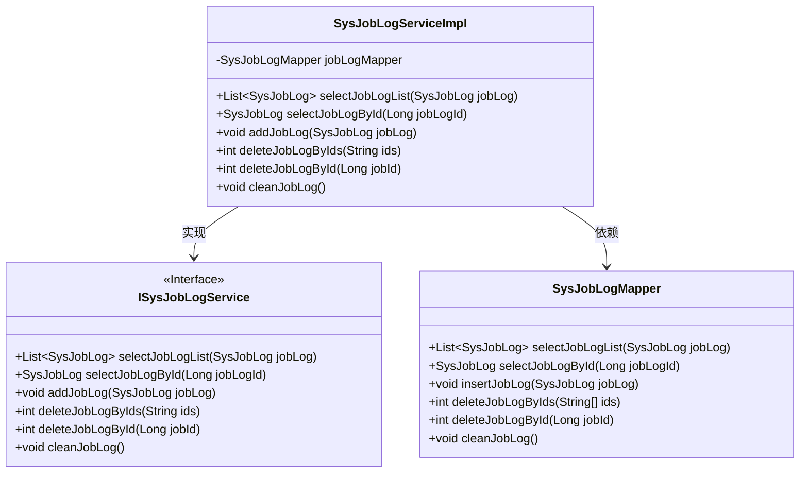
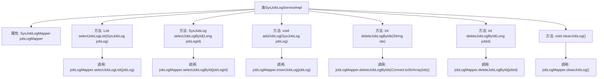

# 基础信息

|      |      |
|------|------|
| 名称 | SysJobLogServiceImpl |
| 编码语言 | .java |
| 代码路径 | RuoYi-main/ruoyi-quartz/src/main/java/com/ruoyi/quartz/service/impl/SysJobLogServiceImpl.java |
| 包名 | com.ruoyi.quartz.service.impl |
| 依赖项 | ['java.util.List', 'org.springframework.beans.factory.annotation.Autowired', 'org.springframework.stereotype.Service', 'com.ruoyi.common.core.text.Convert', 'com.ruoyi.quartz.domain.SysJobLog', 'com.ruoyi.quartz.mapper.SysJobLogMapper', 'com.ruoyi.quartz.service.ISysJobLogService'] |
| 概述说明 | SysJobLogServiceImpl实现ISysJobLogService，提供日志查询、新增、删除和清空功能。 |

# 说明

SysJobLogServiceImpl类实现了ISysJobLogService接口，提供了日志管理的核心功能。具体功能包括日志查询，允许用户检索系统日志；日志新增，支持添加新的日志记录；日志删除，能够移除指定日志；以及日志清空，用于清除所有日志数据。这些功能共同构成了完整的日志管理服务，确保系统日志的有效维护和操作。

# 类列表 Class Summary

| 名称   | 类型  | 说明 |
|-------|------|-------------|
| SysJobLogServiceImpl | class | SysJobLogServiceImpl实现ISysJobLogService，提供日志查询、新增、删除和清空功能。 |

## 类 SysJobLogServiceImpl

|      |      |
|------|------|
| 访问范围 | @Service;public |
| 类型 | class |
| 名称 | SysJobLogServiceImpl |
| 说明 | SysJobLogServiceImpl实现ISysJobLogService，提供日志查询、新增、删除和清空功能。 |

### UML类图

**描述：**
`SysJobLogServiceImpl` 是一个服务实现类，实现了 `ISysJobLogService` 接口，负责处理与调度任务日志相关的业务逻辑。它依赖于 `SysJobLogMapper` 来执行数据库操作，包括查询、插入、删除和清空日志等操作。`ISysJobLogService` 接口定义了这些操作的规范，而 `SysJobLogMapper` 则提供了具体的数据库访问方法。

### 内部方法调用关系图

这段代码是一个服务类 `SysJobLogServiceImpl`，实现了 `ISysJobLogService` 接口，用于处理调度任务日志的相关操作。类中包含了多个方法，分别用于查询、新增、删除和清空调度任务日志。每个方法都调用了 `SysJobLogMapper` 的相应方法来完成具体的数据库操作。流程图展示了类与其方法之间的调用关系，以及每个方法内部对 `jobLogMapper` 的调用过程。

### 字段列表 Field List

| 名称  | 类型  | 说明 |
|-------|-------|------|
| jobLogMapper | SysJobLogMapper | 自动注入SysJobLogMapper实例。 |

### 方法列表 Method List

| 名称  | 类型  | 说明 |
|-------|-------|------|
| selectJobLogById | SysJobLog | 根据ID查询系统任务日志。 |
| cleanJobLog | void | 重写cleanJobLog方法，调用jobLogMapper清理日志。 |
| deleteJobLogById | int | 根据ID删除任务日志并返回结果。 |
| deleteJobLogByIds | int | 重写方法，通过ID批量删除作业日志。 |
| addJobLog | void | 重写addJobLog方法，调用jobLogMapper插入日志。 |
| selectJobLogList | List<SysJobLog> | 重写方法，调用日志列表查询接口。 |

