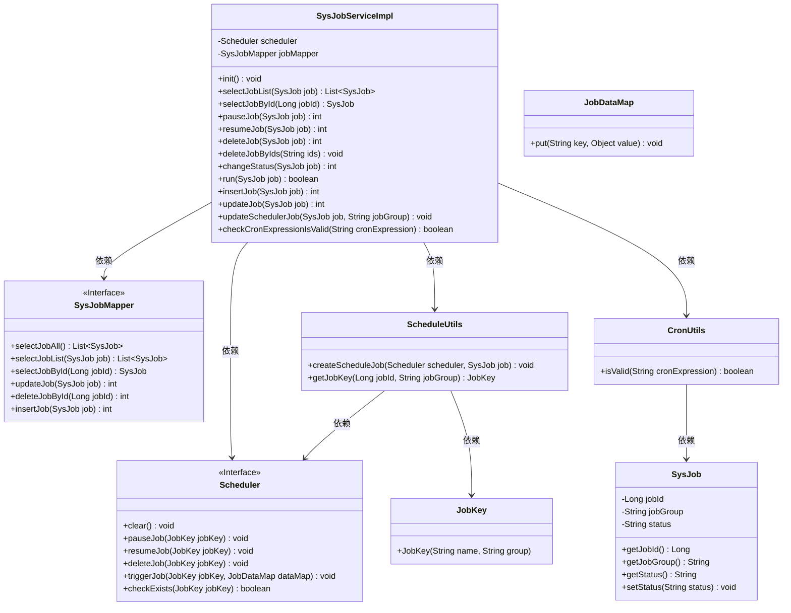

# 基础信息

|      |      |
|------|------|
| 名称 | SysJobServiceImpl |
| 编码语言 | .java |
| 代码路径 | RuoYi-main/ruoyi-quartz/src/main/java/com/ruoyi/quartz/service/impl/SysJobServiceImpl.java |
| 包名 | com.ruoyi.quartz.service.impl |
| 依赖项 | ['java.util.List', 'javax.annotation.PostConstruct', 'org.quartz.JobDataMap', 'org.quartz.JobKey', 'org.quartz.Scheduler', 'org.quartz.SchedulerException', 'org.springframework.beans.factory.annotation.Autowired', 'org.springframework.stereotype.Service', 'org.springframework.transaction.annotation.Transactional', 'com.ruoyi.common.constant.ScheduleConstants', 'com.ruoyi.common.core.text.Convert', 'com.ruoyi.common.exception.job.TaskException', 'com.ruoyi.quartz.domain.SysJob', 'com.ruoyi.quartz.mapper.SysJobMapper', 'com.ruoyi.quartz.service.ISysJobService', 'com.ruoyi.quartz.util.CronUtils', 'com.ruoyi.quartz.util.ScheduleUtils'] |
| 概述说明 | SysJobServiceImpl类实现ISysJobService，提供定时任务管理功能。 |

# 说明

SysJobServiceImpl类实现了ISysJobService接口，提供全面的定时任务管理功能。具体功能包括初始化定时任务、查询任务状态、暂停和恢复任务、删除任务、修改任务状态、立即运行任务、新增和更新任务，以及校验Cron表达式的有效性。该类涵盖了定时任务的各项操作，确保任务管理的灵活性和可靠性。

# 类列表 Class Summary

| 名称   | 类型  | 说明 |
|-------|------|-------------|
| SysJobServiceImpl | class | SysJobServiceImpl类实现ISysJobService，提供定时任务管理功能，包括初始化、查询、暂停、恢复、删除、修改状态、立即运行、新增、更新任务及校验Cron表达式。 |

## 类 SysJobServiceImpl

|      |      |
|------|------|
| 访问范围 | @Service;public |
| 类型 | class |
| 名称 | SysJobServiceImpl |
| 说明 | SysJobServiceImpl类实现ISysJobService，提供定时任务管理功能，包括初始化、查询、暂停、恢复、删除、修改状态、立即运行、新增、更新任务及校验Cron表达式。 |

### UML类图

该代码实现了一个定时任务管理系统，`SysJobServiceImpl`类负责管理定时任务的初始化、查询、暂停、恢复、删除、状态修改、立即运行、新增和更新等操作。它依赖于`Scheduler`接口来管理任务调度，`SysJobMapper`接口来操作数据库，`ScheduleUtils`和`CronUtils`工具类来辅助任务调度和校验Cron表达式。整个系统通过`SysJob`类来表示任务信息，并通过`JobDataMap`和`JobKey`类来传递任务参数和标识任务。

### 内部方法调用关系图

```mermaid
graph TD
    A["类SysJobServiceImpl"]
    B["属性: Scheduler scheduler"]
    C["属性: SysJobMapper jobMapper"]
    D["方法: init()"]
    E["方法: selectJobList(SysJob job)"]
    F["方法: selectJobById(Long jobId)"]
    G["方法: pauseJob(SysJob job)"]
    H["方法: resumeJob(SysJob job)"]
    I["方法: deleteJob(SysJob job)"]
    J["方法: deleteJobByIds(String ids)"]
    K["方法: changeStatus(SysJob job)"]
    L["方法: run(SysJob job)"]
    M["方法: insertJob(SysJob job)"]
    N["方法: updateJob(SysJob job)"]
    O["方法: updateSchedulerJob(SysJob job, String jobGroup)"]
    P["方法: checkCronExpressionIsValid(String cronExpression)"]

    A --> B
    A --> C
    A --> D
    A --> E
    A --> F
    A --> G
    A --> H
    A --> I
    A --> J
    A --> K
    A --> L
    A --> M
    A --> N
    A --> O
    A --> P
```

这段代码是一个Spring服务类 `SysJobServiceImpl`，它实现了 `ISysJobService` 接口，主要用于管理定时任务。类中包含了多个方法，用于初始化定时器、查询任务列表、暂停、恢复、删除任务、修改任务状态、立即运行任务、新增任务、更新任务以及校验Cron表达式等操作。这些方法通过 `Scheduler` 和 `SysJobMapper` 来与调度器和数据库进行交互，确保定时任务的管理和同步。

### 字段列表 Field List

| 名称  | 类型  | 说明 |
|-------|-------|------|
| jobMapper | SysJobMapper | 自动注入SysJobMapper实例。 |
| scheduler | Scheduler | 自动注入调度器实例。 |

### 方法列表 Method List

| 名称  | 类型  | 说明 |
|-------|-------|------|
| insertJob | int | 插入任务并暂停，成功则创建调度任务。 |
| selectJobById | SysJob | 根据jobId查询SysJob信息。 |
| checkCronExpressionIsValid | boolean | 该方法用于验证Cron表达式是否有效。 |
| deleteJobByIds | void | 删除指定ID的作业，处理异常并回滚事务。 |
| updateSchedulerJob | void | 更新调度任务前检查并移除旧任务，再创建新任务。 |
| changeStatus | int | 事务方法changeStatus根据任务状态恢复或暂停任务，返回影响行数。 |
| resumeJob | int | 恢复任务并更新状态，成功后重启调度任务。 |
| selectJobList | List<SysJob> | 重写方法selectJobList，调用jobMapper查询任务列表并返回。 |
| init | void | 初始化时清空调度器并创建所有任务的调度计划。 |
| updateJob | int | 更新任务方法，包含事务回滚，更新任务并同步调度器。 |
| pauseJob | int | 该方法暂停指定任务，更新状态并返回影响行数。 |
| deleteJob | int | 删除指定任务并返回删除行数，成功时同步删除调度任务。 |
| run | boolean | 方法run检查任务是否存在并触发执行，返回执行结果。 |

