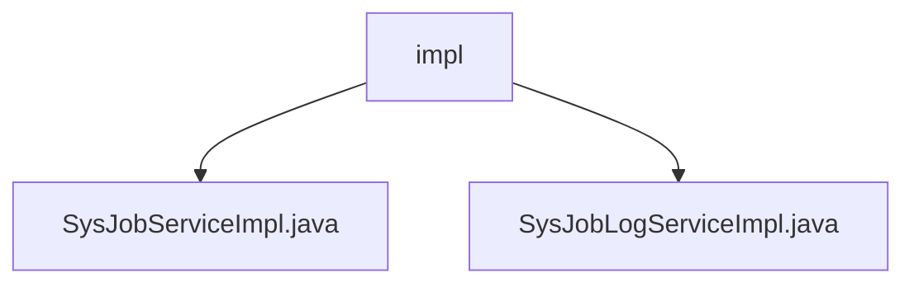

# 基础信息

|      |      |
|------|------|
| 名称 | impl |
| 编码语言 | .java |
| 代码路径 | RuoYi-main/ruoyi-quartz/src/main/java/com/ruoyi/quartz/service/impl |
| 包名 | RuoYi-main.ruoyi-quartz.src.main.java.com.ruoyi.quartz.service.impl |
| 概述说明 | SysJobServiceImpl类提供定时任务管理，包括初始化、查询、暂停、恢复、删除、修改、立即运行、新增、更新及Cron校验。SysJobLogServiceImpl类提供日志管理，包括查询、新增、删除和清空。 |

# 说明

## 概述
该代码模块主要围绕定时任务管理和日志管理两大核心功能展开。通过`SysJobServiceImpl`类实现了全面的定时任务管理功能，包括任务的初始化、状态查询、暂停与恢复、删除、状态修改、立即运行、新增与更新，以及Cron表达式的校验。同时，`SysJobLogServiceImpl`类提供了日志管理的核心功能，涵盖日志的查询、新增、删除和清空操作。这两个服务类共同构成了一个完整的定时任务和日志管理系统，确保任务执行的灵活性和日志数据的有效维护。

## 主要业务场景
1. **定时任务管理**：  
   - 初始化定时任务，确保系统启动时任务能够正常加载。  
   - 查询任务状态，监控任务的执行情况。  
   - 暂停和恢复任务，根据业务需求灵活控制任务的执行。  
   - 删除任务，移除不再需要的任务。  
   - 修改任务状态，调整任务的执行策略。  
   - 立即运行任务，支持手动触发任务的执行。  
   - 新增和更新任务，动态管理任务列表。  
   - 校验Cron表达式，确保任务调度时间的准确性。  

2. **日志管理**：  
   - 日志查询，支持用户检索系统日志信息。  
   - 日志新增，记录系统操作或任务执行的详细信息。  
   - 日志删除，移除指定的日志记录。  
   - 日志清空，清除所有日志数据，释放存储空间。  

通过上述功能，该模块能够有效支持系统的定时任务调度和日志管理需求，为系统的稳定运行提供保障。

### 包内部结构视图

该流程图展示了`impl`文件夹下的两个Java文件`SysJobServiceImpl.java`和`SysJobLogServiceImpl.java`的层级关系。`impl`作为父节点，包含这两个实现类文件，清晰地反映了文件在项目结构中的位置和依赖关系。

# 文件列表 File List

| 名称   | 类型  | 说明 |
|-------|------|-------------|
| [SysJobLogServiceImpl.java](SysJobLogServiceImpl.md) | file | SysJobLogServiceImpl实现ISysJobLogService，提供日志查询、新增、删除和清空功能。 |
| [SysJobServiceImpl.java](SysJobServiceImpl.md) | file | SysJobServiceImpl类实现ISysJobService，提供定时任务管理功能。 |

