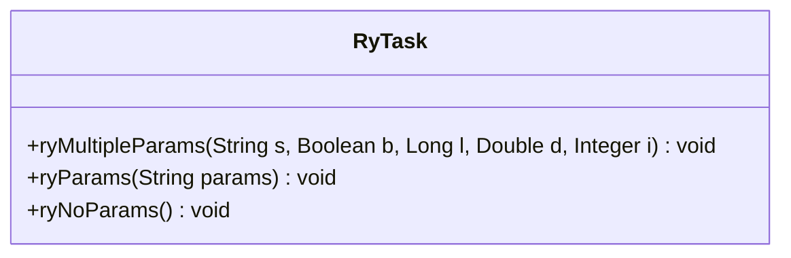
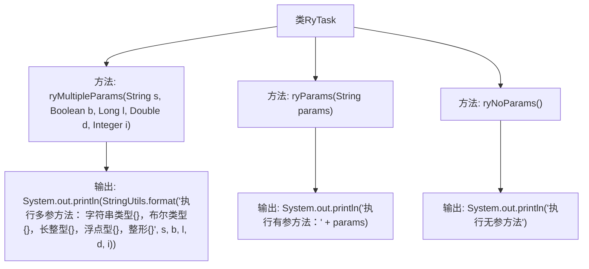

# 基础信息

|      |      |
|------|------|
| 名称 | RyTask |
| 编码语言 | .java |
| 代码路径 | RuoYi-main/ruoyi-quartz/src/main/java/com/ruoyi/quartz/task/RyTask.java |
| 包名 | com.ruoyi.quartz.task |
| 依赖项 | ['org.springframework.stereotype.Component', 'com.ruoyi.common.utils.StringUtils'] |
| 概述说明 | RyTask类包含三个方法：ryMultipleParams、ryParams和ryNoParams。 |

# 说明

RyTask类是一个包含三个方法的类，分别用于处理不同类型的参数。ryMultipleParams方法用于处理多类型参数，能够接收并处理多种数据类型的输入。ryParams方法专门处理单一字符串参数，适用于仅需单个字符串输入的场景。ryNoParams方法则无需任何参数，直接执行其功能。这三个方法共同构成了RyTask类的核心功能，使其能够灵活应对不同的参数需求。

# 类列表 Class Summary

| 名称   | 类型  | 说明 |
|-------|------|-------------|
| RyTask | class | RyTask类包含三个方法：ryMultipleParams处理多类型参数，ryParams处理单一字符串参数，ryNoParams无参数。 |

## 类 RyTask

|      |      |
|------|------|
| 访问范围 | @Component("ryTask");public |
| 类型 | class |
| 名称 | RyTask |
| 说明 | RyTask类包含三个方法：ryMultipleParams处理多类型参数，ryParams处理单一字符串参数，ryNoParams无参数。 |

### UML类图

**描述：**
`RyTask` 类是一个包含多个方法的组件类，用于执行不同类型的任务。它提供了三个方法：`ryMultipleParams` 用于处理多个不同类型的参数，`ryParams` 用于处理单个字符串参数，`ryNoParams` 用于执行无参数的任务。每个方法都会在控制台输出相应的执行信息，展示了不同参数类型和数量的处理方法。

### 内部方法调用关系图

这段代码定义了一个名为 `RyTask` 的类，其中包含三个方法：`ryMultipleParams`、`ryParams` 和 `ryNoParams`。`ryMultipleParams` 方法接受多个不同类型的参数，并格式化输出这些参数的值。`ryParams` 方法接受一个字符串参数，并输出该参数的值。`ryNoParams` 方法不接受任何参数，仅输出一条固定的消息。每个方法都通过 `System.out.println` 进行输出，展示了不同的参数处理方式。

### 字段列表 Field List

| 名称  | 类型  | 说明 |
|-------|-------|------|

### 方法列表 Method List

| 名称  | 类型  | 说明 |
|-------|-------|------|
| ryParams | void | 定义有参方法ryParams，打印传入参数。 |
| ryMultipleParams | void | 方法ryMultipleParams输出字符串、布尔、长整型、浮点型和整型参数。 |
| ryNoParams | void | 无参方法ryNoParams执行时输出"执行无参方法"。 |

