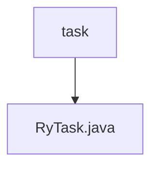

# 基础信息

|      |      |
|------|------|
| 名称 | task |
| 编码语言 | .java |
| 代码路径 | RuoYi-main/ruoyi-quartz/src/main/java/com/ruoyi/quartz/task |
| 包名 | RuoYi-main.ruoyi-quartz.src.main.java.com.ruoyi.quartz.task |
| 概述说明 | RyTask类包含三个方法：ryMultipleParams、ryParams和ryNoParams。 |

# 说明

RyTask类是一个包含三个方法的类，分别用于处理不同类型的参数。ryMultipleParams方法用于处理多类型参数，能够接收并处理多种数据类型的输入。ryParams方法专门处理单一字符串参数，适用于仅需单个字符串输入的场景。ryNoParams方法则无需任何参数，直接执行其功能。这三个方法共同构成了RyTask类的核心功能，使其能够灵活应对不同的参数需求。

### 包内部结构视图

该流程图展示了任务路径的层级关系，其中`task`是根节点，`RyTask.java`是叶子节点。`task`文件夹下包含`RyTask.java`文件，表示任务模块的具体实现。这种结构清晰地反映了代码的组织方式，便于理解和维护。

# 文件列表 File List

| 名称   | 类型  | 说明 |
|-------|------|-------------|
| [RyTask.java](RyTask.md) | file | RyTask类包含三个方法：ryMultipleParams、ryParams和ryNoParams。 |

