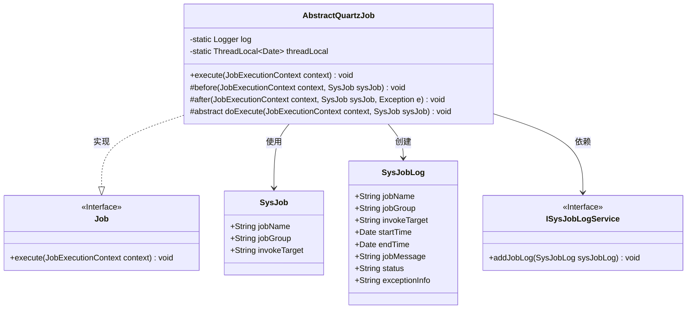
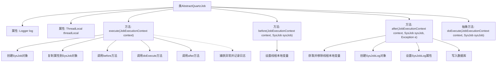

# 基础信息

|      |      |
|------|------|
| 名称 | AbstractQuartzJob |
| 编码语言 | .java |
| 代码路径 | RuoYi-main/ruoyi-quartz/src/main/java/com/ruoyi/quartz/util/AbstractQuartzJob.java |
| 包名 | com.ruoyi.quartz.util |
| 依赖项 | ['java.util.Date', 'org.quartz.Job', 'org.quartz.JobExecutionContext', 'org.slf4j.Logger', 'org.slf4j.LoggerFactory', 'com.ruoyi.common.constant.Constants', 'com.ruoyi.common.constant.ScheduleConstants', 'com.ruoyi.common.utils.ExceptionUtil', 'com.ruoyi.common.utils.StringUtils', 'com.ruoyi.common.utils.bean.BeanUtils', 'com.ruoyi.common.utils.spring.SpringUtils', 'com.ruoyi.quartz.domain.SysJob', 'com.ruoyi.quartz.domain.SysJobLog', 'com.ruoyi.quartz.service.ISysJobLogService'] |
| 概述说明 | 抽象类实现Quartz任务，支持日志记录和异常处理。 |

# 说明

该抽象类实现了Quartz任务调度框架中的任务接口，主要用于定义任务的执行流程。在执行任务前后，该类会自动记录日志，方便追踪任务执行状态。同时，该类还集成了异常处理机制，能够在任务执行过程中捕获并处理异常，确保系统的稳定性和可靠性。通过这种方式，开发者可以专注于业务逻辑的实现，而无需重复编写日志记录和异常处理代码。

# 类列表 Class Summary

| 名称   | 类型  | 说明 |
|-------|------|-------------|
| AbstractQuartzJob | class | 抽象类实现Quartz任务，包含执行前后日志记录和异常处理。 |

## 类 AbstractQuartzJob

|      |      |
|------|------|
| 访问范围 | public abstract |
| 类型 | class |
| 名称 | AbstractQuartzJob |
| 说明 | 抽象类实现Quartz任务，包含执行前后日志记录和异常处理。 |

### UML类图

这段代码定义了一个抽象类 `AbstractQuartzJob`，它实现了 `Job` 接口，用于处理定时任务的执行。类中包含了任务执行前、执行后以及具体执行逻辑的抽象方法。`AbstractQuartzJob` 类通过线程本地变量 `threadLocal` 记录任务执行时间，并在任务执行后生成日志记录 `SysJobLog`，最后通过 `ISysJobLogService` 接口将日志写入数据库。

### 内部方法调用关系图

**描述：**  
`AbstractQuartzJob` 是一个抽象类，用于处理 Quartz 任务调度。它包含一个 `execute` 方法，该方法在执行任务前后分别调用 `before` 和 `after` 方法，并在执行过程中捕获异常。`before` 方法用于设置线程本地变量，`after` 方法用于记录任务执行日志并将其写入数据库。`doExecute` 是一个抽象方法，需要由子类实现具体的任务执行逻辑。

### 字段列表 Field List

| 名称  | 类型  | 说明 |
|-------|-------|------|
| log = LoggerFactory.getLogger(AbstractQuartzJob.class) | Logger | AbstractQuartzJob类中定义了一个静态的Logger对象。 |
| threadLocal = new ThreadLocal<>() | ThreadLocal<Date> | ThreadLocal用于线程局部变量存储Date对象。 |

### 方法列表 Method List

| 名称  | 类型  | 说明 |
|-------|-------|------|
| before | void | 在任务执行前，将当前日期存入线程局部变量。 |
| doExecute | void | 保护抽象方法doExecute，接受JobExecutionContext和SysJob参数，可能抛出异常。 |
| execute | void | 重写execute方法，执行任务前后处理异常。 |
| after | void | 方法记录任务执行日志，包括名称、组、目标、起止时间、耗时和状态，并写入数据库。 |

