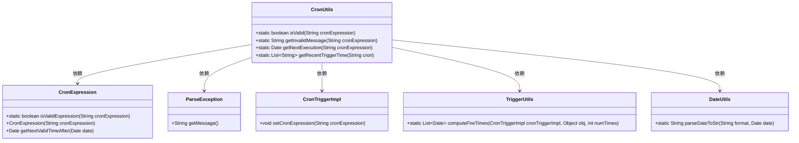

# 基础信息

|      |      |
|------|------|
| 名称 | CronUtils |
| 编码语言 | .java |
| 代码路径 | RuoYi-main/ruoyi-quartz/src/main/java/com/ruoyi/quartz/util/CronUtils.java |
| 包名 | com.ruoyi.quartz.util |
| 依赖项 | ['java.text.ParseException', 'java.util.ArrayList', 'java.util.Date', 'java.util.List', 'org.quartz.CronExpression', 'org.quartz.TriggerUtils', 'org.quartz.impl.triggers.CronTriggerImpl', 'com.ruoyi.common.utils.DateUtils'] |
| 概述说明 | CronUtils类支持Cron表达式验证、错误提示、下次及近10次执行时间查询。 |

# 说明

CronUtils类是一个功能强大的工具类，主要用于处理Cron表达式。它提供了验证Cron表达式是否合法的功能，能够检测并返回表达式中的错误信息。此外，该类还能计算并返回Cron表达式的下次执行时间，以及列出近10次的执行时间。这些功能使得CronUtils类在需要精确调度任务的场景中非常实用，帮助开发者确保Cron表达式的正确性，并准确预测任务的执行时间。

# 类列表 Class Summary

| 名称   | 类型  | 说明 |
|-------|------|-------------|
| CronUtils | class | CronUtils类提供验证Cron表达式、获取错误信息、下次执行时间及近10次执行时间的功能。 |

## 类 CronUtils

|      |      |
|------|------|
| 访问范围 | public |
| 类型 | class |
| 名称 | CronUtils |
| 说明 | CronUtils类提供验证Cron表达式、获取错误信息、下次执行时间及近10次执行时间的功能。 |

### UML类图

**描述**：`CronUtils` 类提供了四个静态方法，用于验证和操作Cron表达式。`isValid` 方法验证Cron表达式的有效性，`getInvalidMessage` 方法返回无效表达式的错误信息，`getNextExecution` 方法返回下一个执行时间，`getRecentTriggerTime` 方法返回近10次的执行时间。这些方法依赖于 `CronExpression`、`ParseException`、`CronTriggerImpl`、`TriggerUtils` 和 `DateUtils` 类来实现其功能。

### 内部方法调用关系图

这段代码定义了一个名为 `CronUtils` 的类，主要用于处理和验证Cron表达式。类中包含四个方法：`isValid` 用于验证Cron表达式的有效性；`getInvalidMessage` 返回无效Cron表达式的错误信息；`getNextExecution` 返回Cron表达式的下一次执行时间；`getRecentTriggerTime` 返回Cron表达式近10次的执行时间。每个方法都调用了不同的内部方法或类来完成其功能，流程图清晰地展示了这些调用关系。

### 字段列表 Field List

| 名称  | 类型  | 说明 |
|-------|-------|------|

### 方法列表 Method List

| 名称  | 类型  | 说明 |
|-------|-------|------|
| isValid | boolean | 静态方法isValid验证cron表达式是否有效。 |
| getNextExecution | Date | 根据Cron表达式获取下一次执行时间。 |
| getInvalidMessage | String | 该方法验证cron表达式有效性，无效时返回错误信息。 |
| getRecentTriggerTime | List<String> | 根据Cron表达式获取最近10次触发时间并返回格式化字符串列表。 |

