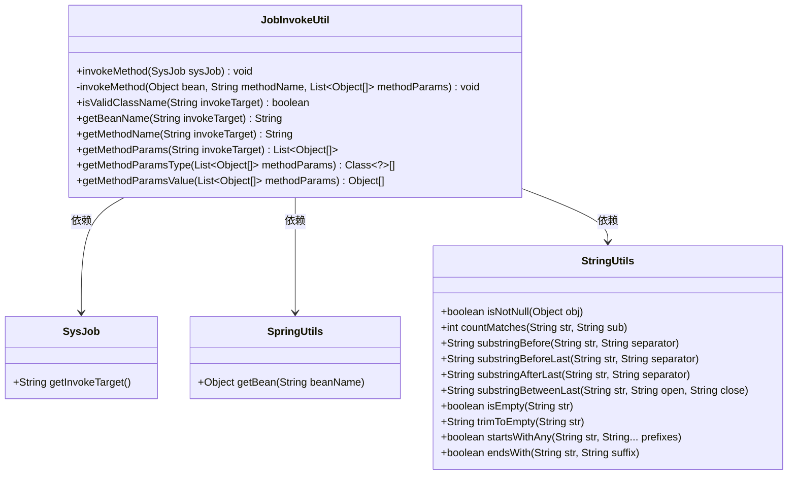
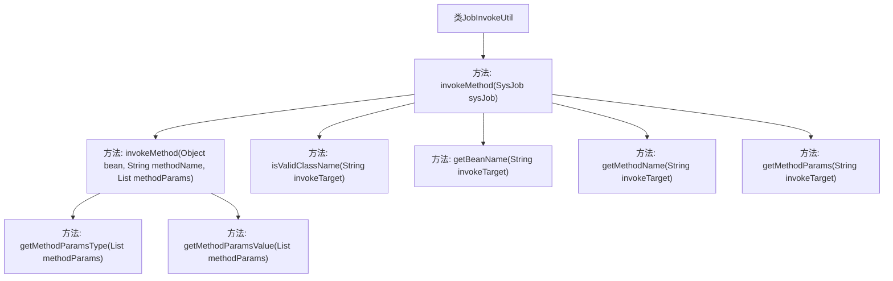

# 基础信息

|      |      |
|------|------|
| 名称 | JobInvokeUtil |
| 编码语言 | .java |
| 代码路径 | RuoYi-main/ruoyi-quartz/src/main/java/com/ruoyi/quartz/util/JobInvokeUtil.java |
| 包名 | com.ruoyi.quartz.util |
| 依赖项 | ['java.lang.reflect.InvocationTargetException', 'java.lang.reflect.Method', 'java.util.LinkedList', 'java.util.List', 'com.ruoyi.common.utils.StringUtils', 'com.ruoyi.common.utils.spring.SpringUtils', 'com.ruoyi.quartz.domain.SysJob'] |
| 概述说明 | JobInvokeUtil类解析字符串，调用指定Bean方法并处理参数。 |

# 说明

JobInvokeUtil类的主要功能是执行系统任务，它通过解析目标字符串来获取Bean和方法名，然后调用相应的方法并处理参数。该类在系统中扮演着关键角色，确保任务能够准确地被执行和参数得到适当的处理。

# 类列表 Class Summary

| 名称   | 类型  | 说明 |
|-------|------|-------------|
| JobInvokeUtil | class | JobInvokeUtil类用于执行系统任务，通过解析目标字符串获取Bean和方法名，调用对应方法并处理参数。 |

## 类 JobInvokeUtil

|      |      |
|------|------|
| 访问范围 | public |
| 类型 | class |
| 名称 | JobInvokeUtil |
| 说明 | JobInvokeUtil类用于执行系统任务，通过解析目标字符串获取Bean和方法名，调用对应方法并处理参数。 |

### UML类图

这段代码描述了一个名为 `JobInvokeUtil` 的工具类，用于执行系统任务中的方法。`JobInvokeUtil` 通过解析 `SysJob` 对象中的目标字符串，获取 Bean 名称、方法名称和参数列表，并根据参数类型调用相应的方法。`SpringUtils` 用于获取 Bean 实例，`StringUtils` 提供了字符串处理功能。整个过程涉及字符串解析、Bean 实例化、方法调用等多个步骤，确保任务能够正确执行。

### 内部方法调用关系图

这段代码定义了一个`JobInvokeUtil`类，主要用于动态调用系统中的任务方法。`invokeMethod(SysJob sysJob)`是主方法，它从`SysJob`对象中提取目标方法的相关信息，并根据这些信息调用相应的方法。其他辅助方法如`getBeanName`、`getMethodName`、`getMethodParams`等用于解析目标方法的名称、参数类型和参数值。`isValidClassName`方法用于校验目标类名是否为合法的类包名。整体流程通过解析目标方法信息并动态调用，实现了任务的灵活执行。

### 字段列表 Field List

| 名称  | 类型  | 说明 |
|-------|-------|------|

### 方法列表 Method List

| 名称  | 类型  | 说明 |
|-------|-------|------|
| getBeanName | String | 提取方法名前的类名作为Bean名称。 |
| getMethodParamsType | Class<?>[] | 获取方法参数类型列表的静态函数。 |
| getMethodParamsValue | Object[] | 提取方法参数值并返回对象数组。 |
| getMethodName | String | 提取方法名，去除括号和类名前缀。 |
| isValidClassName | boolean | 该方法检查字符串中的点号数量是否大于1，以验证类名是否有效。 |
| invokeMethod | void | 通过bean名称和方法名称调用指定方法，支持Spring容器和类实例化。 |
| invokeMethod | void | 通过反射调用指定对象的指定方法，支持带参数和无参数调用。 |
| getMethodParams | List<Object[]> | 提取方法参数并分类为字符串、布尔、长整、浮点和整型。 |

