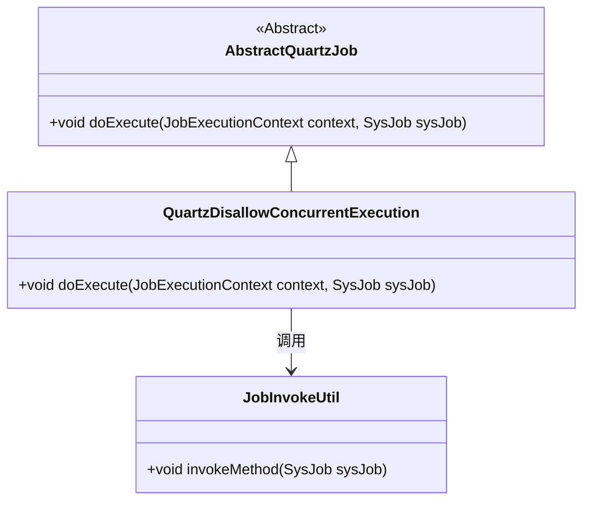
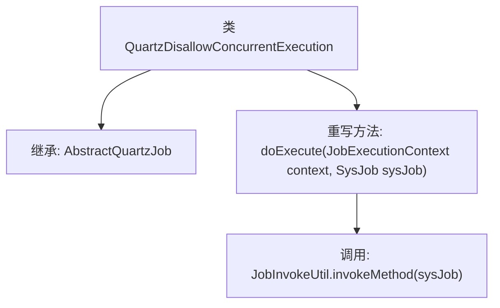

# 基础信息

|      |      |
|------|------|
| 名称 | QuartzDisallowConcurrentExecution |
| 编码语言 | .java |
| 代码路径 | RuoYi-main/ruoyi-quartz/src/main/java/com/ruoyi/quartz/util/QuartzDisallowConcurrentExecution.java |
| 包名 | com.ruoyi.quartz.util |
| 依赖项 | ['org.quartz.DisallowConcurrentExecution', 'org.quartz.JobExecutionContext', 'com.ruoyi.quartz.domain.SysJob'] |
| 概述说明 | Quartz任务类禁止并发，仅执行指定方法。 |

# 说明

Quartz任务类被配置为禁止并发执行，确保在同一时间只有一个任务实例在运行。该任务类通过调用指定的方法来实现其功能，避免多个任务同时执行可能导致的数据竞争或资源冲突。这种设置适用于需要严格顺序执行或对共享资源有独占访问需求的场景，以保证任务的正确性和一致性。

# 类列表 Class Summary

| 名称   | 类型  | 说明 |
|-------|------|-------------|
| QuartzDisallowConcurrentExecution | class | Quartz任务类禁止并发执行，调用指定方法。 |

## 类 QuartzDisallowConcurrentExecution

|      |      |
|------|------|
| 访问范围 | @DisallowConcurrentExecution;public |
| 类型 | class |
| 名称 | QuartzDisallowConcurrentExecution |
| 说明 | Quartz任务类禁止并发执行，调用指定方法。 |

### UML类图

### 描述
`QuartzDisallowConcurrentExecution` 类继承自 `AbstractQuartzJob` 抽象类，并重写了 `doExecute` 方法。在 `doExecute` 方法中，它通过 `JobInvokeUtil` 类的 `invokeMethod` 方法来执行任务。`AbstractQuartzJob` 是一个抽象类，定义了任务执行的基本结构，而 `QuartzDisallowConcurrentExecution` 是其具体实现，用于处理不允许并发执行的任务。

### 内部方法调用关系图

这段代码定义了一个名为`QuartzDisallowConcurrentExecution`的类，该类继承自`AbstractQuartzJob`。它重写了父类的`doExecute`方法，并在该方法中调用了`JobInvokeUtil.invokeMethod`来执行具体的任务。该类的设计目的是确保在执行任务时不会并发执行，通过`@DisallowConcurrentExecution`注解来实现这一功能。

### 字段列表 Field List

| 名称  | 类型  | 说明 |
|-------|-------|------|

### 方法列表 Method List

| 名称  | 类型  | 说明 |
|-------|-------|------|
| doExecute | void | 重写doExecute方法，调用JobInvokeUtil.invokeMethod执行任务。 |

