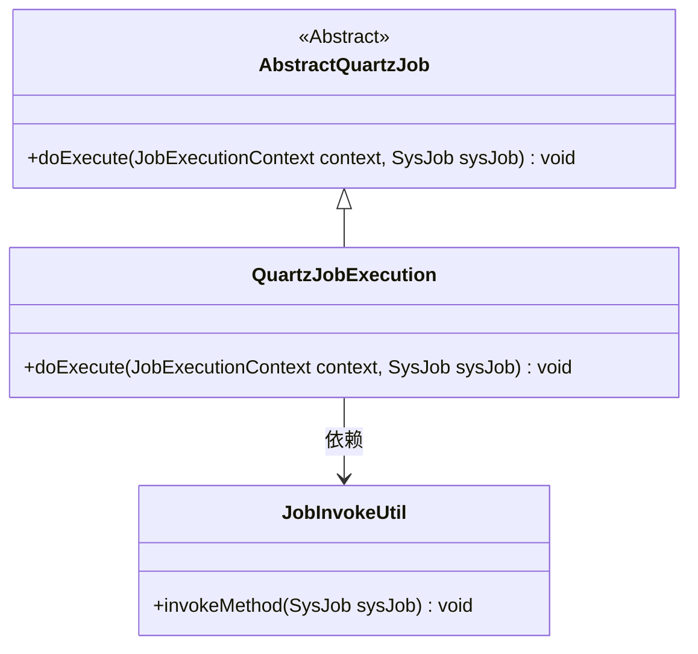
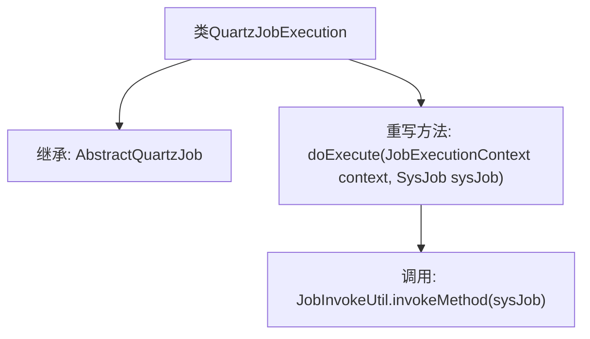

# 基础信息

|      |      |
|------|------|
| 名称 | QuartzJobExecution |
| 编码语言 | .java |
| 代码路径 | RuoYi-main/ruoyi-quartz/src/main/java/com/ruoyi/quartz/util/QuartzJobExecution.java |
| 包名 | com.ruoyi.quartz.util |
| 依赖项 | ['org.quartz.JobExecutionContext', 'com.ruoyi.quartz.domain.SysJob'] |
| 概述说明 | QuartzJobExecution继承AbstractQuartzJob，重写doExecute调用JobInvokeUtil.invokeMethod。 |

# 说明

QuartzJobExecution类继承自AbstractQuartzJob，并在其中重写了doExecute方法。该方法的主要功能是调用JobInvokeUtil.invokeMethod，用于执行具体的任务逻辑。通过这种方式，QuartzJobExecution类实现了对任务的调度和执行，确保了任务能够按照预定的时间或条件被触发并执行。

# 类列表 Class Summary

| 名称   | 类型  | 说明 |
|-------|------|-------------|
| QuartzJobExecution | class | QuartzJobExecution类继承AbstractQuartzJob，重写doExecute方法调用JobInvokeUtil.invokeMethod。 |

## 类 QuartzJobExecution

|      |      |
|------|------|
| 访问范围 | public |
| 类型 | class |
| 名称 | QuartzJobExecution |
| 说明 | QuartzJobExecution类继承AbstractQuartzJob，重写doExecute方法调用JobInvokeUtil.invokeMethod。 |

### UML类图

这段代码定义了一个`QuartzJobExecution`类，它继承自`AbstractQuartzJob`类。`QuartzJobExecution`类重写了`doExecute`方法，并在该方法中调用了`JobInvokeUtil`类的`invokeMethod`方法来执行任务。`AbstractQuartzJob`是一个抽象类，`QuartzJobExecution`是其具体实现类。`JobInvokeUtil`类提供了执行任务的具体方法。

### 内部方法调用关系图

这段代码定义了一个名为 `QuartzJobExecution` 的类，该类继承自 `AbstractQuartzJob`。在 `QuartzJobExecution` 类中，重写了 `doExecute` 方法，该方法接收 `JobExecutionContext` 和 `SysJob` 两个参数，并在方法内部调用了 `JobInvokeUtil.invokeMethod(sysJob)` 来执行任务。这段代码的主要作用是实现一个具体的任务执行逻辑，通过调用 `JobInvokeUtil` 中的方法来执行传入的任务。

### 字段列表 Field List

| 名称  | 类型  | 说明 |
|-------|-------|------|

### 方法列表 Method List

| 名称  | 类型  | 说明 |
|-------|-------|------|
| doExecute | void | 重写doExecute方法，调用JobInvokeUtil.invokeMethod执行任务。 |

