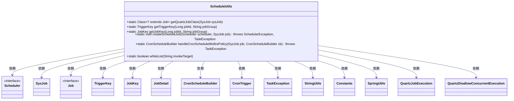
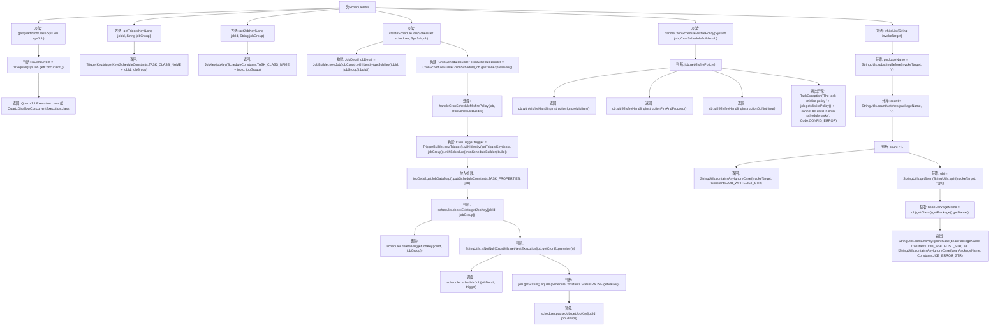

# 基础信息

|      |      |
|------|------|
| 名称 | ScheduleUtils |
| 编码语言 | .java |
| 代码路径 | RuoYi-main/ruoyi-quartz/src/main/java/com/ruoyi/quartz/util/ScheduleUtils.java |
| 包名 | com.ruoyi.quartz.util |
| 依赖项 | ['org.quartz.CronScheduleBuilder', 'org.quartz.CronTrigger', 'org.quartz.Job', 'org.quartz.JobBuilder', 'org.quartz.JobDetail', 'org.quartz.JobKey', 'org.quartz.Scheduler', 'org.quartz.SchedulerException', 'org.quartz.TriggerBuilder', 'org.quartz.TriggerKey', 'com.ruoyi.common.constant.Constants', 'com.ruoyi.common.constant.ScheduleConstants', 'com.ruoyi.common.exception.job.TaskException', 'com.ruoyi.common.exception.job.TaskException.Code', 'com.ruoyi.common.utils.StringUtils', 'com.ruoyi.common.utils.spring.SpringUtils', 'com.ruoyi.quartz.domain.SysJob'] |
| 概述说明 | ScheduleUtils类实现Quartz任务管理，涵盖任务创建、触发策略及白名单检查。 |

# 说明

ScheduleUtils类是一个提供Quartz任务管理功能的工具类，主要包含任务创建、触发策略配置以及白名单检查等核心功能。通过该类，用户可以高效地创建和管理Quartz任务，灵活设置任务的触发策略，并确保任务执行前通过白名单检查，从而提升任务管理的安全性和可靠性。

# 类列表 Class Summary

| 名称   | 类型  | 说明 |
|-------|------|-------------|
| ScheduleUtils | class | ScheduleUtils类提供Quartz任务管理功能，包括任务创建、触发策略及白名单检查。 |

## 类 ScheduleUtils

|      |      |
|------|------|
| 访问范围 | public |
| 类型 | class |
| 名称 | ScheduleUtils |
| 说明 | ScheduleUtils类提供Quartz任务管理功能，包括任务创建、触发策略及白名单检查。 |

### UML类图

这段代码定义了一个`ScheduleUtils`工具类，用于处理与Quartz调度相关的任务。它包含了获取Quartz任务类、构建任务触发对象、创建定时任务、处理定时任务策略以及检查包名是否为白名单配置等方法。`ScheduleUtils`类依赖于多个其他类，如`Scheduler`、`SysJob`、`Job`、`TriggerKey`、`JobKey`等，以实现其功能。通过这些方法，可以方便地管理和调度定时任务，并确保任务的正确执行。

### 内部方法调用关系图

这段代码是一个用于管理定时任务的工具类 `ScheduleUtils`，主要功能包括获取任务类、构建任务触发对象、创建定时任务、处理任务策略以及检查包名是否在白名单中。代码通过多个方法实现了定时任务的创建、调度、暂停和策略处理，并且提供了白名单检查功能以确保任务的安全性。

### 字段列表 Field List

| 名称  | 类型  | 说明 |
|-------|-------|------|

### 方法列表 Method List

| 名称  | 类型  | 说明 |
|-------|-------|------|
| handleCronScheduleMisfirePolicy | CronScheduleBuilder | 根据任务策略处理Cron调度器的未触发行为。 |
| getJobKey | JobKey | 根据jobId和jobGroup生成JobKey对象。 |
| getQuartzJobClass | Class<? extends Job> | 根据任务并发性返回相应的Quartz作业类。 |
| createScheduleJob | void | 创建调度任务，检查存在性，处理过期，执行或暂停任务。 |
| whiteList | boolean | 检查调用目标是否在白名单中，通过包名和常量匹配进行验证。 |
| getTriggerKey | TriggerKey | 静态方法返回基于任务ID和组名的触发器键。 |

