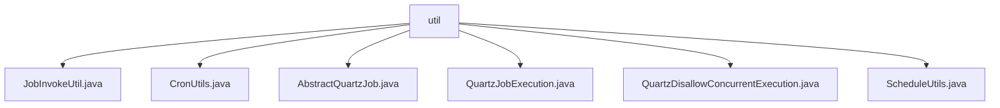

# 基础信息

|      |      |
|------|------|
| 名称 | util |
| 编码语言 | .java |
| 代码路径 | RuoYi-main/ruoyi-quartz/src/main/java/com/ruoyi/quartz/util |
| 包名 | RuoYi-main.ruoyi-quartz.src.main.java.com.ruoyi.quartz.util |
| 概述说明 | JobInvokeUtil执行系统任务，CronUtils处理Cron表达式，AbstractQuartzJob定义任务流程，QuartzJobExecution调度任务，QuartzDisallowConcurrentExecution禁止并发，ScheduleUtils管理任务。 |

# 说明

## 概述
该代码模块主要围绕Quartz任务调度框架的实现和扩展，提供了任务执行、Cron表达式处理、任务管理、日志记录、异常处理等功能。模块通过多个工具类和抽象类，确保任务能够准确、安全地调度和执行，同时提供了对Cron表达式的验证和时间计算功能，帮助开发者更好地管理和监控任务。

## 主要业务场景
1. **任务执行**：`JobInvokeUtil`类负责解析目标字符串并调用相应的方法，确保任务能够准确地被执行。`QuartzJobExecution`类继承自`AbstractQuartzJob`，并通过`JobInvokeUtil`执行具体的任务逻辑。
2. **Cron表达式处理**：`CronUtils`类提供了Cron表达式的验证、下次执行时间的计算以及近10次执行时间的列举功能，确保任务调度的准确性和可预测性。
3. **任务管理**：`ScheduleUtils`类提供了任务创建、触发策略配置以及白名单检查等功能，帮助用户高效地创建和管理Quartz任务，确保任务执行的安全性和可靠性。
4. **日志记录与异常处理**：`AbstractQuartzJob`抽象类在执行任务前后自动记录日志，并集成了异常处理机制，确保系统的稳定性和可追踪性。
5. **任务并发控制**：`QuartzDisallowConcurrentExecution`类通过配置禁止任务并发执行，确保在同一时间只有一个任务实例在运行，避免数据竞争或资源冲突。

### 包内部结构视图

该流程图展示了`util`文件夹下的文件层级关系。`util`作为根节点，包含了六个文件：`JobInvokeUtil.java`、`CronUtils.java`、`AbstractQuartzJob.java`、`QuartzJobExecution.java`、`QuartzDisallowConcurrentExecution.java`和`ScheduleUtils.java`。这些文件都属于`util`文件夹，且没有进一步的子文件夹结构。

# 文件列表 File List

| 名称   | 类型  | 说明 |
|-------|------|-------------|
| [QuartzJobExecution.java](QuartzJobExecution.md) | file | QuartzJobExecution继承AbstractQuartzJob，重写doExecute调用JobInvokeUtil.invokeMethod。 |
| [JobInvokeUtil.java](JobInvokeUtil.md) | file | JobInvokeUtil类解析字符串，调用指定Bean方法并处理参数。 |
| [ScheduleUtils.java](ScheduleUtils.md) | file | ScheduleUtils类实现Quartz任务管理，涵盖任务创建、触发策略及白名单检查。 |
| [QuartzDisallowConcurrentExecution.java](QuartzDisallowConcurrentExecution.md) | file | Quartz任务类禁止并发，仅执行指定方法。 |
| [AbstractQuartzJob.java](AbstractQuartzJob.md) | file | 抽象类实现Quartz任务，支持日志记录和异常处理。 |
| [CronUtils.java](CronUtils.md) | file | CronUtils类支持Cron表达式验证、错误提示、下次及近10次执行时间查询。 |

