# 基础信息

|      |      |
|------|------|
| 名称 | system |
| 编码语言 | .java |
| 代码路径 | RuoYi-main/ruoyi-system/src/main/java/com/ruoyi/system |
| 包名 | RuoYi-main.ruoyi-system.src.main.java.com.ruoyi.system |
| 概述说明 | 该模块涵盖用户、角色、部门等核心功能，支持增删改查、权限校验及日志管理，确保系统高效稳定运行。 |

# 说明

## 概述

该代码模块是 RuoYi 框架中的 `ruoyi-system` 模块，是一个综合性的系统管理模块，涵盖了用户、角色、岗位、部门、菜单、字典、配置、日志等多个核心功能的管理。模块通过服务类、数据访问层（Mapper）和领域模型类的实现，提供了全面的数据管理和操作功能，确保系统的高效运行和数据的一致性。模块的设计注重功能的完整性和扩展性，支持对各类系统数据的增删改查操作，并通过缓存管理和权限校验等机制，提升了系统的性能和安全性。

## 主要业务场景

1. **用户管理**：
   - 用户信息的查询、新增、修改、删除、授权、重置密码等操作。
   - 用户与岗位、角色的关联管理，确保用户数据的安全性和完整性。

2. **角色管理**：
   - 角色的查询、新增、修改、删除以及权限校验功能。
   - 角色与部门、菜单的关联管理，支持用户角色分配和权限管理。

3. **岗位管理**：
   - 岗位的查询、新增、修改、删除及校验。
   - 管理用户与岗位的关联关系。

4. **部门管理**：
   - 部门信息的查询、新增、修改和删除。
   - 维护部门数据的准确性和一致性。

5. **菜单管理**：
   - 菜单查询、权限管理及树结构转换功能。
   - 支持前端菜单展示和操作。

6. **字典管理**：
   - 字典数据和字典类型的查询、新增、修改、删除及缓存管理。
   - 确保字典数据的高效访问和维护。

7. **配置管理**：
   - 系统参数的查询、新增、修改、删除及缓存管理。
   - 提升系统配置的维护效率。

8. **日志管理**：
   - **操作日志**：记录系统的操作日志，支持增删改查及清空操作，确保操作的可追溯性。
   - **登录日志**：管理用户登录日志，支持增删查清功能，便于跟踪用户登录行为。

9. **公告管理**：
   - 公告的查询、新增、修改和删除功能。
   - 确保公告信息的及时更新和维护。

10. **在线用户管理**：
    - 管理在线用户会话，支持查询、删除、保存及缓存清理功能。
    - 确保在线用户数据的准确性。

通过这些功能，该模块为系统提供了全面的管理支持，涵盖了从用户、角色到日志、配置等多个方面的核心业务需求，确保系统的稳定性、安全性和可维护性。

### 包内部结构视图

```mermaid
graph TD
    system --> service
    system --> domain
    system --> mapper
    service --> ISysPostService.java
    service --> ISysDictDataService.java
    service --> ISysConfigService.java
    service --> ISysRoleService.java
    service --> ISysOperLogService.java
    service --> ISysDeptService.java
    service --> ISysLogininforService.java
    service --> ISysNoticeService.java
    service --> ISysMenuService.java
    service --> ISysUserOnlineService.java
    service --> ISysDictTypeService.java
    service --> ISysUserService.java
    service --> impl
    impl --> SysOperLogServiceImpl.java
    impl --> SysUserServiceImpl.java
    impl --> SysConfigServiceImpl.java
    impl --> SysPostServiceImpl.java
    impl --> SysRoleServiceImpl.java
    impl --> SysLogininforServiceImpl.java
    impl --> SysDictDataServiceImpl.java
    impl --> SysNoticeServiceImpl.java
    impl --> SysDeptServiceImpl.java
    impl --> SysUserOnlineServiceImpl.java
    impl --> SysDictTypeServiceImpl.java
    impl --> SysMenuServiceImpl.java
    domain --> SysLogininfor.java
    domain --> SysConfig.java
    domain --> SysUserPost.java
    domain --> SysOperLog.java
    domain --> SysRoleMenu.java
    domain --> SysRoleDept.java
    domain --> SysPost.java
    domain --> SysNotice.java
    domain --> SysUserOnline.java
    domain --> SysUserRole.java
    mapper --> SysPostMapper.java
    mapper --> SysUserPostMapper.java
    mapper --> SysUserRoleMapper.java
    mapper --> SysDictTypeMapper.java
    mapper --> SysUserMapper.java
    mapper --> SysOperLogMapper.java
    mapper --> SysRoleDeptMapper.java
    mapper --> SysNoticeMapper.java
    mapper --> SysConfigMapper.java
    mapper --> SysRoleMapper.java
    mapper --> SysUserOnlineMapper.java
    mapper --> SysDeptMapper.java
    mapper --> SysDictDataMapper.java
    mapper --> SysLogininforMapper.java
    mapper --> SysRoleMenuMapper.java
    mapper --> SysMenuMapper.java
```

该流程图展示了RuoYi系统中`system`模块的目录结构，主要分为`service`、`domain`和`mapper`三个主要部分。`service`部分包含多个接口及其实现类，`domain`部分包含各种实体类，`mapper`部分则包含与数据库操作相关的映射类。

# 文件列表 File List

| 名称   | 类型  | 说明 |
|-------|------|-------------|
| [mapper](mapper/_module.md) | package | 内容为空，无法总结。请提供具体信息。 |
| [domain](domain/_module.md) | package | SysLogininfor记录登录信息，SysConfig管理配置，SysUserPost关联用户岗位，SysOperLog记录操作日志，SysRoleMenu管理角色菜单，SysRoleDept关联角色部门，SysPost管理岗位，SysNotice管理公告，SysUserOnline管理在线用户，SysUserRole关联用户角色。 |
| [service](service/_module.md) | package | 内容为空，无法生成总结描述。请提供具体信息。 |

