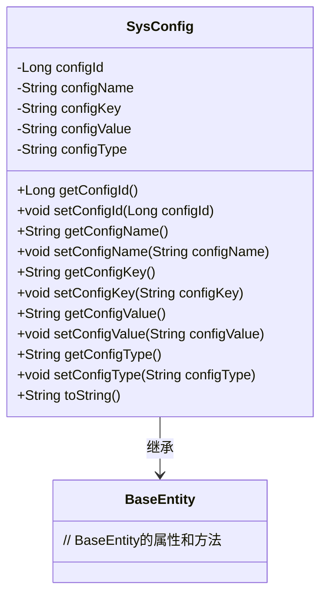

# 基础信息

|      |      |
|------|------|
| 名称 | SysConfig |
| 编码语言 | .java |
| 代码路径 | RuoYi-main/ruoyi-system/src/main/java/com/ruoyi/system/domain/SysConfig.java |
| 包名 | com.ruoyi.system.domain |
| 依赖项 | ['javax.validation.constraints', 'org.apache.commons.lang3.builder.ToStringBuilder', 'org.apache.commons.lang3.builder.ToStringStyle', 'com.ruoyi.common.annotation.Excel', 'com.ruoyi.common.annotation.Excel.ColumnType', 'com.ruoyi.common.core.domain.BaseEntity'] |
| 概述说明 | SysConfig继承BaseEntity，含配置ID、名称、键名、键值及系统内置类型属性，提供getter和setter方法。 |

# 说明

SysConfig类继承自BaseEntity，包含了配置ID、名称、键名、键值和系统内置类型等多个属性。该类提供了对这些属性的getter和setter方法，以便于获取和设置各个属性的值。这些属性用于存储和管理系统配置的相关信息，确保配置数据的完整性和可访问性。

# 类列表 Class Summary

| 名称   | 类型  | 说明 |
|-------|------|-------------|
| SysConfig | class | SysConfig类继承BaseEntity，包含配置ID、名称、键名、键值和系统内置类型等属性，并提供相关getter和setter方法。 |

## 类 SysConfig

|      |      |
|------|------|
| 访问范围 | public |
| 类型 | class |
| 名称 | SysConfig |
| 说明 | SysConfig类继承BaseEntity，包含配置ID、名称、键名、键值和系统内置类型等属性，并提供相关getter和setter方法。 |

### UML类图

这段代码定义了一个`SysConfig`类，该类继承自`BaseEntity`。`SysConfig`类包含多个私有属性，如`configId`、`configName`、`configKey`、`configValue`和`configType`，并提供了相应的getter和setter方法。`toString`方法用于返回对象的字符串表示，包含了所有属性的值。`SysConfig`类通过继承`BaseEntity`，可能继承了其基础属性和方法。

### 内部方法调用关系图

```mermaid
graph TD
    A["类SysConfig"]
    B["属性: Long configId"]
    C["属性: String configName"]
    D["属性: String configKey"]
    E["属性: String configValue"]
    F["属性: String configType"]
    G["方法: Long getConfigId()"]
    H["方法: void setConfigId(Long configId)"]
    I["方法: String getConfigName()"]
    J["方法: void setConfigName(String configName)"]
    K["方法: String getConfigKey()"]
    L["方法: void setConfigKey(String configKey)"]
    M["方法: String getConfigValue()"]
    N["方法: void setConfigValue(String configValue)"]
    O["方法: String getConfigType()"]
    P["方法: void setConfigType(String configType)"]
    Q["重写方法: String toString()"]

    A --> B
    A --> C
    A --> D
    A --> E
    A --> F
    A --> G
    A --> H
    A --> I
    A --> J
    A --> K
    A --> L
    A --> M
    A --> N
    A --> O
    A --> P
    A --> Q
```

这段代码定义了一个名为 `SysConfig` 的类，继承自 `BaseEntity`。该类包含多个属性，如 `configId`、`configName`、`configKey`、`configValue` 和 `configType`，并为每个属性提供了相应的 `getter` 和 `setter` 方法。`toString` 方法被重写，用于返回对象的字符串表示形式。代码还使用了注解来对属性的输入进行验证，确保数据的合法性和完整性。

### 字段列表 Field List

| 名称  | 类型  | 说明 |
|-------|-------|------|
| configKey | String | Excel配置键名字段为configKey。 |
| configValue | String | Excel参数键值配置字段。 |
| serialVersionUID = 1L | long | 定义序列化版本号的静态常量，值为1L。 |
| configId | Long | Excel中参数主键为数值类型的配置ID。 |
| configType | String | Excel配置类型字段，内置系统标识，Y表示是，N表示否。 |
| configName | String | Excel注解用于定义参数名称的配置项。 |

### 方法列表 Method List

| 名称  | 类型  | 说明 |
|-------|-------|------|
| setConfigName | void | 设置配置名称的方法。 |
| getConfigType | String | 该方法返回配置类型字符串。 |
| setConfigType | void | 设置配置类型的Java方法。 |
| setConfigKey | void | 设置配置键的公共方法。 |
| getConfigValue | String | 检查参数键值非空且长度不超过500字符。 |
| setConfigId | void | 方法setConfigId用于设置configId属性的值。 |
| toString | String | 重写toString方法，返回包含配置信息的多行字符串。 |
| setConfigValue | void | 该方法用于设置配置值，将传入的configValue赋值给类的成员变量。 |
| getConfigKey | String | 参数键名长度不能为空且不超过100字符。 |
| getConfigName | String | 方法返回配置名称，参数不能为空且长度不超过100字符。 |
| getConfigId | Long | 获取配置ID的方法，返回configId值。 |

