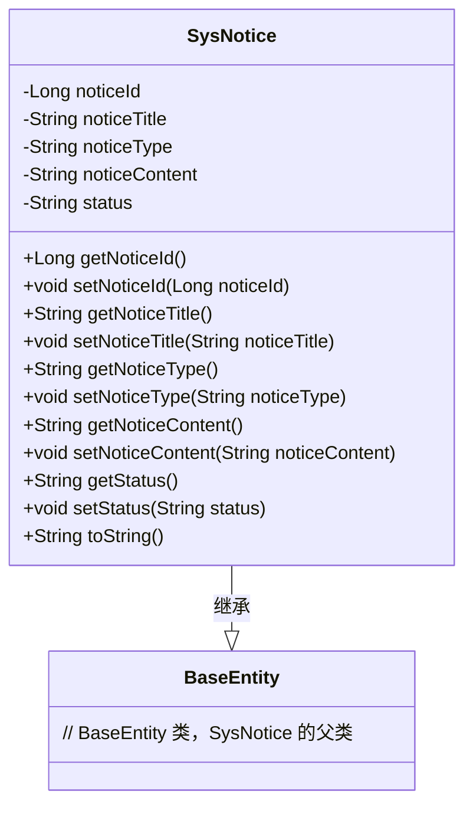

# 基础信息

|      |      |
|------|------|
| 名称 | SysNotice |
| 编码语言 | .java |
| 代码路径 | RuoYi-main/ruoyi-system/src/main/java/com/ruoyi/system/domain/SysNotice.java |
| 包名 | com.ruoyi.system.domain |
| 依赖项 | ['javax.validation.constraints.NotBlank', 'javax.validation.constraints.Size', 'org.apache.commons.lang3.builder.ToStringBuilder', 'org.apache.commons.lang3.builder.ToStringStyle', 'com.ruoyi.common.core.domain.BaseEntity', 'com.ruoyi.common.xss.Xss'] |
| 概述说明 | SysNotice类含公告ID、标题、类型、内容和状态，提供getter、setter及toString方法。 |

# 说明

SysNotice类是一个用于管理公告信息的类，包含五个主要属性：公告ID、标题、类型、内容和状态。该类提供了获取和设置这些属性的getter和setter方法，方便对公告信息进行读取和修改。此外，SysNotice类还重写了toString方法，用于返回对象的字符串表示，便于调试和日志记录。

# 类列表 Class Summary

| 名称   | 类型  | 说明 |
|-------|------|-------------|
| SysNotice | class | SysNotice类包含公告ID、标题、类型、内容和状态，提供getter和setter方法，并重写toString方法。 |

## 类 SysNotice

|      |      |
|------|------|
| 访问范围 | public |
| 类型 | class |
| 名称 | SysNotice |
| 说明 | SysNotice类包含公告ID、标题、类型、内容和状态，提供getter和setter方法，并重写toString方法。 |

### UML类图

### 描述
`SysNotice` 类继承自 `BaseEntity`，用于表示系统公告的实体。它包含公告的ID、标题、类型、内容和状态等属性，并提供了相应的 getter 和 setter 方法。`toString` 方法用于将对象转换为字符串表示，包含所有属性的信息。`SysNotice` 类通过继承 `BaseEntity` 获得了基础的实体属性，如创建时间、更新时间等。

### 内部方法调用关系图

```mermaid
graph TD
    A["类SysNotice"]
    B["属性: Long noticeId"]
    C["属性: String noticeTitle"]
    D["属性: String noticeType"]
    E["属性: String noticeContent"]
    F["属性: String status"]
    G["方法: Long getNoticeId()"]
    H["方法: void setNoticeId(Long noticeId)"]
    I["方法: String getNoticeTitle()"]
    J["方法: void setNoticeTitle(String noticeTitle)"]
    K["方法: String getNoticeType()"]
    L["方法: void setNoticeType(String noticeType)"]
    M["方法: String getNoticeContent()"]
    N["方法: void setNoticeContent(String noticeContent)"]
    O["方法: String getStatus()"]
    P["方法: void setStatus(String status)"]
    Q["重写方法: String toString()"]

    A --> B
    A --> C
    A --> D
    A --> E
    A --> F
    A --> G
    A --> H
    A --> I
    A --> J
    A --> K
    A --> L
    A --> M
    A --> N
    A --> O
    A --> P
    A --> Q
```

这段代码定义了一个名为`SysNotice`的类，继承自`BaseEntity`。类中包含多个属性，如`noticeId`、`noticeTitle`、`noticeType`、`noticeContent`和`status`，并提供了相应的getter和setter方法。`getNoticeTitle`方法还包含了注解，用于验证公告标题的合法性。`toString`方法重写了父类的方法，用于返回对象的字符串表示，包含所有属性的值。流程图展示了类中各个属性与方法之间的调用关系。

### 字段列表 Field List

| 名称  | 类型  | 说明 |
|-------|-------|------|
| serialVersionUID = 1L | long | 声明序列化版本号，确保对象序列化兼容性。 |
| noticeId | Long | 定义了一个长整型的通知ID变量。 |
| noticeTitle | String | 私有字符串变量，用于存储通知标题。 |
| noticeContent | String | 私有字符串变量用于存储通知内容。 |
| status | String | 定义了一个私有字符串变量status。 |
| noticeType | String | 定义了一个私有字符串变量noticeType。 |

### 方法列表 Method List

| 名称  | 类型  | 说明 |
|-------|-------|------|
| getNoticeContent | String | 该方法返回通知内容。 |
| setNoticeContent | void | 设置通知内容的方法。 |
| getStatus | String | 方法getStatus返回字符串status的值。 |
| getNoticeType | String | 获取通知类型的方法。 |
| setNoticeTitle | void | 设置公告标题的方法，参数为noticeTitle。 |
| getNoticeId | Long | 获取公告ID的方法，返回noticeId值。 |
| setNoticeType | void | 设置通知类型的方法，参数为noticeType。 |
| getNoticeTitle | String | 公告标题需非空，不含脚本字符，且不超过50个字符。 |
| setNoticeId | void | 设置通知ID的方法，参数为长整型noticeId。 |
| toString | String | 重写toString方法，多行显示通知对象的所有属性。 |
| setStatus | void | 方法设置对象状态属性。 |

