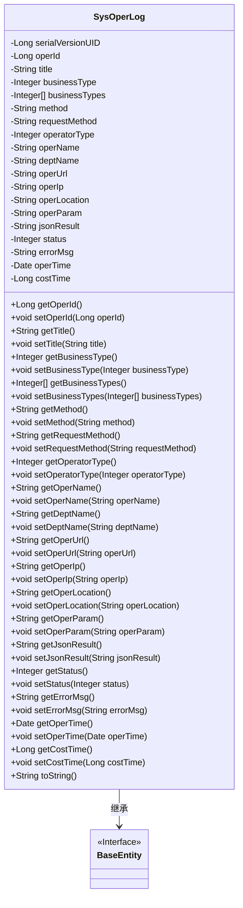

# 基础信息

|      |      |
|------|------|
| 名称 | SysOperLog |
| 编码语言 | .java |
| 代码路径 | RuoYi-main/ruoyi-system/src/main/java/com/ruoyi/system/domain/SysOperLog.java |
| 包名 | com.ruoyi.system.domain |
| 依赖项 | ['org.apache.commons.lang3.builder.ToStringBuilder', 'org.apache.commons.lang3.builder.ToStringStyle', 'java.util.Date', 'com.ruoyi.common.annotation.Excel', 'com.ruoyi.common.annotation.Excel.ColumnType', 'com.ruoyi.common.core.domain.BaseEntity'] |
| 概述说明 | SysOperLog类记录模块、业务类型、操作人员及请求参数等操作日志信息。 |

# 说明

SysOperLog类用于记录系统的操作日志，主要包含模块信息、业务类型、操作人员以及请求参数等关键数据。通过该类，可以详细追踪和记录系统操作的各个环节，便于后续的审计和分析。模块信息标识操作发生的具体功能模块，业务类型描述操作的性质，操作人员记录执行操作的用户，请求参数则保存操作过程中使用的具体数据。这些信息共同构成了完整的操作日志，为系统监控和问题排查提供了重要依据。

# 类列表 Class Summary

| 名称   | 类型  | 说明 |
|-------|------|-------------|
| SysOperLog | class | SysOperLog类记录操作日志，包含模块、业务类型、操作人员、请求参数等信息。 |

## 类 SysOperLog

|      |      |
|------|------|
| 访问范围 | public |
| 类型 | class |
| 名称 | SysOperLog |
| 说明 | SysOperLog类记录操作日志，包含模块、业务类型、操作人员、请求参数等信息。 |

### UML类图

这段代码定义了一个名为 `SysOperLog` 的类，该类继承自 `BaseEntity` 接口。`SysOperLog` 类包含了多个私有属性，用于记录系统操作日志的详细信息，如操作序号、操作模块、业务类型、请求方法、操作人员、操作时间等。每个属性都有对应的 getter 和 setter 方法，用于访问和修改这些属性。`toString` 方法用于将对象转换为字符串表示形式，便于调试和日志记录。

### 内部方法调用关系图

这段代码定义了一个名为`SysOperLog`的类，该类继承自`BaseEntity`，用于记录系统操作日志。类中包含多个属性，如操作序号、操作模块、业务类型、请求方法等，并为每个属性提供了对应的`getter`和`setter`方法。`toString`方法被重写，用于返回对象的字符串表示，包含所有属性的值。该类的设计旨在通过`Excel`注解将日志数据导出为Excel文件，便于后续分析和处理。

### 字段列表 Field List

| 名称  | 类型  | 说明 |
|-------|-------|------|
| operName | String | 操作人员姓名字段定义。 |
| operParam | String | Excel请求参数为operParam。 |
| serialVersionUID = 1L | long | 定义序列化版本号为1L的私有静态常量。 |
| businessTypes | Integer[] | 定义私有整型数组变量businessTypes。 |
| requestMethod | String | Excel注解标记的请求方式字段。 |
| operLocation | String | 操作地点字段为私有字符串类型。 |
| jsonResult | String | Excel返回参数为jsonResult字符串。 |
| method | String | Excel请求方法字段定义为私有字符串类型。 |
| businessType | Integer | 业务类型包括新增、修改、删除等十种操作。 |
| status | Integer | 状态字段：0表示正常，1表示异常。 |
| operUrl | String | Excel注解标记请求地址变量为operUrl。 |
| errorMsg | String | Excel注解标记错误消息字段为errorMsg。 |
| operId | Long | Excel列“操作序号”为长整型数据。 |
| operIp | String | 操作地址对应的字段为operIp。 |
| deptName | String | 定义Excel表头为“部门名称”的字符串变量deptName。 |
| operatorType | Integer | 操作类别：0为其它，1为后台用户，2为手机端用户。 |
| title | String | 操作模块包含一个名为title的私有字符串变量。 |
| costTime | Long | Excel字段"消耗时间"表示毫秒级时间成本。 |
| operTime | Date | Excel列名为“操作时间”，宽度30，日期格式为“yyyy-MM-dd HH:mm:ss”。 |

### 方法列表 Method List

| 名称  | 类型  | 说明 |
|-------|-------|------|
| setCostTime | void | 设置方法，用于更新耗时属性。 |
| setOperUrl | void | 设置操作URL的方法，将传入的operUrl赋值给类的成员变量。 |
| getMethod | String | 获取方法的字符串返回值。 |
| setRequestMethod | void | 设置HTTP请求方法。 |
| getCostTime | Long | 获取成本时间的公共方法，返回长整型值。 |
| setOperTime | void | 设置操作时间的方法。 |
| getTitle | String | 该方法返回对象的标题属性。 |
| getDeptName | String | 获取部门名称的方法。 |
| setOperParam | void | 设置操作参数的方法。 |
| setStatus | void | 设置状态值的方法。 |
| setOperId | void | 设置操作ID的方法。 |
| getOperLocation | String | 获取操作位置的字符串方法。 |
| setOperName | void | 设置操作名称的方法。 |
| getJsonResult | String | 获取JSON结果的方法。 |
| getOperIp | String | 获取操作IP地址的方法。 |
| setOperLocation | void | 设置操作位置的Java方法。 |
| setOperatorType | void | 设置操作符类型的方法。 |
| setMethod | void | 该方法用于设置成员变量method的值。 |
| getErrorMsg | String | 获取错误信息的字符串方法。 |
| setTitle | void | 设置对象的标题属性为指定值。 |
| getRequestMethod | String | 获取请求方法并返回其值。 |
| getBusinessTypes | Integer[] | 方法返回整数数组businessTypes。 |
| getStatus | Integer | 获取当前状态值的方法。 |
| setDeptName | void | 设置部门名称的方法，将传入的deptName赋值给当前对象。 |
| getOperUrl | String | 获取操作URL的Java方法。 |
| getOperId | Long | 获取操作ID的方法，返回长整型operId。 |
| getOperTime | Date | 获取操作时间的公共方法。 |
| getOperatorType | Integer | 获取操作员类型的方法，返回整数类型。 |
| setBusinessTypes | void | 设置业务类型数组的方法。 |
| getBusinessType | Integer | 获取业务类型的方法，返回整型值。 |
| setJsonResult | void | 设置jsonResult的值为传入的字符串参数。 |
| setErrorMsg | void | 设置错误信息的方法。 |
| getOperName | String | 获取操作名称的方法。 |
| setOperIp | void | 设置操作IP地址的方法。 |
| getOperParam | String | 该方法返回操作参数operParam的值。 |
| toString | String | 重写toString方法，返回包含操作ID、标题、业务类型等信息的字符串。 |
| setBusinessType | void | 设置业务类型的方法，接受整数参数。 |

