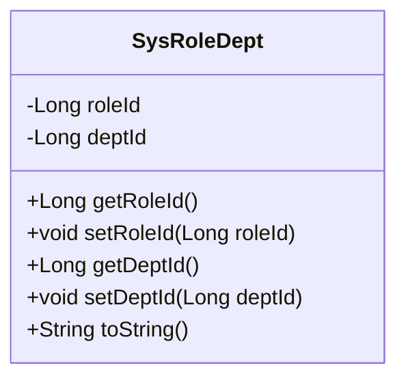
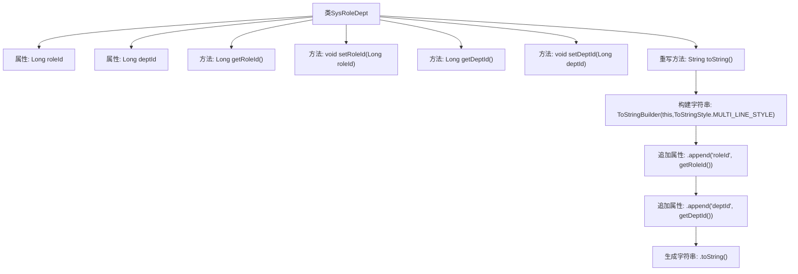

# 基础信息

|      |      |
|------|------|
| 名称 | SysRoleDept |
| 编码语言 | .java |
| 代码路径 | RuoYi-main/ruoyi-system/src/main/java/com/ruoyi/system/domain/SysRoleDept.java |
| 包名 | com.ruoyi.system.domain |
| 依赖项 | ['org.apache.commons.lang3.builder.ToStringBuilder', 'org.apache.commons.lang3.builder.ToStringStyle'] |
| 概述说明 | SysRoleDept类含角色ID和部门ID，提供getter/setter方法，重写toString。 |

# 说明

SysRoleDept类是一个包含角色ID和部门ID属性的实体类。该类提供了获取和设置这两个属性的getter和setter方法，以便外部代码可以访问和修改这些属性。此外，该类还重写了toString方法，用于返回对象的字符串表示形式，通常包括角色ID和部门ID的信息。通过这些方法，SysRoleDept类能够有效地管理角色与部门之间的关系，并提供清晰的输出以便于调试和日志记录。

# 类列表 Class Summary

| 名称   | 类型  | 说明 |
|-------|------|-------------|
| SysRoleDept | class | SysRoleDept类包含角色ID和部门ID属性，提供getter和setter方法，并重写toString方法。 |

## 类 SysRoleDept

|      |      |
|------|------|
| 访问范围 | public |
| 类型 | class |
| 名称 | SysRoleDept |
| 说明 | SysRoleDept类包含角色ID和部门ID属性，提供getter和setter方法，并重写toString方法。 |

### UML类图

这段代码定义了一个名为 `SysRoleDept` 的类，该类包含两个私有属性 `roleId` 和 `deptId`，分别表示角色ID和部门ID。类中提供了这些属性的 getter 和 setter 方法，用于获取和设置这些属性的值。此外，`toString` 方法被重写，以返回对象的字符串表示形式，使用 `ToStringBuilder` 来构建多行样式的字符串。这个类主要用于管理和操作角色与部门之间的关系。

### 内部方法调用关系图

这段代码定义了一个名为`SysRoleDept`的类，包含两个私有属性`roleId`和`deptId`，并提供了相应的getter和setter方法。`toString`方法使用`ToStringBuilder`类来生成一个多行格式的字符串，包含`roleId`和`deptId`的值。流程图展示了类的结构及其方法的调用关系，清晰地描述了属性的获取、设置以及字符串生成的过程。

### 字段列表 Field List

| 名称  | 类型  | 说明 |
|-------|-------|------|
| roleId | Long | 定义了一个长整型的角色ID变量。 |
| deptId | Long | 定义长整型变量deptId，用于存储部门ID。 |

### 方法列表 Method List

| 名称  | 类型  | 说明 |
|-------|-------|------|
| getDeptId | Long | 获取部门ID的方法，返回类型为Long。 |
| setDeptId | void | 设置部门ID的方法，将参数赋值给对象属性。 |
| getRoleId | Long | 获取角色ID的方法，返回长整型角色ID。 |
| toString | String | 重写toString方法，返回角色ID和部门ID的多行字符串。 |
| setRoleId | void | 设置角色ID的方法，将传入的roleId赋值给当前对象的roleId属性。 |

