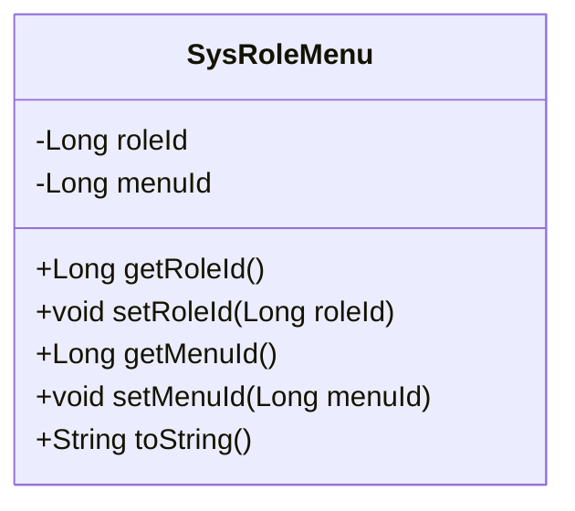
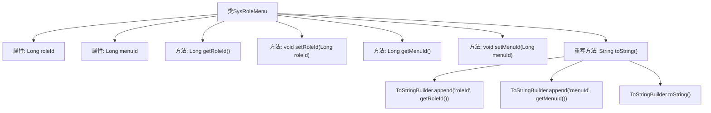

# 基础信息

|      |      |
|------|------|
| 名称 | SysRoleMenu |
| 编码语言 | .java |
| 代码路径 | RuoYi-main/ruoyi-system/src/main/java/com/ruoyi/system/domain/SysRoleMenu.java |
| 包名 | com.ruoyi.system.domain |
| 依赖项 | ['org.apache.commons.lang3.builder.ToStringBuilder', 'org.apache.commons.lang3.builder.ToStringStyle'] |
| 概述说明 | SysRoleMenu类管理角色与菜单关联，包含ID获取设置及字符串表示方法。 |

# 说明

SysRoleMenu类是一个用于管理角色与菜单关系的实体类。该类包含两个主要属性：角色ID和菜单ID，分别用于标识角色和菜单的唯一标识。类中提供了标准的getter和setter方法，用于获取和设置这两个属性的值。此外，该类还重写了toString方法，以便在需要时以字符串形式返回对象的详细信息，便于调试和日志记录。

# 类列表 Class Summary

| 名称   | 类型  | 说明 |
|-------|------|-------------|
| SysRoleMenu | class | SysRoleMenu类包含角色ID和菜单ID，提供getter和setter方法，并重写toString方法。 |

## 类 SysRoleMenu

|      |      |
|------|------|
| 访问范围 | public |
| 类型 | class |
| 名称 | SysRoleMenu |
| 说明 | SysRoleMenu类包含角色ID和菜单ID，提供getter和setter方法，并重写toString方法。 |

### UML类图

这段代码定义了一个名为 `SysRoleMenu` 的类，该类包含两个私有属性 `roleId` 和 `menuId`，分别表示角色ID和菜单ID。类中提供了这两个属性的 getter 和 setter 方法，用于获取和设置它们的值。此外，类还重写了 `toString` 方法，使用 `ToStringBuilder` 来生成格式化的字符串表示。这个类主要用于管理角色与菜单之间的关联关系，适合在权限管理系统中使用。

### 内部方法调用关系图

这段代码定义了一个名为`SysRoleMenu`的类，包含两个私有属性`roleId`和`menuId`，并提供了相应的getter和setter方法。`toString`方法被重写，使用`ToStringBuilder`来生成多行格式的字符串表示。流程图展示了类的结构及其方法之间的调用关系，清晰地描述了属性、方法和`toString`方法的具体实现。

### 字段列表 Field List

| 名称  | 类型  | 说明 |
|-------|-------|------|
| roleId | Long | 定义角色ID的长整型私有变量。 |
| menuId | Long | 定义了一个长整型的菜单ID变量。 |

### 方法列表 Method List

| 名称  | 类型  | 说明 |
|-------|-------|------|
| getRoleId | Long | 获取角色ID的方法。 |
| setRoleId | void | 设置角色ID的方法。 |
| setMenuId | void | 设置菜单ID的方法。 |
| toString | String | 重写toString方法，使用ToStringBuilder输出roleId和menuId。 |
| getMenuId | Long | 获取菜单ID的方法，返回长整型menuId。 |

