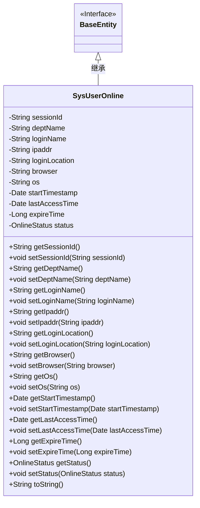

# 基础信息

|      |      |
|------|------|
| 名称 | SysUserOnline |
| 编码语言 | .java |
| 代码路径 | RuoYi-main/ruoyi-system/src/main/java/com/ruoyi/system/domain/SysUserOnline.java |
| 包名 | com.ruoyi.system.domain |
| 依赖项 | ['java.util.Date', 'org.apache.commons.lang3.builder.ToStringBuilder', 'org.apache.commons.lang3.builder.ToStringStyle', 'com.ruoyi.common.core.domain.BaseEntity', 'com.ruoyi.common.enums.OnlineStatus'] |
| 概述说明 | SysUserOnline类管理用户在线信息，包括会话ID、登录名、IP地址、浏览器和操作系统。 |

# 说明

SysUserOnline类专门用于管理用户的在线信息，包含多个关键属性，如会话ID、登录名、IP地址、浏览器类型和操作系统等。这些属性共同构成了用户在线状态的完整描述，便于系统实时监控和管理用户会话。

# 类列表 Class Summary

| 名称   | 类型  | 说明 |
|-------|------|-------------|
| SysUserOnline | class | SysUserOnline类用于管理用户在线信息，包含会话ID、登录名、IP地址、浏览器、操作系统等属性。 |

## 类 SysUserOnline

|      |      |
|------|------|
| 访问范围 | public |
| 类型 | class |
| 名称 | SysUserOnline |
| 说明 | SysUserOnline类用于管理用户在线信息，包含会话ID、登录名、IP地址、浏览器、操作系统等属性。 |

### UML类图

这段代码定义了一个名为 `SysUserOnline` 的类，该类继承自 `BaseEntity` 接口。`SysUserOnline` 类包含了多个私有属性，用于存储用户在线会话的相关信息，如会话ID、部门名称、登录名称、IP地址、登录位置、浏览器类型、操作系统、会话创建时间、最后访问时间、超时时间和在线状态。类中提供了这些属性的getter和setter方法，并重写了 `toString` 方法，用于返回对象的字符串表示形式。类图展示了 `SysUserOnline` 类与 `BaseEntity` 接口之间的继承关系，并详细列出了类的属性和方法。

### 内部方法调用关系图

这段代码定义了一个名为`SysUserOnline`的类，继承自`BaseEntity`。该类包含多个属性，如`sessionId`、`deptName`、`loginName`等，分别用于存储用户会话ID、部门名称、登录名称等信息。每个属性都有对应的`getter`和`setter`方法，用于获取和设置属性值。此外，类中还重写了`toString`方法，用于返回对象的字符串表示形式，包含所有属性的值。这段代码主要用于管理在线用户的信息，并提供对这些信息的访问和修改接口。

### 字段列表 Field List

| 名称  | 类型  | 说明 |
|-------|-------|------|
| sessionId | String | 定义了一个私有字符串类型的sessionId变量。 |
| lastAccessTime | Date | 最后访问时间的私有日期变量。 |
| loginName | String | 定义了一个私有字符串类型的登录名变量。 |
| status = OnlineStatus.on_line | OnlineStatus | 私有变量status被初始化为在线状态。 |
| browser | String | 定义私有字符串变量browser。 |
| ipaddr | String | 定义私有字符串变量ipaddr。 |
| serialVersionUID = 1L | long | 定义了一个静态不可变的序列化版本号，值为1L。 |
| startTimestamp | Date | 私有日期类型变量startTimestamp。 |
| expireTime | Long | 私有长整型变量expireTime用于存储过期时间。 |
| deptName | String | 私有字符串类型变量deptName，用于存储部门名称。 |
| loginLocation | String | 定义私有字符串变量loginLocation。 |
| os | String | 定义了一个私有字符串变量os。 |

### 方法列表 Method List

| 名称  | 类型  | 说明 |
|-------|-------|------|
| setIpaddr | void | 设置IP地址的方法。 |
| setOs | void | 设置操作系统属性。 |
| getOs | String | 获取操作系统信息的Java方法。 |
| setLoginLocation | void | 设置登录位置的方法。 |
| setDeptName | void | 设置部门名称的方法。 |
| getDeptName | String | 该方法返回部门名称字符串。 |
| setStartTimestamp | void | 设置起始时间戳的方法。 |
| getLoginLocation | String | 获取登录位置的方法。 |
| setExpireTime | void | 设置过期时间的方法，接受长整型参数。 |
| getIpaddr | String | 获取IP地址的Java方法。 |
| setBrowser | void | 定义设置浏览器属性的方法。 |
| getBrowser | String | 获取浏览器名称的公共方法。 |
| getExpireTime | Long | 获取过期时间的Java方法。 |
| getSessionId | String | 获取并返回当前会话ID。 |
| getLastAccessTime | Date | 获取最后访问时间的方法。 |
| getStatus | OnlineStatus | 获取当前在线状态的公开方法。 |
| getLoginName | String | 该方法返回登录名。 |
| toString | String | 重写toString方法，返回多行格式的会话信息。 |
| setLoginName | void | 设置登录名的方法，将传入的字符串赋值给类成员变量。 |
| setSessionId | void | 设置会话ID的方法，将传入的sessionId赋值给当前对象的sessionId属性。 |
| setStatus | void | 该方法用于设置在线状态，将传入的状态赋值给类的状态变量。 |
| getStartTimestamp | Date | 方法getStartTimestamp返回startTimestamp的值。 |
| setLastAccessTime | void | 设置最后访问时间为指定日期。 |

