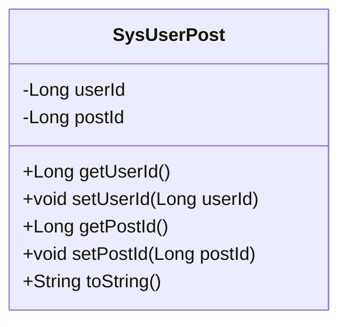
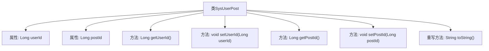

# 基础信息

|      |      |
|------|------|
| 名称 | SysUserPost |
| 编码语言 | .java |
| 代码路径 | RuoYi-main/ruoyi-system/src/main/java/com/ruoyi/system/domain/SysUserPost.java |
| 包名 | com.ruoyi.system.domain |
| 依赖项 | ['org.apache.commons.lang3.builder.ToStringBuilder', 'org.apache.commons.lang3.builder.ToStringStyle'] |
| 概述说明 | SysUserPost类管理用户ID与岗位ID，包含获取、设置及字符串输出方法。 |

# 说明

SysUserPost类是一个用于表示用户与岗位关联的实体类。该类包含两个主要属性：用户ID和岗位ID，分别用于标识用户和岗位的唯一性。为了便于访问和修改这些属性，类中提供了相应的getter和setter方法。此外，为了在需要时能够以字符串形式展示类的实例信息，SysUserPost类还重写了toString方法，确保输出格式清晰且包含所有关键信息。

# 类列表 Class Summary

| 名称   | 类型  | 说明 |
|-------|------|-------------|
| SysUserPost | class | SysUserPost类包含用户ID和岗位ID，提供getter和setter方法，并重写toString方法。 |

## 类 SysUserPost

|      |      |
|------|------|
| 访问范围 | public |
| 类型 | class |
| 名称 | SysUserPost |
| 说明 | SysUserPost类包含用户ID和岗位ID，提供getter和setter方法，并重写toString方法。 |

### UML类图

这段代码定义了一个名为 `SysUserPost` 的类，该类包含两个私有成员变量 `userId` 和 `postId`，分别表示用户ID和岗位ID。类中提供了获取和设置这两个成员变量的公有方法 `getUserId`、`setUserId`、`getPostId` 和 `setPostId`。此外，类还重写了 `toString` 方法，用于返回包含 `userId` 和 `postId` 的字符串表示。这个类主要用于存储和操作用户与岗位之间的关系数据。

### 内部方法调用关系图

这段代码定义了一个名为`SysUserPost`的类，包含两个私有属性`userId`和`postId`，分别表示用户ID和岗位ID。类中提供了这两个属性的getter和setter方法，用于获取和设置属性的值。此外，类还重写了`toString`方法，使用`ToStringBuilder`来生成格式化的字符串表示，其中包含`userId`和`postId`的值。代码结构清晰，功能明确，主要用于管理用户与岗位的关联信息。

### 字段列表 Field List

| 名称  | 类型  | 说明 |
|-------|-------|------|
| postId | Long | 定义一个长整型的帖子ID变量。 |
| userId | Long | 用户ID为长整型。 |

### 方法列表 Method List

| 名称  | 类型  | 说明 |
|-------|-------|------|
| getUserId | Long | 该方法返回用户ID的数值。 |
| getPostId | Long | 获取帖子ID的方法。 |
| setUserId | void | 设置用户ID方法，将参数赋值给类成员变量。 |
| setPostId | void | 设置帖子ID的方法，将传入的postId赋值给当前对象的postId属性。 |
| toString | String | 重写toString方法，返回包含userId和postId的多行字符串。 |

