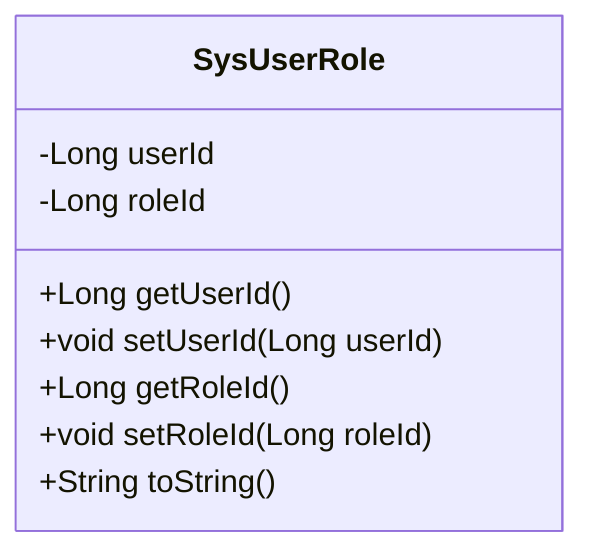
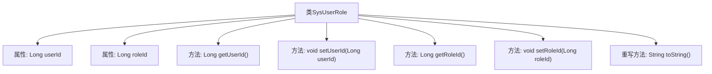

# 基础信息

|      |      |
|------|------|
| 名称 | SysUserRole |
| 编码语言 | .java |
| 代码路径 | RuoYi-main/ruoyi-system/src/main/java/com/ruoyi/system/domain/SysUserRole.java |
| 包名 | com.ruoyi.system.domain |
| 依赖项 | ['org.apache.commons.lang3.builder.ToStringBuilder', 'org.apache.commons.lang3.builder.ToStringStyle'] |
| 概述说明 | SysUserRole类管理用户ID和角色ID，提供访问和修改方法，并重写toString。 |

# 说明

SysUserRole类是一个用于管理用户与角色关联的实体类。它包含两个主要属性：用户ID和角色ID，分别用于标识用户和角色的唯一性。该类提供了标准的getter和setter方法，用于获取和设置这两个属性的值。此外，SysUserRole类还重写了toString方法，以便在需要时能够以字符串形式输出对象的详细信息，便于调试和日志记录。

# 类列表 Class Summary

| 名称   | 类型  | 说明 |
|-------|------|-------------|
| SysUserRole | class | SysUserRole类包含用户ID和角色ID，提供getter和setter方法，并重写toString方法。 |

## 类 SysUserRole

|      |      |
|------|------|
| 访问范围 | public |
| 类型 | class |
| 名称 | SysUserRole |
| 说明 | SysUserRole类包含用户ID和角色ID，提供getter和setter方法，并重写toString方法。 |

### UML类图

这段代码定义了一个名为 `SysUserRole` 的类，用于表示用户与角色之间的关联关系。类中包含两个私有属性 `userId` 和 `roleId`，分别表示用户ID和角色ID。类提供了这两个属性的 `getter` 和 `setter` 方法，用于获取和设置属性值。此外，类还重写了 `toString` 方法，用于返回对象的字符串表示形式，通常用于调试和日志记录。这个类主要用于在系统中管理用户与角色的关联信息。

### 内部方法调用关系图

这段代码定义了一个名为`SysUserRole`的类，包含两个属性`userId`和`roleId`，并提供了相应的getter和setter方法。此外，该类重写了`toString`方法，使用`ToStringBuilder`生成格式化的字符串表示。流程图展示了类结构与各方法之间的调用关系，清晰地反映了类的设计逻辑和功能。

### 字段列表 Field List

| 名称  | 类型  | 说明 |
|-------|-------|------|
| userId | Long | 用户ID字段为长整型。 |
| roleId | Long | 包含私有长整型角色ID字段。 |

### 方法列表 Method List

| 名称  | 类型  | 说明 |
|-------|-------|------|
| getRoleId | Long | 获取角色ID的方法。 |
| getUserId | Long | 获取用户ID的方法，返回类型为长整型。 |
| toString | String | 重写toString方法，返回包含userId和roleId的多行字符串。 |
| setUserId | void | 该方法用于设置用户ID，将传入的Long类型值赋给当前对象的userId属性。 |
| setRoleId | void | 设置角色ID的方法，将传入的roleId赋值给当前对象的roleId属性。 |

