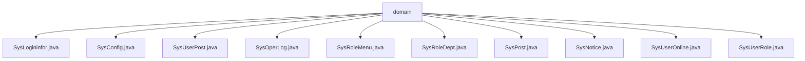

# 基础信息

|      |      |
|------|------|
| 名称 | domain |
| 编码语言 | .java |
| 代码路径 | RuoYi-main/ruoyi-system/src/main/java/com/ruoyi/system/domain |
| 包名 | RuoYi-main.ruoyi-system.src.main.java.com.ruoyi.system.domain |
| 概述说明 | SysLogininfor记录登录信息，SysConfig管理配置，SysUserPost关联用户岗位，SysOperLog记录操作日志，SysRoleMenu管理角色菜单，SysRoleDept关联角色部门，SysPost管理岗位，SysNotice管理公告，SysUserOnline管理在线用户，SysUserRole关联用户角色。 |

# 说明

## 概述

该代码模块主要涉及系统管理相关的核心功能，包括用户登录信息记录、系统配置管理、用户与岗位关联、操作日志记录、角色与菜单关系管理、角色与部门关系管理、岗位信息管理、公告信息管理、用户在线状态管理以及用户与角色关联等功能。这些类通过封装关键属性和提供标准的getter和setter方法，确保了数据的完整性和可访问性，同时通过重写`toString`方法，便于调试和日志记录。

## 主要业务场景

1. **用户登录信息记录**：通过`SysLogininfor`类记录用户的登录信息，包括账号、登录状态、IP地址、登录地点、浏览器类型、操作系统、消息内容和登录时间，便于后续审计和分析。
2. **系统配置管理**：`SysConfig`类用于存储和管理系统配置信息，确保配置数据的完整性和可访问性。
3. **用户与岗位关联**：`SysUserPost`类用于表示用户与岗位的关联关系，便于管理用户岗位信息。
4. **操作日志记录**：`SysOperLog`类用于记录系统操作的详细信息，包括模块信息、业务类型、操作人员和请求参数，便于系统监控和问题排查。
5. **角色与菜单关系管理**：`SysRoleMenu`类用于管理角色与菜单的关联关系，确保角色能够访问相应的菜单。
6. **角色与部门关系管理**：`SysRoleDept`类用于管理角色与部门的关联关系，便于角色在部门中的权限管理。
7. **岗位信息管理**：`SysPost`类用于管理岗位信息，包括岗位ID、编码、名称、排序、状态等，便于岗位信息的操作和管理。
8. **公告信息管理**：`SysNotice`类用于管理公告信息，包括公告ID、标题、类型、内容和状态，便于公告的发布和管理。
9. **用户在线状态管理**：`SysUserOnline`类用于管理用户的在线信息，包括会话ID、登录名、IP地址、浏览器类型和操作系统，便于实时监控用户会话。
10. **用户与角色关联**：`SysUserRole`类用于管理用户与角色的关联关系，确保用户拥有相应的角色权限。

这些类共同构成了系统管理模块的核心功能，提供了全面的数据管理和操作记录功能，确保系统的稳定性和可维护性。

### 包内部结构视图

该流程图展示了`domain`文件夹下的多个Java文件，这些文件分别表示系统中的不同实体或功能模块，如用户登录信息、系统配置、用户岗位等。每个文件都是`domain`文件夹的直接子节点，清晰地反映了这些文件在项目中的层级关系。

# 文件列表 File List

| 名称   | 类型  | 说明 |
|-------|------|-------------|
| [SysNotice.java](SysNotice.md) | file | SysNotice类含公告ID、标题、类型、内容和状态，提供getter、setter及toString方法。 |
| [SysUserPost.java](SysUserPost.md) | file | SysUserPost类管理用户ID与岗位ID，包含获取、设置及字符串输出方法。 |
| [SysUserRole.java](SysUserRole.md) | file | SysUserRole类管理用户ID和角色ID，提供访问和修改方法，并重写toString。 |
| [SysUserOnline.java](SysUserOnline.md) | file | SysUserOnline类管理用户在线信息，包括会话ID、登录名、IP地址、浏览器和操作系统。 |
| [SysPost.java](SysPost.md) | file | SysPost类包含岗位ID、编码、名称、排序、状态和标识字段，并提供getter和setter方法。 |
| [SysRoleDept.java](SysRoleDept.md) | file | SysRoleDept类含角色ID和部门ID，提供getter/setter方法，重写toString。 |
| [SysRoleMenu.java](SysRoleMenu.md) | file | SysRoleMenu类管理角色与菜单关联，包含ID获取设置及字符串表示方法。 |
| [SysOperLog.java](SysOperLog.md) | file | SysOperLog类记录模块、业务类型、操作人员及请求参数等操作日志信息。 |
| [SysConfig.java](SysConfig.md) | file | SysConfig继承BaseEntity，含配置ID、名称、键名、键值及系统内置类型属性，提供getter和setter方法。 |
| [SysLogininfor.java](SysLogininfor.md) | file | SysLogininfor类记录登录信息，包含账号、状态、IP、地点、浏览器、系统、消息和时间。 |

