# 基础信息

|      |      |
|------|------|
| 名称 | mapper |
| 编码语言 | .java |
| 代码路径 | RuoYi-main/ruoyi-system/src/main/java/com/ruoyi/system/mapper |
| 包名 | RuoYi-main.ruoyi-system.src.main.java.com.ruoyi.system.mapper |
| 概述说明 | 内容为空，无法总结。请提供具体信息。 |

# 说明

## 概述
该代码模块是 RuoYi 框架中的 `ruoyi-system` 模块的一部分，主要涉及系统管理相关的数据访问层（Mapper）实现。这些 Mapper 接口负责与数据库进行交互，处理系统管理模块中的核心业务数据，包括用户、角色、部门、菜单、字典、日志等信息的增删改查操作。

## 主要业务场景
该模块的主要业务场景包括但不限于以下几个方面：
1. **用户管理**：通过 `SysUserMapper`、`SysUserPostMapper`、`SysUserRoleMapper` 等接口，实现用户信息的增删改查、用户与岗位的关联、用户与角色的关联等功能。
2. **角色管理**：通过 `SysRoleMapper`、`SysRoleDeptMapper`、`SysRoleMenuMapper` 等接口，实现角色信息的增删改查、角色与部门的关联、角色与菜单的关联等功能。
3. **部门管理**：通过 `SysDeptMapper` 接口，实现部门信息的增删改查操作。
4. **菜单管理**：通过 `SysMenuMapper` 接口，实现菜单信息的增删改查操作。
5. **字典管理**：通过 `SysDictTypeMapper`、`SysDictDataMapper` 等接口，实现字典类型和字典数据的增删改查操作。
6. **日志管理**：通过 `SysOperLogMapper`、`SysLogininforMapper` 等接口，实现操作日志和登录日志的记录与查询。
7. **系统配置**：通过 `SysConfigMapper` 接口，实现系统配置信息的增删改查操作。
8. **通知公告**：通过 `SysNoticeMapper` 接口，实现通知公告的增删改查操作。
9. **在线用户管理**：通过 `SysUserOnlineMapper` 接口，实现在线用户的监控与管理。

这些 Mapper 接口共同支撑了 RuoYi 框架中系统管理模块的核心功能，提供了对系统基础数据的全面管理能力。

### 包内部结构视图

```mermaid
graph TD
    mapper --> SysPostMapper.java
    mapper --> SysUserPostMapper.java
    mapper --> SysUserRoleMapper.java
    mapper --> SysDictTypeMapper.java
    mapper --> SysUserMapper.java
    mapper --> SysOperLogMapper.java
    mapper --> SysRoleDeptMapper.java
    mapper --> SysNoticeMapper.java
    mapper --> SysConfigMapper.java
    mapper --> SysRoleMapper.java
    mapper --> SysUserOnlineMapper.java
    mapper --> SysDeptMapper.java
    mapper --> SysDictDataMapper.java
    mapper --> SysLogininforMapper.java
    mapper --> SysRoleMenuMapper.java
    mapper --> SysMenuMapper.java
```

该流程图展示了`mapper`文件夹下的所有文件层级关系。`mapper`作为根节点，包含了多个与系统功能相关的Mapper文件，如`SysPostMapper.java`、`SysUserMapper.java`等。这些文件分别对应不同的系统模块，用于处理数据库操作。

# 文件列表 File List

| 名称   | 类型  | 说明 |
|-------|------|-------------|
| [SysUserMapper.java](SysUserMapper.md) | file | 内容为空，无法生成概要描述。 |
| [SysUserRoleMapper.java](SysUserRoleMapper.md) | file | 信息为空，无法生成概要描述。 |
| [SysPostMapper.java](SysPostMapper.md) | file | 无内容可总结。 |
| [SysMenuMapper.java](SysMenuMapper.md) | file | 输入内容为空，无法生成概要描述。 |
| [SysRoleMenuMapper.java](SysRoleMenuMapper.md) | file | 无内容，无法生成概要描述。 |
| [SysLogininforMapper.java](SysLogininforMapper.md) | file | 信息为空，无法生成概要描述。 |
| [SysDictDataMapper.java](SysDictDataMapper.md) | file | 无内容可总结。 |
| [SysDeptMapper.java](SysDeptMapper.md) | file | 信息为空，无法生成概要描述。 |
| [SysUserOnlineMapper.java](SysUserOnlineMapper.md) | file | 无内容可总结。 |
| [SysConfigMapper.java](SysConfigMapper.md) | file | 无内容，无法生成概要描述。 |
| [SysUserPostMapper.java](SysUserPostMapper.md) | file | 无内容可总结。 |
| [SysOperLogMapper.java](SysOperLogMapper.md) | file | 无内容，无法生成概要描述。 |
| [SysDictTypeMapper.java](SysDictTypeMapper.md) | file | 内容为空，无法生成概要描述。 |
| [SysRoleMapper.java](SysRoleMapper.md) | file | 无内容提供，无法生成概要描述。 |
| [SysNoticeMapper.java](SysNoticeMapper.md) | file | 无信息提供，无法生成概要描述。 |
| [SysRoleDeptMapper.java](SysRoleDeptMapper.md) | file | 无内容提供，无法生成概要描述。 |

