# 基础信息

|      |      |
|------|------|
| 名称 | service |
| 编码语言 | .java |
| 代码路径 | RuoYi-main/ruoyi-system/src/main/java/com/ruoyi/system/service |
| 包名 | RuoYi-main.ruoyi-system.src.main.java.com.ruoyi.system.service |
| 概述说明 | 内容为空，无法生成总结描述。请提供具体信息。 |

# 说明

## 概述
该代码模块是一个综合性的系统管理模块，涵盖了用户、角色、岗位、部门、菜单、字典、配置、日志等多个核心功能的管理。通过多个服务类的实现，模块提供了全面的数据管理和操作功能，确保系统的高效运行和数据的一致性。模块的设计注重功能的完整性和扩展性，支持对各类系统数据的增删改查操作，并通过缓存管理和权限校验等机制，提升了系统的性能和安全性。

## 主要业务场景
1. **用户管理**：包括用户信息的查询、新增、修改、删除、授权、重置密码等操作，确保用户数据的安全性和完整性。
2. **角色管理**：提供角色的查询、新增、修改、删除以及权限校验功能，支持用户角色分配和权限管理。
3. **岗位管理**：支持岗位的查询、新增、修改、删除及校验，管理用户与岗位的关联关系。
4. **部门管理**：实现对部门信息的查询、新增、修改和删除，维护部门数据的准确性和一致性。
5. **菜单管理**：提供菜单查询、权限管理及树结构转换功能，支持前端菜单展示和操作。
6. **字典管理**：包括字典数据和字典类型的查询、新增、修改、删除及缓存管理，确保字典数据的高效访问和维护。
7. **配置管理**：支持系统参数的查询、新增、修改、删除及缓存管理，提升系统配置的维护效率。
8. **日志管理**：
   - **操作日志**：记录系统的操作日志，支持增删改查及清空操作，确保操作的可追溯性。
   - **登录日志**：管理用户登录日志，支持增删查清功能，便于跟踪用户登录行为。
9. **公告管理**：提供公告的查询、新增、修改和删除功能，确保公告信息的及时更新和维护。
10. **在线用户管理**：管理在线用户会话，支持查询、删除、保存及缓存清理功能，确保在线用户数据的准确性。

通过这些功能，该模块为系统提供了全面的管理支持，涵盖了从用户、角色到日志、配置等多个方面的核心业务需求，确保系统的稳定性、安全性和可维护性。

### 包内部结构视图

```mermaid
graph TD
    service --> ISysPostService.java
    service --> ISysDictDataService.java
    service --> ISysConfigService.java
    service --> ISysRoleService.java
    service --> ISysOperLogService.java
    service --> ISysDeptService.java
    service --> ISysLogininforService.java
    service --> ISysNoticeService.java
    service --> ISysMenuService.java
    service --> ISysUserOnlineService.java
    service --> ISysDictTypeService.java
    service --> ISysUserService.java
    service --> impl
    impl --> SysOperLogServiceImpl.java
    impl --> SysUserServiceImpl.java
    impl --> SysConfigServiceImpl.java
    impl --> SysPostServiceImpl.java
    impl --> SysRoleServiceImpl.java
    impl --> SysLogininforServiceImpl.java
    impl --> SysDictDataServiceImpl.java
    impl --> SysNoticeServiceImpl.java
    impl --> SysDeptServiceImpl.java
    impl --> SysUserOnlineServiceImpl.java
    impl --> SysDictTypeServiceImpl.java
    impl --> SysMenuServiceImpl.java
```

该流程图展示了RuoYi系统中`service`模块的层级结构。`service`目录下包含多个接口文件（如`ISysPostService.java`等），以及一个`impl`子目录，`impl`目录中包含了这些接口的具体实现类（如`SysPostServiceImpl.java`等）。整个结构清晰地反映了接口与实现之间的依赖关系。

# 文件列表 File List

| 名称   | 类型  | 说明 |
|-------|------|-------------|
| [ISysUserService.java](ISysUserService.md) | file | 无内容提供，无法生成概要描述。 |
| [ISysDictTypeService.java](ISysDictTypeService.md) | file | 输入信息为空，无法生成概要描述。 |
| [ISysUserOnlineService.java](ISysUserOnlineService.md) | file | 信息为空，无法生成概要描述。 |
| [ISysMenuService.java](ISysMenuService.md) | file | 信息为空，无法生成概要描述。 |
| [ISysLogininforService.java](ISysLogininforService.md) | file | 无内容可总结。 |
| [ISysOperLogService.java](ISysOperLogService.md) | file | 信息为空，无法生成概要描述。 |
| [ISysConfigService.java](ISysConfigService.md) | file | 信息为空，无法生成概要描述。 |
| [ISysPostService.java](ISysPostService.md) | file | 信息为空，无法生成概要描述。 |
| [ISysNoticeService.java](ISysNoticeService.md) | file | 无内容，无法生成概要描述。 |
| [ISysDeptService.java](ISysDeptService.md) | file | 信息为空，无法生成概要描述。 |
| [ISysRoleService.java](ISysRoleService.md) | file | 无内容提供，无法生成概要描述。 |
| [ISysDictDataService.java](ISysDictDataService.md) | file | 信息为空，无法生成概要描述。 |
| [impl](impl/_module.md) | package | 系统实现日志、用户、配置、岗位、角色、登录、字典、公告、部门、在线用户、字典类型、菜单等管理功能，确保数据完整性和系统稳定性。 |

