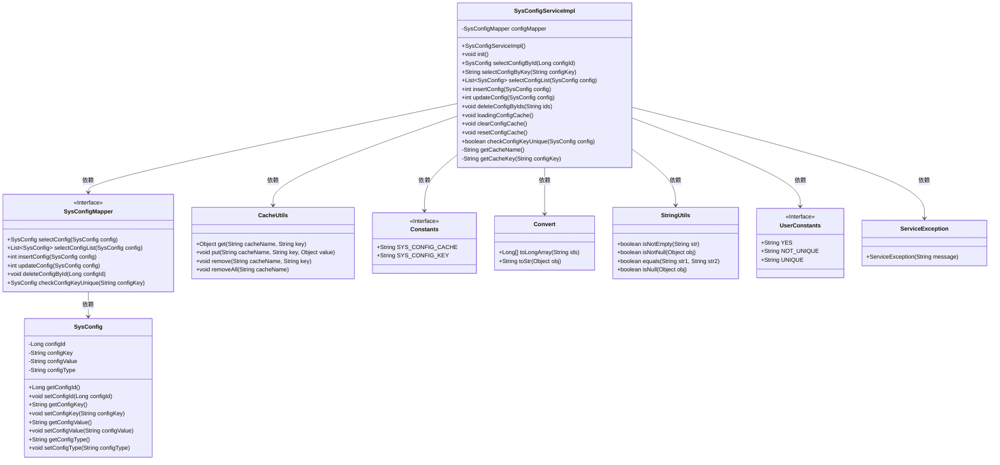
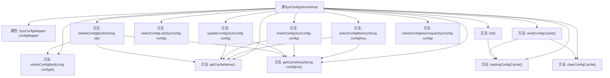

# 基础信息

|      |      |
|------|------|
| 名称 | SysConfigServiceImpl |
| 编码语言 | .java |
| 代码路径 | RuoYi-main/ruoyi-system/src/main/java/com/ruoyi/system/service/impl/SysConfigServiceImpl.java |
| 包名 | com.ruoyi.system.service.impl |
| 依赖项 | ['java.util.List', 'javax.annotation.PostConstruct', 'org.springframework.beans.factory.annotation.Autowired', 'org.springframework.stereotype.Service', 'com.ruoyi.common.constant.Constants', 'com.ruoyi.common.constant.UserConstants', 'com.ruoyi.common.core.text.Convert', 'com.ruoyi.common.exception.ServiceException', 'com.ruoyi.common.utils.CacheUtils', 'com.ruoyi.common.utils.StringUtils', 'com.ruoyi.system.domain.SysConfig', 'com.ruoyi.system.mapper.SysConfigMapper', 'com.ruoyi.system.service.ISysConfigService'] |
| 概述说明 | SysConfigServiceImpl类实现ISysConfigService接口，提供参数配置的查询、新增、修改、删除及缓存管理功能。 |

# 说明

SysConfigServiceImpl类实现了ISysConfigService接口，主要负责参数配置的管理功能。该类提供了对参数配置的查询、新增、修改和删除操作，同时还负责缓存的管理，确保系统配置数据的高效访问和更新。通过这一实现，系统能够有效地维护和管理配置信息，提升整体性能和稳定性。

# 类列表 Class Summary

| 名称   | 类型  | 说明 |
|-------|------|-------------|
| SysConfigServiceImpl | class | SysConfigServiceImpl类实现ISysConfigService接口，提供参数配置的查询、新增、修改、删除及缓存管理功能。 |

## 类 SysConfigServiceImpl

|      |      |
|------|------|
| 访问范围 | @Service;public |
| 类型 | class |
| 名称 | SysConfigServiceImpl |
| 说明 | SysConfigServiceImpl类实现ISysConfigService接口，提供参数配置的查询、新增、修改、删除及缓存管理功能。 |

### UML类图

这段代码描述了一个系统配置服务实现类 `SysConfigServiceImpl`，它实现了 `ISysConfigService` 接口，负责管理系统配置的缓存、查询、新增、修改、删除等操作。`SysConfigServiceImpl` 依赖于 `SysConfigMapper` 进行数据库操作，同时使用 `CacheUtils` 来管理缓存。代码中还涉及多个工具类和常量类，如 `Convert`、`StringUtils`、`Constants` 和 `UserConstants`，用于辅助数据处理和验证。整体设计旨在通过缓存机制提高系统配置的访问效率，并确保数据的一致性和唯一性。

### 内部方法调用关系图

这段代码描述了一个系统配置服务实现类 `SysConfigServiceImpl`，它通过 `SysConfigMapper` 与数据库交互，并提供了多种配置管理功能，如查询、新增、修改、删除配置等。代码中还涉及缓存管理，通过 `CacheUtils` 进行缓存操作，确保数据的一致性和高效访问。`init()` 方法在项目启动时初始化缓存，其他方法则根据不同的业务需求进行配置的增删改查操作。

### 字段列表 Field List

| 名称  | 类型  | 说明 |
|-------|-------|------|
| configMapper | SysConfigMapper | 自动注入SysConfigMapper实例。 |

### 方法列表 Method List

| 名称  | 类型  | 说明 |
|-------|-------|------|
| clearConfigCache | void | 该方法用于清除指定名称的缓存。 |
| selectConfigById | SysConfig | 通过配置ID查询系统配置信息。 |
| loadingConfigCache | void | 加载配置缓存，遍历配置列表并存入缓存。 |
| selectConfigList | List<SysConfig> | 重写方法，调用配置映射器查询配置列表。 |
| resetConfigCache | void | 重置配置缓存，先清除再加载。 |
| insertConfig | int | 插入配置并更新缓存，返回影响行数。 |
| deleteConfigByIds | void | 根据ID删除配置，内置参数不可删除，删除后清除缓存。 |
| checkConfigKeyUnique | boolean | 检查配置键唯一性，若存在且ID不同则返回不唯一。 |
| init | void | 初始化方法调用加载配置缓存。 |
| getCacheName | String | 获取系统配置缓存的名称。 |
| selectConfigByKey | String | 根据配置键查询配置值，优先从缓存获取，缓存未命中则查询数据库并更新缓存。 |
| updateConfig | int | 更新配置时，先检查配置键是否变化，若变化则清除旧缓存，更新配置后若成功则添加新缓存。 |
| getCacheKey | String | 该方法生成系统配置的缓存键，拼接常量与配置键。 |

