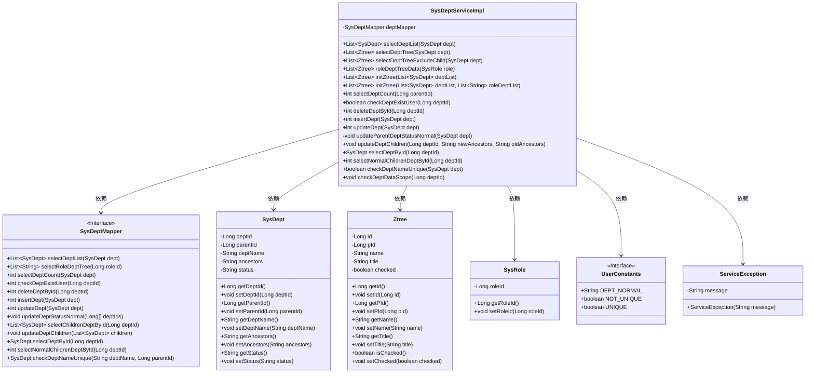

# 基础信息

|      |      |
|------|------|
| 名称 | SysDeptServiceImpl |
| 编码语言 | .java |
| 代码路径 | RuoYi-main/ruoyi-system/src/main/java/com/ruoyi/system/service/impl/SysDeptServiceImpl.java |
| 包名 | com.ruoyi.system.service.impl |
| 依赖项 | ['java.util.ArrayList', 'java.util.List', 'org.apache.commons.lang3.ArrayUtils', 'org.springframework.beans.factory.annotation.Autowired', 'org.springframework.stereotype.Service', 'org.springframework.transaction.annotation.Transactional', 'com.ruoyi.common.annotation.DataScope', 'com.ruoyi.common.constant.UserConstants', 'com.ruoyi.common.core.domain.Ztree', 'com.ruoyi.common.core.domain.entity.SysDept', 'com.ruoyi.common.core.domain.entity.SysRole', 'com.ruoyi.common.core.domain.entity.SysUser', 'com.ruoyi.common.core.text.Convert', 'com.ruoyi.common.exception.ServiceException', 'com.ruoyi.common.utils.ShiroUtils', 'com.ruoyi.common.utils.StringUtils', 'com.ruoyi.common.utils.spring.SpringUtils', 'com.ruoyi.system.mapper.SysDeptMapper', 'com.ruoyi.system.service.ISysDeptService'] |
| 概述说明 | SysDeptServiceImpl实现ISysDeptService接口，提供部门管理功能。 |

# 说明

SysDeptServiceImpl实现了ISysDeptService接口，主要负责部门管理功能。该服务类提供了全面的部门操作，包括查询部门信息、新增部门、修改部门信息以及删除部门等功能。通过这些操作，SysDeptServiceImpl能够有效地管理和维护系统中的部门数据，确保部门信息的准确性和一致性。

# 类列表 Class Summary

| 名称   | 类型  | 说明 |
|-------|------|-------------|
| SysDeptServiceImpl | class | SysDeptServiceImpl实现ISysDeptService接口，提供部门管理功能，包括查询、新增、修改、删除等操作。 |

## 类 SysDeptServiceImpl

|      |      |
|------|------|
| 访问范围 | @Service;public |
| 类型 | class |
| 名称 | SysDeptServiceImpl |
| 说明 | SysDeptServiceImpl实现ISysDeptService接口，提供部门管理功能，包括查询、新增、修改、删除等操作。 |

### UML类图

**描述**：`SysDeptServiceImpl`类实现了`ISysDeptService`接口，负责处理部门管理相关的业务逻辑。它依赖于`SysDeptMapper`接口来访问数据库，并使用`SysDept`、`Ztree`、`SysRole`等类来表示部门和树结构数据。`UserConstants`和`ServiceException`分别用于定义常量和处理异常。该类提供了部门查询、新增、修改、删除等功能，并通过`initZtree`方法将部门数据转换为树结构。

### 内部方法调用关系图

```mermaid
graph TD
    A["类SysDeptServiceImpl"]
    B["属性: SysDeptMapper deptMapper"]
    C["方法: List<SysDept> selectDeptList(SysDept dept)"]
    D["方法: List<Ztree> selectDeptTree(SysDept dept)"]
    E["方法: List<Ztree> selectDeptTreeExcludeChild(SysDept dept)"]
    F["方法: List<Ztree> roleDeptTreeData(SysRole role)"]
    G["方法: List<Ztree> initZtree(List<SysDept> deptList)"]
    H["方法: List<Ztree> initZtree(List<SysDept> deptList, List<String> roleDeptList)"]
    I["方法: int selectDeptCount(Long parentId)"]
    J["方法: boolean checkDeptExistUser(Long deptId)"]
    K["方法: int deleteDeptById(Long deptId)"]
    L["方法: int insertDept(SysDept dept)"]
    M["方法: int updateDept(SysDept dept)"]
    N["方法: void updateParentDeptStatusNormal(SysDept dept)"]
    O["方法: void updateDeptChildren(Long deptId, String newAncestors, String oldAncestors)"]
    P["方法: SysDept selectDeptById(Long deptId)"]
    Q["方法: int selectNormalChildrenDeptById(Long deptId)"]
    R["方法: boolean checkDeptNameUnique(SysDept dept)"]
    S["方法: void checkDeptDataScope(Long deptId)"]

    A --> B
    A --> C
    A --> D
    A --> E
    A --> F
    A --> G
    A --> H
    A --> I
    A --> J
    A --> K
    A --> L
    A --> M
    A --> N
    A --> O
    A --> P
    A --> Q
    A --> R
    A --> S
```

这段代码是 `SysDeptServiceImpl` 类的实现，主要处理部门管理的相关操作。它通过 `SysDeptMapper` 与数据库交互，提供了查询部门列表、构建部门树、新增、修改、删除部门等功能。每个方法都负责特定的业务逻辑，如 `selectDeptList` 用于查询部门列表，`selectDeptTree` 用于构建部门树，`insertDept` 和 `updateDept` 分别用于新增和修改部门信息。此外，还包含一些辅助方法，如 `initZtree` 用于将部门列表转换为树结构，`checkDeptDataScope` 用于校验部门数据权限。

### 字段列表 Field List

| 名称  | 类型  | 说明 |
|-------|-------|------|
| deptMapper | SysDeptMapper | 自动注入SysDeptMapper实例。 |

### 方法列表 Method List

| 名称  | 类型  | 说明 |
|-------|-------|------|
| selectDeptById | SysDept | 该方法通过deptId查询并返回SysDept对象。 |
| selectDeptTreeExcludeChild | List<Ztree> | 根据部门ID排除子部门并生成树结构。 |
| selectDeptCount | int | 根据父部门ID查询子部门数量。 |
| updateDeptChildren | void | 更新部门子节点的祖先信息，替换旧祖先为新祖先。 |
| checkDeptExistUser | boolean | 检查部门是否存在用户，返回布尔值。 |
| initZtree | List<Ztree> | 初始化Ztree方法，接受部门列表，调用重载方法。 |
| selectDeptTree | List<Ztree> | 该方法根据部门列表生成Ztree结构并返回。 |
| selectDeptList | List<SysDept> | 该方法通过数据权限过滤，查询部门列表。 |
| insertDept | int | 插入部门时检查父节点状态，异常则报错，正常则设置祖先路径并插入。 |
| checkDeptDataScope | void | 非管理员用户检查部门数据权限，无权限则抛出异常。 |
| checkDeptNameUnique | boolean | 检查部门名称唯一性，存在同名且ID不同则返回不唯一。 |
| selectNormalChildrenDeptById | int | 重写方法selectNormalChildrenDeptById，调用deptMapper查询子部门。 |
| roleDeptTreeData | List<Ztree> | 根据角色获取部门树数据，初始化Ztree并返回。 |
| deleteDeptById | int | 重写deleteDeptById方法，调用deptMapper删除指定部门ID。 |
| updateParentDeptStatusNormal | void | 更新父部门状态为正常，使用部门ID数组调用更新方法。 |
| initZtree | List<Ztree> | 初始化Ztree，遍历部门列表，创建Ztree节点并设置属性，返回Ztree列表。 |
| updateDept | int | 更新部门信息，调整祖先路径并启用上级部门。 |

