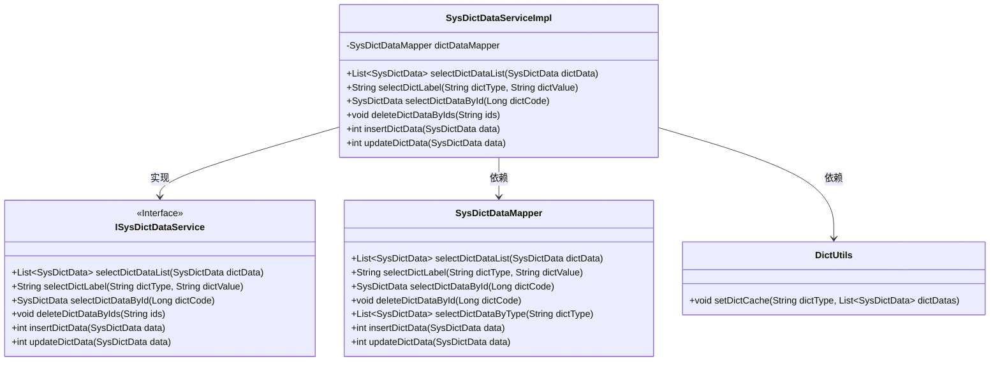
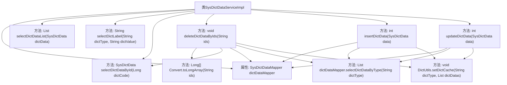

# 基础信息

|      |      |
|------|------|
| 名称 | SysDictDataServiceImpl |
| 编码语言 | .java |
| 代码路径 | RuoYi-main/ruoyi-system/src/main/java/com/ruoyi/system/service/impl/SysDictDataServiceImpl.java |
| 包名 | com.ruoyi.system.service.impl |
| 依赖项 | ['java.util.List', 'org.springframework.beans.factory.annotation.Autowired', 'org.springframework.stereotype.Service', 'com.ruoyi.common.core.domain.entity.SysDictData', 'com.ruoyi.common.core.text.Convert', 'com.ruoyi.common.utils.DictUtils', 'com.ruoyi.system.mapper.SysDictDataMapper', 'com.ruoyi.system.service.ISysDictDataService'] |
| 概述说明 | 实现字典数据服务，支持查询、删除、新增和修改操作。 |

# 说明

实现字典数据服务，涵盖查询、删除、新增和修改功能。查询功能允许用户根据指定条件检索字典数据，删除功能支持按条件移除数据，新增功能用于向字典中添加新条目，修改功能则允许更新现有字典数据。这些功能共同构建了一个完整的字典数据管理服务，确保数据的高效操作和维护。

# 类列表 Class Summary

| 名称   | 类型  | 说明 |
|-------|------|-------------|
| SysDictDataServiceImpl | class | 实现字典数据服务，包括查询、删除、新增和修改功能。 |

## 类 SysDictDataServiceImpl

|      |      |
|------|------|
| 访问范围 | @Service;public |
| 类型 | class |
| 名称 | SysDictDataServiceImpl |
| 说明 | 实现字典数据服务，包括查询、删除、新增和修改功能。 |

### UML类图

这段代码定义了一个服务类 `SysDictDataServiceImpl`，它实现了 `ISysDictDataService` 接口，并依赖于 `SysDictDataMapper` 和 `DictUtils` 类。`SysDictDataServiceImpl` 提供了字典数据的查询、删除、插入和更新功能，并通过 `SysDictDataMapper` 与数据库交互，同时使用 `DictUtils` 来缓存字典数据。代码结构清晰，职责分离明确，适合处理字典数据的增删改查操作。

### 内部方法调用关系图

这段代码展示了`SysDictDataServiceImpl`类的实现，该类通过`SysDictDataMapper`与数据库交互，提供了对字典数据的增删改查操作。代码中包含了多个方法，如`selectDictDataList`用于查询字典数据列表，`deleteDictDataByIds`用于批量删除字典数据，`insertDictData`和`updateDictData`分别用于新增和修改字典数据。每个方法在执行数据库操作后，都会更新缓存以确保数据一致性。

### 字段列表 Field List

| 名称  | 类型  | 说明 |
|-------|-------|------|
| dictDataMapper | SysDictDataMapper | 自动注入SysDictDataMapper实例。 |

### 方法列表 Method List

| 名称  | 类型  | 说明 |
|-------|-------|------|
| deleteDictDataByIds | void | 根据ID删除字典数据并更新缓存。 |
| selectDictDataList | List<SysDictData> | 重写方法，调用mapper查询字典数据列表。 |
| insertDictData | int | 重写插入字典数据方法，插入成功后更新缓存。 |
| selectDictDataById | SysDictData | 重写方法selectDictDataById，通过dictCode查询SysDictData。 |
| selectDictLabel | String | 重写selectDictLabel方法，调用dictDataMapper查询字典标签。 |
| updateDictData | int | 更新字典数据并缓存，返回影响行数。 |

