# 基础信息

|      |      |
|------|------|
| 名称 | SysDictTypeServiceImpl |
| 编码语言 | .java |
| 代码路径 | RuoYi-main/ruoyi-system/src/main/java/com/ruoyi/system/service/impl/SysDictTypeServiceImpl.java |
| 包名 | com.ruoyi.system.service.impl |
| 依赖项 | ['java.util.ArrayList', 'java.util.Comparator', 'java.util.List', 'java.util.Map', 'java.util.stream.Collectors', 'javax.annotation.PostConstruct', 'org.springframework.beans.factory.annotation.Autowired', 'org.springframework.stereotype.Service', 'org.springframework.transaction.annotation.Transactional', 'com.ruoyi.common.constant.UserConstants', 'com.ruoyi.common.core.domain.Ztree', 'com.ruoyi.common.core.domain.entity.SysDictData', 'com.ruoyi.common.core.domain.entity.SysDictType', 'com.ruoyi.common.core.text.Convert', 'com.ruoyi.common.exception.ServiceException', 'com.ruoyi.common.utils.DictUtils', 'com.ruoyi.common.utils.StringUtils', 'com.ruoyi.system.mapper.SysDictDataMapper', 'com.ruoyi.system.mapper.SysDictTypeMapper', 'com.ruoyi.system.service.ISysDictTypeService'] |
| 概述说明 | SysDictTypeServiceImpl类实现字典类型服务，支持缓存管理、查询、增删改及校验功能。 |

# 说明

SysDictTypeServiceImpl类是一个实现字典类型服务的核心类，主要负责字典类型的管理和操作。该类提供了全面的功能，包括字典缓存的维护与管理，确保数据的高效访问与更新。此外，它还支持对字典类型的查询操作，允许用户根据特定条件检索所需信息。同时，该类实现了字典类型的增加、删除和修改功能，确保数据的完整性和一致性。最后，SysDictTypeServiceImpl类还包含了校验功能，用于验证字典类型数据的合法性和准确性，从而保证系统的稳定性和可靠性。

# 类列表 Class Summary

| 名称   | 类型  | 说明 |
|-------|------|-------------|
| SysDictTypeServiceImpl | class | SysDictTypeServiceImpl类实现字典类型服务，提供字典缓存管理、查询、增删改及校验功能。 |

## 类 SysDictTypeServiceImpl

|      |      |
|------|------|
| 访问范围 | @Service;public |
| 类型 | class |
| 名称 | SysDictTypeServiceImpl |
| 说明 | SysDictTypeServiceImpl类实现字典类型服务，提供字典缓存管理、查询、增删改及校验功能。 |

### UML类图

```mermaid
classDiagram
    class SysDictTypeServiceImpl {
        -SysDictTypeMapper dictTypeMapper
        -SysDictDataMapper dictDataMapper
        +init()
        +List~SysDictType~ selectDictTypeList(SysDictType dictType)
        +List~SysDictType~ selectDictTypeAll()
        +List~SysDictData~ selectDictDataByType(String dictType)
        +SysDictType selectDictTypeById(Long dictId)
        +SysDictType selectDictTypeByType(String dictType)
        +void deleteDictTypeByIds(String ids)
        +void loadingDictCache()
        +void clearDictCache()
        +void resetDictCache()
        +int insertDictType(SysDictType dict)
        +int updateDictType(SysDictType dict)
        +boolean checkDictTypeUnique(SysDictType dict)
        +List~Ztree~ selectDictTree(SysDictType dictType)
        +String transDictName(SysDictType dictType)
    }
    class ISysDictTypeService {
        <<Interface>>
        +List~SysDictType~ selectDictTypeList(SysDictType dictType)
        +List~SysDictType~ selectDictTypeAll()
        +List~SysDictData~ selectDictDataByType(String dictType)
        +SysDictType selectDictTypeById(Long dictId)
        +SysDictType selectDictTypeByType(String dictType)
        +void deleteDictTypeByIds(String ids)
        +void loadingDictCache()
        +void clearDictCache()
        +void resetDictCache()
        +int insertDictType(SysDictType dict)
        +int updateDictType(SysDictType dict)
        +boolean checkDictTypeUnique(SysDictType dict)
        +List~Ztree~ selectDictTree(SysDictType dictType)
    }
    class SysDictTypeMapper {
        +List~SysDictType~ selectDictTypeList(SysDictType dictType)
        +List~SysDictType~ selectDictTypeAll()
        +SysDictType selectDictTypeById(Long dictId)
        +SysDictType selectDictTypeByType(String dictType)
        +int insertDictType(SysDictType dict)
        +int updateDictType(SysDictType dict)
        +SysDictType checkDictTypeUnique(String dictType)
        +void deleteDictTypeById(Long dictId)
    }
    class SysDictDataMapper {
        +List~SysDictData~ selectDictDataByType(String dictType)
        +int countDictDataByType(String dictType)
        +void updateDictDataType(String oldDictType, String newDictType)
        +List~SysDictData~ selectDictDataList(SysDictData dictData)
    }
    class DictUtils {
        +List~SysDictData~ getDictCache(String dictType)
        +void setDictCache(String dictType, List~SysDictData~ dictDatas)
        +void removeDictCache(String dictType)
        +void clearDictCache()
    }
    class Ztree {
        +Long id
        +String name
        +String title
        +void setId(Long id)
        +void setName(String name)
        +void setTitle(String title)
    }
    class SysDictType {
        +Long dictId
        +String dictType
        +String dictName
        +String status
        +Long getDictId()
        +String getDictType()
        +String getDictName()
        +String getStatus()
    }
    class SysDictData {
        +String dictType
        +String dictSort
        +String status
        +String getDictType()
        +String getDictSort()
        +String getStatus()
    }
    SysDictTypeServiceImpl --> ISysDictTypeService : 实现
    SysDictTypeServiceImpl --> SysDictTypeMapper : 依赖
    SysDictTypeServiceImpl --> SysDictDataMapper : 依赖
    SysDictTypeServiceImpl --> DictUtils : 依赖
    SysDictTypeServiceImpl --> Ztree : 依赖
    SysDictTypeServiceImpl --> SysDictType : 依赖
    SysDictTypeServiceImpl --> SysDictData : 依赖
```

### 描述
该代码实现了一个字典类型服务类 `SysDictTypeServiceImpl`，它实现了 `ISysDictTypeService` 接口，提供了字典类型的管理功能，包括查询、新增、修改、删除、缓存管理等。`SysDictTypeServiceImpl` 依赖于 `SysDictTypeMapper` 和 `SysDictDataMapper` 来操作数据库，并通过 `DictUtils` 管理字典缓存。`Ztree` 类用于构建字典类型树，`SysDictType` 和 `SysDictData` 分别表示字典类型和字典数据。

### 内部方法调用关系图

```mermaid
graph TD
    A["类SysDictTypeServiceImpl"]
    B["属性: SysDictTypeMapper dictTypeMapper"]
    C["属性: SysDictDataMapper dictDataMapper"]
    D["方法: init()"]
    E["方法: selectDictTypeList(SysDictType dictType)"]
    F["方法: selectDictTypeAll()"]
    G["方法: selectDictDataByType(String dictType)"]
    H["方法: selectDictTypeById(Long dictId)"]
    I["方法: selectDictTypeByType(String dictType)"]
    J["方法: deleteDictTypeByIds(String ids)"]
    K["方法: loadingDictCache()"]
    L["方法: clearDictCache()"]
    M["方法: resetDictCache()"]
    N["方法: insertDictType(SysDictType dict)"]
    O["方法: updateDictType(SysDictType dict)"]
    P["方法: checkDictTypeUnique(SysDictType dict)"]
    Q["方法: selectDictTree(SysDictType dictType)"]
    R["方法: transDictName(SysDictType dictType)"]

    A --> B
    A --> C
    A --> D
    A --> E
    A --> F
    A --> G
    A --> H
    A --> I
    A --> J
    A --> K
    A --> L
    A --> M
    A --> N
    A --> O
    A --> P
    A --> Q
    A --> R
```

这段代码定义了一个名为`SysDictTypeServiceImpl`的服务类，用于管理系统字典类型和字典数据。该类通过`SysDictTypeMapper`和`SysDictDataMapper`与数据库交互，提供了字典类型的查询、删除、缓存管理等功能。`init()`方法在项目启动时初始化字典缓存，其他方法如`selectDictTypeList`、`deleteDictTypeByIds`等分别用于查询字典类型、删除字典类型等操作。`loadingDictCache`和`clearDictCache`方法用于管理字典缓存，确保数据的一致性和高效访问。

### 字段列表 Field List

| 名称  | 类型  | 说明 |
|-------|-------|------|
| dictDataMapper | SysDictDataMapper | 自动注入SysDictDataMapper实例。 |
| dictTypeMapper | SysDictTypeMapper | 自动注入SysDictTypeMapper实例到dictTypeMapper变量。 |

### 方法列表 Method List

| 名称  | 类型  | 说明 |
|-------|-------|------|
| transDictName | String | 将字典名称和类型拼接成字符串返回。 |
| selectDictTypeList | List<SysDictType> | 重写方法，返回字典类型列表。 |
| selectDictTypeAll | List<SysDictType> | 重写方法返回所有字典类型列表。 |
| loadingDictCache | void | 重写方法加载字典缓存，按状态筛选并分组排序后存入缓存。 |
| init | void | 使用@PostConstruct注解初始化时加载字典缓存。 |
| selectDictTree | List<Ztree> | 方法根据字典类型筛选正常状态字典并生成Ztree列表。 |
| clearDictCache | void | 该方法用于清除字典缓存，调用DictUtils的clearDictCache方法实现。 |
| deleteDictTypeByIds | void | 根据ID删除字典类型，若已分配则抛出异常，并清除缓存。 |
| resetDictCache | void | 重置字典缓存，先清除再加载。 |
| insertDictType | int | 重写插入字典类型方法，插入成功时更新缓存并返回行数。 |
| checkDictTypeUnique | boolean | 检查字典类型唯一性，若存在且ID不同则返回不唯一。 |
| selectDictTypeByType | SysDictType | 重写方法，通过字典类型查询并返回系统字典类型。 |
| updateDictType | int | 更新字典类型并同步缓存，返回更新行数。 |
| selectDictDataByType | List<SysDictData> | 根据字典类型查询数据，优先从缓存获取，缓存未命中则查询数据库并更新缓存。 |
| selectDictTypeById | SysDictType | 重写方法，通过ID查询字典类型并返回结果。 |

