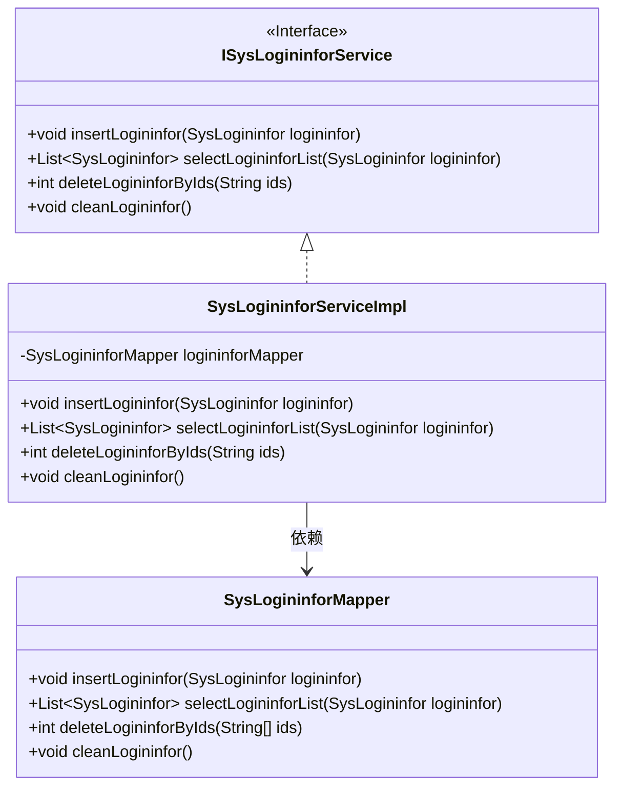
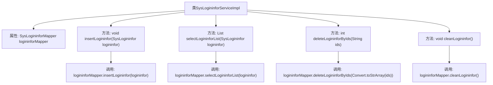

# 基础信息

|      |      |
|------|------|
| 名称 | SysLogininforServiceImpl |
| 编码语言 | .java |
| 代码路径 | RuoYi-main/ruoyi-system/src/main/java/com/ruoyi/system/service/impl/SysLogininforServiceImpl.java |
| 包名 | com.ruoyi.system.service.impl |
| 依赖项 | ['java.util.List', 'org.springframework.beans.factory.annotation.Autowired', 'org.springframework.stereotype.Service', 'com.ruoyi.common.core.text.Convert', 'com.ruoyi.system.domain.SysLogininfor', 'com.ruoyi.system.mapper.SysLogininforMapper', 'com.ruoyi.system.service.ISysLogininforService'] |
| 概述说明 | SysLogininforServiceImpl实现登录日志的增删查清功能。 |

# 说明

SysLogininforServiceImpl类实现了登录日志的增删查清功能。具体来说，该类提供了增加登录日志记录的方法，用于存储用户登录的相关信息；删除登录日志记录的方法，用于移除不再需要的日志数据；查询登录日志记录的方法，用于检索和查看特定用户的登录历史；以及清空登录日志记录的方法，用于批量删除所有日志数据。这些功能共同构成了一个完整的登录日志管理系统，便于对用户登录行为进行跟踪和管理。

# 类列表 Class Summary

| 名称   | 类型  | 说明 |
|-------|------|-------------|
| SysLogininforServiceImpl | class | SysLogininforServiceImpl实现登录日志的增删查清功能。 |

## 类 SysLogininforServiceImpl

|      |      |
|------|------|
| 访问范围 | @Service;public |
| 类型 | class |
| 名称 | SysLogininforServiceImpl |
| 说明 | SysLogininforServiceImpl实现登录日志的增删查清功能。 |

### UML类图

这段代码描述了一个系统登录日志服务的实现类 `SysLogininforServiceImpl`，它实现了 `ISysLogininforService` 接口，并通过 `SysLogininforMapper` 进行数据库操作。`SysLogininforServiceImpl` 类提供了新增、查询、批量删除和清空登录日志的功能，依赖于 `SysLogininforMapper` 来执行具体的数据库操作。

### 内部方法调用关系图

这段代码定义了一个服务类 `SysLogininforServiceImpl`，用于管理系统登录日志。它通过 `SysLogininforMapper` 与数据库交互，提供了插入、查询、批量删除和清空登录日志的功能。每个方法都调用了相应的 `logininforMapper` 方法来完成数据库操作，确保日志数据的增删查改功能得以实现。

### 字段列表 Field List

| 名称  | 类型  | 说明 |
|-------|-------|------|
| logininforMapper | SysLogininforMapper | 自动注入SysLogininforMapper实例。 |

### 方法列表 Method List

| 名称  | 类型  | 说明 |
|-------|-------|------|
| selectLogininforList | List<SysLogininfor> | 方法重写，调用Mapper查询登录信息列表。 |
| cleanLogininfor | void | 重写cleanLogininfor方法，调用logininforMapper清理登录信息。 |
| insertLogininfor | void | 重写插入登录信息方法，调用Mapper插入数据。 |
| deleteLogininforByIds | int | 该方法通过传入的ID字符串删除登录信息，返回删除结果。 |

