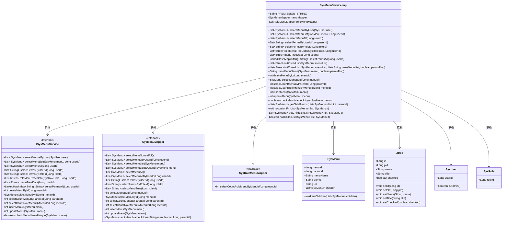

# 基础信息

|      |      |
|------|------|
| 名称 | SysMenuServiceImpl |
| 编码语言 | .java |
| 代码路径 | RuoYi-main/ruoyi-system/src/main/java/com/ruoyi/system/service/impl/SysMenuServiceImpl.java |
| 包名 | com.ruoyi.system.service.impl |
| 依赖项 | ['java.text.MessageFormat', 'java.util.ArrayList', 'java.util.Arrays', 'java.util.HashSet', 'java.util.Iterator', 'java.util.LinkedHashMap', 'java.util.LinkedList', 'java.util.List', 'java.util.Set', 'org.springframework.beans.factory.annotation.Autowired', 'org.springframework.stereotype.Service', 'com.ruoyi.common.constant.UserConstants', 'com.ruoyi.common.core.domain.Ztree', 'com.ruoyi.common.core.domain.entity.SysMenu', 'com.ruoyi.common.core.domain.entity.SysRole', 'com.ruoyi.common.core.domain.entity.SysUser', 'com.ruoyi.common.utils.StringUtils', 'com.ruoyi.system.mapper.SysMenuMapper', 'com.ruoyi.system.mapper.SysRoleMenuMapper', 'com.ruoyi.system.service.ISysMenuService'] |
| 概述说明 | SysMenuServiceImpl类实现ISysMenuService接口，提供菜单查询、权限管理和树结构转换功能。 |

# 说明

SysMenuServiceImpl类实现了ISysMenuService接口，主要负责菜单查询、权限管理以及树结构转换等功能。该类通过实现接口中的方法，提供了对系统菜单的全面管理能力，包括查询菜单信息、管理用户权限以及将菜单数据转换为树形结构，以便于在前端展示和操作。

# 类列表 Class Summary

| 名称   | 类型  | 说明 |
|-------|------|-------------|
| SysMenuServiceImpl | class | SysMenuServiceImpl类实现ISysMenuService接口，提供菜单查询、权限管理、树结构转换等功能。 |

## 类 SysMenuServiceImpl

|      |      |
|------|------|
| 访问范围 | @Service;public |
| 类型 | class |
| 名称 | SysMenuServiceImpl |
| 说明 | SysMenuServiceImpl类实现ISysMenuService接口，提供菜单查询、权限管理、树结构转换等功能。 |

### UML类图

**描述：**  
`SysMenuServiceImpl` 类实现了 `ISysMenuService` 接口，负责管理系统菜单的相关操作。它依赖于 `SysMenuMapper` 和 `SysRoleMenuMapper` 来访问数据库，并处理与菜单相关的业务逻辑，如查询菜单列表、权限管理、菜单树结构的生成等。该类通过多个方法实现了菜单的增删改查、权限校验、菜单树生成等功能，并与 `SysMenu`、`Ztree`、`SysUser`、`SysRole` 等类进行交互，确保系统菜单管理的完整性和一致性。

### 内部方法调用关系图

这段代码是一个实现菜单管理的服务类，主要功能包括根据用户查询菜单、查询菜单列表、查询权限、删除菜单、新增菜单、修改菜单等操作。代码通过调用`menuMapper`和`roleMenuMapper`来与数据库进行交互，并通过递归方法处理菜单的父子关系。流程图展示了类中各个方法之间的调用关系，帮助理解代码的执行流程。

### 字段列表 Field List

| 名称  | 类型  | 说明 |
|-------|-------|------|
| menuMapper | SysMenuMapper | 自动注入SysMenuMapper实例。 |
| PREMISSION_STRING = "perms[\"{0}\"]" | String | 定义静态常量字符串，用于权限格式。 |
| roleMenuMapper | SysRoleMenuMapper | 自动注入SysRoleMenuMapper角色菜单映射器实例。 |

### 方法列表 Method List

| 名称  | 类型  | 说明 |
|-------|-------|------|
| getChildList | List<SysMenu> | 获取指定菜单的所有子菜单列表。 |
| selectPermsByUserId | Set<String> | 根据用户ID查询权限并返回去重后的权限集合。 |
| getChildPerms | List<SysMenu> | 根据父节点ID获取所有子节点并返回列表。 |
| recursionFn | void | 递归构建菜单树结构，设置子节点并遍历处理。 |
| menuTreeData | List<Ztree> | 根据用户ID获取菜单树数据并返回Ztree结构。 |
| deleteMenuById | int | 该方法通过菜单ID删除菜单，并返回删除结果。 |
| selectPermsAll | LinkedHashMap<String, String> | 根据用户ID查询权限并生成URL与权限的映射。 |
| selectCountMenuByParentId | int | 该方法通过父ID查询子菜单数量并返回结果。 |
| insertMenu | int | 重写insertMenu方法，调用menuMapper插入菜单并返回结果。 |
| hasChild | boolean | 判断菜单列表中的指定菜单是否包含子菜单。 |
| selectCountRoleMenuByMenuId | int | 方法selectCountRoleMenuByMenuId通过menuId查询角色菜单数量。 |
| selectMenuById | SysMenu | 重写方法，通过menuMapper根据menuId查询菜单。 |
| updateMenu | int | 重写updateMenu方法，调用menuMapper更新菜单并返回结果。 |
| roleMenuTreeData | List<Ztree> | 方法根据用户ID和角色生成菜单树，返回Ztree列表。 |
| transMenuName | String | 方法transMenuName根据权限标志生成菜单名称，包含菜单名和权限信息。 |
| initZtree | List<Ztree> | 初始化Ztree列表，遍历菜单列表，设置节点属性并检查角色菜单。 |
| selectPermsByRoleId | Set<String> | 通过角色ID查询权限并返回去重后的权限集合。 |
| selectMenusByUser | List<SysMenu> | 根据用户权限获取菜单列表，管理员显示所有菜单，普通用户显示个人菜单。 |
| selectMenuList | List<SysMenu> | 根据用户权限查询菜单列表，管理员返回全部，普通用户返回指定用户菜单。 |
| initZtree | List<Ztree> | 初始化菜单树，调用重载方法，传入菜单列表、空父节点和false参数。 |
| selectMenuAll | List<SysMenu> | 根据用户ID查询菜单列表，管理员获取全部菜单，普通用户获取个人菜单。 |
| checkMenuNameUnique | boolean | 检查菜单名称是否唯一，若存在且ID不同则返回不唯一，否则返回唯一。 |

