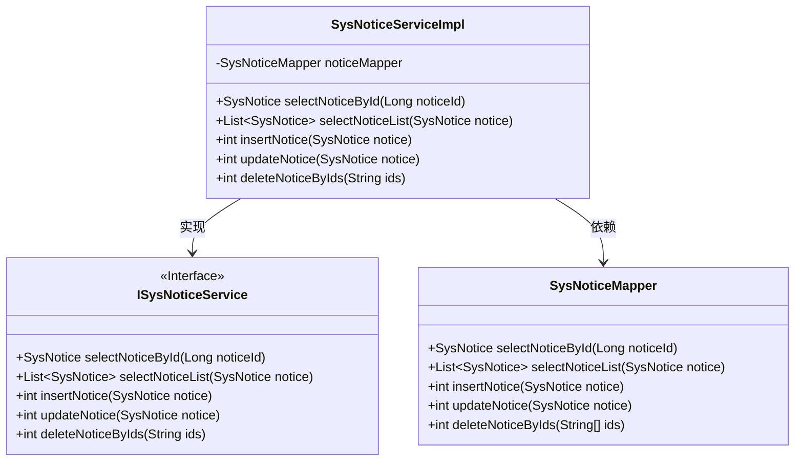
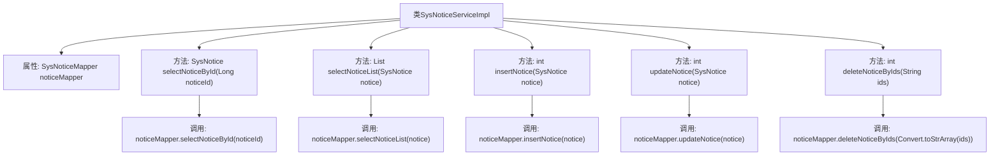

# 基础信息

|      |      |
|------|------|
| 名称 | SysNoticeServiceImpl |
| 编码语言 | .java |
| 代码路径 | RuoYi-main/ruoyi-system/src/main/java/com/ruoyi/system/service/impl/SysNoticeServiceImpl.java |
| 包名 | com.ruoyi.system.service.impl |
| 依赖项 | ['java.util.List', 'org.springframework.beans.factory.annotation.Autowired', 'org.springframework.stereotype.Service', 'com.ruoyi.common.core.text.Convert', 'com.ruoyi.system.domain.SysNotice', 'com.ruoyi.system.mapper.SysNoticeMapper', 'com.ruoyi.system.service.ISysNoticeService'] |
| 概述说明 | SysNoticeServiceImpl类实现公告的查询、新增、修改、删除功能。 |

# 说明

SysNoticeServiceImpl类是一个实现公告管理功能的类，主要负责公告的查询、新增、修改和删除操作。通过该类，用户可以方便地对公告信息进行全面的管理，包括获取现有公告、添加新公告、更新公告内容以及移除不再需要的公告。这些功能共同构成了公告管理系统的核心，确保了公告信息的及时更新和有效维护。

# 类列表 Class Summary

| 名称   | 类型  | 说明 |
|-------|------|-------------|
| SysNoticeServiceImpl | class | SysNoticeServiceImpl类实现公告查询、新增、修改、删除功能。 |

## 类 SysNoticeServiceImpl

|      |      |
|------|------|
| 访问范围 | @Service;public |
| 类型 | class |
| 名称 | SysNoticeServiceImpl |
| 说明 | SysNoticeServiceImpl类实现公告查询、新增、修改、删除功能。 |

### UML类图

该代码展示了一个公告服务实现类 `SysNoticeServiceImpl`，它实现了 `ISysNoticeService` 接口，并依赖于 `SysNoticeMapper` 来进行数据库操作。`SysNoticeServiceImpl` 提供了公告的查询、新增、修改和删除功能，并通过 `SysNoticeMapper` 执行具体的数据库操作。类图清晰地展示了类之间的关系和依赖。

### 内部方法调用关系图

这段代码是一个服务实现类 `SysNoticeServiceImpl`，它实现了 `ISysNoticeService` 接口。类中通过 `@Autowired` 注解注入了 `SysNoticeMapper` 对象，并提供了多个方法用于操作公告数据，包括查询、新增、修改和删除公告。每个方法都调用了 `noticeMapper` 的相应方法来完成数据库操作。

### 字段列表 Field List

| 名称  | 类型  | 说明 |
|-------|-------|------|
| noticeMapper | SysNoticeMapper | 自动注入SysNoticeMapper实例。 |

### 方法列表 Method List

| 名称  | 类型  | 说明 |
|-------|-------|------|
| selectNoticeById | SysNotice | 根据ID查询系统公告信息。 |
| deleteNoticeByIds | int | 重写方法，通过ID字符串删除公告，返回删除结果。 |
| updateNotice | int | 重写updateNotice方法，调用noticeMapper更新通知。 |
| insertNotice | int | 重写insertNotice方法，调用noticeMapper插入通知。 |
| selectNoticeList | List<SysNotice> | 重写方法，调用Mapper查询通知列表。 |

