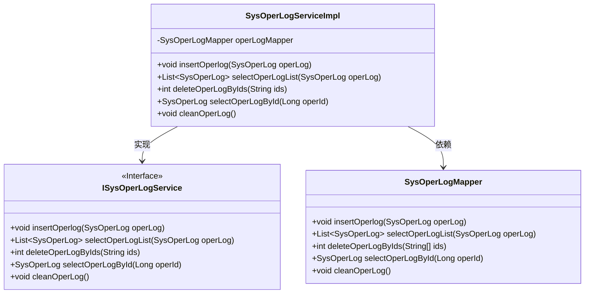
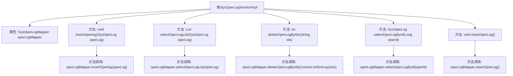

# 基础信息

|      |      |
|------|------|
| 名称 | SysOperLogServiceImpl |
| 编码语言 | .java |
| 代码路径 | RuoYi-main/ruoyi-system/src/main/java/com/ruoyi/system/service/impl/SysOperLogServiceImpl.java |
| 包名 | com.ruoyi.system.service.impl |
| 依赖项 | ['java.util.List', 'org.springframework.beans.factory.annotation.Autowired', 'org.springframework.stereotype.Service', 'com.ruoyi.common.core.text.Convert', 'com.ruoyi.system.domain.SysOperLog', 'com.ruoyi.system.mapper.SysOperLogMapper', 'com.ruoyi.system.service.ISysOperLogService'] |
| 概述说明 | 实现操作日志的增删查改及清空功能。 |

# 说明

该内容描述了一个系统功能的实现，主要涉及操作日志的管理。具体功能包括增加日志记录、删除日志记录、查询日志记录、修改日志记录以及清空所有日志记录。这些功能旨在提供全面的日志管理能力，确保系统操作的透明性和可追溯性。通过实现这些功能，用户可以方便地管理和维护操作日志，从而提高系统的可靠性和安全性。

# 类列表 Class Summary

| 名称   | 类型  | 说明 |
|-------|------|-------------|
| SysOperLogServiceImpl | class | 实现操作日志的增删查改及清空功能。 |

## 类 SysOperLogServiceImpl

|      |      |
|------|------|
| 访问范围 | @Service;public |
| 类型 | class |
| 名称 | SysOperLogServiceImpl |
| 说明 | 实现操作日志的增删查改及清空功能。 |

### UML类图

这段代码描述了一个服务类 `SysOperLogServiceImpl`，它实现了 `ISysOperLogService` 接口，并依赖于 `SysOperLogMapper` 来执行数据库操作。`SysOperLogServiceImpl` 提供了插入、查询、删除和清空操作日志的功能。`ISysOperLogService` 接口定义了这些操作的方法，而 `SysOperLogMapper` 则负责具体的数据库交互。

### 内部方法调用关系图

**描述：**  
该流程图展示了`SysOperLogServiceImpl`类的结构及其内部方法的调用关系。类中包含一个`SysOperLogMapper`属性，并通过该属性调用不同的数据库操作方法，如插入操作日志、查询操作日志列表、批量删除操作日志、查询单个操作日志详细信息和清空操作日志。每个方法都通过`operLogMapper`对象与数据库进行交互，完成相应的操作。

### 字段列表 Field List

| 名称  | 类型  | 说明 |
|-------|-------|------|
| operLogMapper | SysOperLogMapper | 自动注入SysOperLogMapper操作日志映射器。 |

### 方法列表 Method List

| 名称  | 类型  | 说明 |
|-------|-------|------|
| deleteOperLogByIds | int | 重写方法删除指定ID的操作日志。 |
| selectOperLogById | SysOperLog | 重写方法，通过ID查询操作日志。 |
| cleanOperLog | void | 该方法用于清理操作日志，调用`operLogMapper.cleanOperLog()`实现。 |
| insertOperlog | void | 重写插入操作日志方法，调用mapper插入日志。 |
| selectOperLogList | List<SysOperLog> | 重写方法，调用mapper查询操作日志列表。 |

